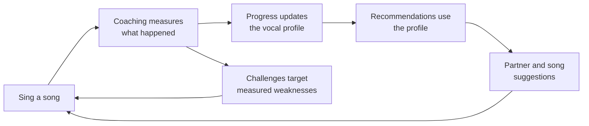
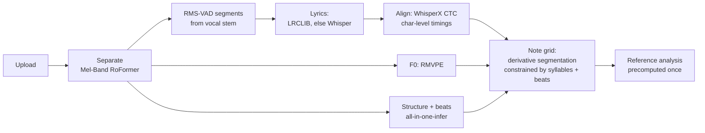
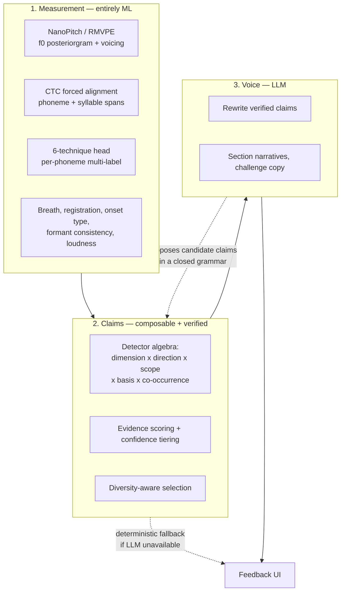
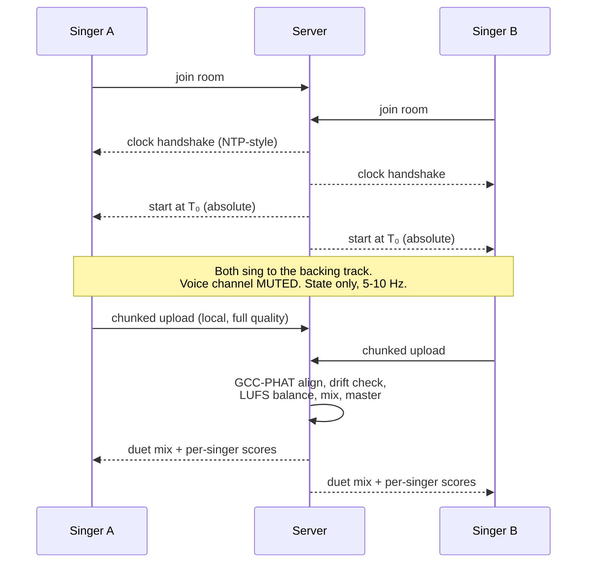
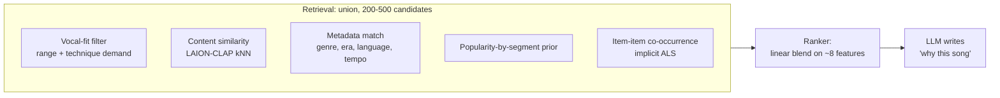
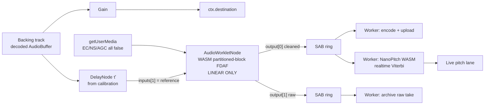
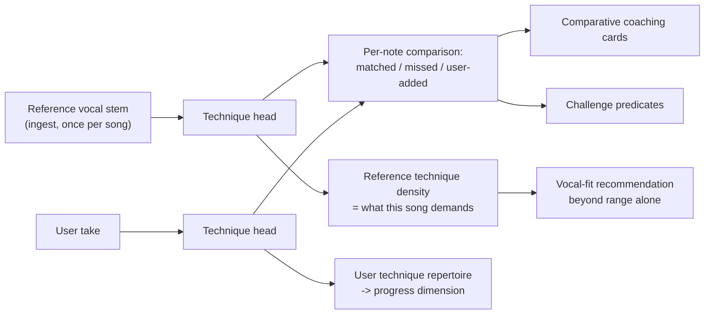
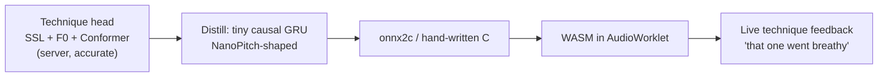

# Elums — Technical Approach and Architecture

**Author:** Dillon McHenry
**Date:** October 2026
**Status:** Pre-build research. High-level toolset and architecture selection; deliberately not a schema or API spec.

---

## 0. Executive summary

Elums is a social karaoke web app that makes singing together easy, measurable, and fun. This document selects the stack and architecture, and justifies each choice against evidence.

Ten decisions carry most of the weight:

1. **Build on Smule Labs' own open-source audio stack.** `windowed-roformer` and `smule-renaissance` are MIT. `NanoPitch` is CC BY-NC-ND, but Smule Labs *is* the licensor — one written grant makes it the client-side pitch tracker, and it is the right choice on technical merit. (§2)
2. **Automatic song ingest is the unlock.** An uploaded MP3 becomes stems, synced lyrics, a note grid, sections, and a beat map in ~2 minutes on the provided GPU. Every other feature depends on this working. (§5)
3. **Do not ship a learned "singing quality" score.** The best published attempt to predict listener-rated *skill* from acoustic features on amateur Smule karaoke reached **R² = 0.06**. Report measurements against published pedagogical norms instead. (§6.1)
4. **The LLM may propose, but only the engine may assert.** VocalCoachBench (Aug 2026) shows 12 recent audio-language models scoring *below the label-prior baseline* on fine-grained issue identification and **under 7%** on strict diagnosis alignment. So feedback richness comes from wider *measurement* and composable detectors, not from a learned claim generator — with the LLM allowed to propose hypotheses that the engine then verifies numerically. (§6.4, §12)
5. **True real-time duet over the public internet is not feasible, and Smule doesn't do it either.** Build a synchronized double-ender: both singers record locally against a shared song clock, upload, and the server aligns and mixes. (§7)
6. **Never share a microphone between two singers.** Per-singer separation of simultaneous singing is an open research problem — SOTA target-singer extraction reaches 5.58 dB SI-SDR. One singer per device makes scoring, mixing, and gain balancing trivial. (§7.5)
7. **Vocal-fit recommendation has substantial prior art.** Claim the gaps — passive profiling, pedagogically actionable explanations, and the coaching↔recommendation loop — not the idea. (§8.2)
8. **Disable the browser's echo canceller and build a known-reference AEC.** Chrome's chrome-wide AEC is default-on and adds **170 ms** of capture delay on Windows/macOS; its suppressor and AGC destroy the dynamics the coach measures. (§10.2)
9. **Train two models, in priority order.** The 6-technique head on GTSinger is load-bearing — two depth bets depend on it. Improving NanoPitch against its own published baseline is the better presentation artifact. Everything else is off the shelf. (§11.2, §11.4)
10. **One Python codebase, three entrypoints, Postgres for records and the filesystem for bytes.** No Kubernetes, no object store, no Triton. The 16 GB GPU hosts audio ML only — the OpenRouter credits are what keep it free to do so. (§4, §12.3, §13)

### What carries over from SecondPass, and what does not

| Carries over | Discarded |
| --- | --- |
| The measurement → verified-claim → LLM voice three-layer split | Filesystem-as-database, in-process job dict |
| — | Enumerated detectors with no composition (see §6.4) |
| Config-as-data for every threshold | The 9-technique taxonomy (see §11.1) |
| Graceful degradation at every optional boundary | Hand-curated UltraStar song bundles |
| Confidence tiering and willingness to say "I don't know" | `gpt-4o-mini` / OpenAI client |
| Absolute-vs-comparative feedback basis | `ScriptProcessorNode` capture |
| Median-based, self-relative normalization | Desktop-first CSS |
| Click-a-card-to-hear-it as the core interaction | — |

---

## 1. Reading the brief

Six required features, one stated value proposition ("people come for the fun and stay for the community"), and an explicit instruction: depth over completeness.

The three depth bets are **unified coaching**, **singing together**, and **recommendations**. They are chosen because they are the three features where the interesting engineering is, because they compose into a single loop, and because they map cleanly onto the three review audiences:



The loop is the product. A song recommendation that knows you went flat on sustained notes above E4 is a different product from one that knows you like Adele.

Song ingest and client audio are not depth bets but are **load-bearing** — nothing works on real content without ingest, and the brief explicitly names WebAssembly, Web Audio, and acoustic echo cancellation. They get competent, well-reasoned baselines (§5, §10) rather than research effort.

---

## 2. Strategic foundation: Smule Labs' own open stack

Smule Labs launched in October 2025 and has published three repositories. Two are directly usable and one is instructive. Using them is both the right engineering call and a deliberate signal.

| Asset | What it is | License | Role in Elums |
| --- | --- | --- | --- |
| [`windowed-roformer`](https://github.com/smulelabs/windowed-roformer) | Mel-Band RoFormer with windowed sink attention. 11.17 dB vocals SDR vs 12.12 dB for full MB-R (92% retention) at **44.5× fewer attention FLOPs** ([arXiv:2510.25745](https://arxiv.org/abs/2510.25745)) | **MIT, © 2025 Smule Labs** | Secondary separation path; the `flex_attention_utils.py` module is a drop-in |
| [`smule-renaissance`](https://github.com/smulelabs/smule-renaissance) | 10.4M-param vocal restoration in the complex STFT domain. 10.5× real-time on an iPhone 12 CPU. Beats all open-source baselines on singing ([arXiv:2510.21659](https://arxiv.org/abs/2510.21659)) | **MIT** | **Core product feature** — see below |
| [`NanoPitch`](https://github.com/smulelabs/NanoPitch) | 333K-param causal GRU pitch tracker + VAD. 360-bin posteriorgram at 20-cent resolution, 40 mel bands @ 16 kHz, 10 ms frames. Hand-written C inference engine + Emscripten build, RTF 0.1–0.3 in WASM | CC BY-NC-ND 4.0, **grant requested** | **Client-side live pitch + voicing**, and the distillation template for in-browser technique detection |

### 2.1 Renaissance is the most underrated asset here

Smule Renaissance Small restores vocals degraded by "noise, reverberation, band-limiting, and clipping" — a precise description of a phone recording made in a bedroom. It is MIT-licensed, 10.4M parameters, and faster than real-time on a four-generation-old phone CPU.

This matters for two independent reasons:

- **As a product feature.** The AES 2025 listener study (§6.1) found *recording quality* and *background noise* were the two best-predicted perceptual dimensions from acoustic features (R² = 0.20 and 0.33) while *skill* was essentially unpredictable (R² = 0.06). The cheapest way to make someone's recording sound better is not to coach them — it is to fix the recording. Renaissance does that, server-side, for free.
- **As a measurement preprocessor.** Several of the metrics in §6.2 are sensitive to reverb and band-limiting. Running restoration before analysis narrows the device-variance problem that otherwise poisons longitudinal tracking.

### 2.2 NanoPitch: the licensing question, and why it is the right tracker anyway

Two separate issues get conflated here, so take them apart.

**Access was never a constraint.** It is a public repository; we can read it, build it, and train it. What the license governs is what we do *downstream*. The LICENSE file is Creative Commons Attribution-NonCommercial-NoDerivatives 4.0, whose operative grant is:

> reproduce and Share the Licensed Material, in whole or in part, for NonCommercial purposes only; and produce and reproduce, **but not Share**, Adapted Material for NonCommercial purposes only.

So NoDerivatives blocks *shipping* a fine-tuned checkpoint (though training one and reporting the numbers is explicitly permitted), and NonCommercial blocks a product dependency. Note that GitHub's API reports this repo as `NOASSERTION` — the terms are only visible if you open the file.

**And Smule Labs is the licensor**, so a one-line written grant for this project dissolves both constraints. That request has been made. Asking is worth doing on its own merits: it is cheap, it is correct, and reading the LICENSE on a repo whose tooling metadata says nothing is a habit worth demonstrating.

**With the grant in hand, NanoPitch is the better client-side tracker than SwiftF0 on technical merit**, which is the real reason to use it:

- **It is causal by construction.** Explicit left-padding means `output[t]` depends only on `input[t-2..t]`, which the README identifies as essential for streaming. SwiftF0 is a 2D CNN over STFT frames; I have not verified its receptive field, but that architecture class is normally non-causal, which costs look-ahead latency on a meter that is supposed to move *while* you sing.
- **It emits a posteriorgram, not a scalar.** 360 bins at 20-cent resolution means uncertainty is first-class — "if the model isn't sure between two pitches, both bins can have moderate confidence" — which feeds the confidence gating in §6.4 directly rather than through a derived confidence scalar.
- **It has a jointly-trained VAD head.** We need singing/not-singing detection anyway, for onset detection and for refusing to coach silence.
- **The offline/realtime Viterbi split is already built and measured.** This maps exactly onto our two-path problem: global-optimal decoding for server-side scoring, greedy decoding for the live meter that "can't change its mind about past frames." Numerical parity between the offline and online paths is available from day one instead of being a porting hazard.
- **`nanopitch.c` already implements mel FFT, GRU cells, and Viterbi in C**, with an Emscripten `build.sh`. The hard part of the WASM port is done.

Two honest caveats. The repo ships **no pretrained weights** and `augment_mel_batch` in `train.py` is a deliberate stub returning clean audio only, so the as-shipped baseline is an unaugmented model — we must train it, which is fine on the provided GPU. And because its training targets are **RMVPE posteriorgrams**, its accuracy ceiling is RMVPE; it cannot beat its own teacher. That is precisely why server-side scoring stays on RMVPE (§11.5) and NanoPitch owns only the latency-critical path.

[SwiftF0](https://github.com/lars76/swift-f0) (MIT, 95,842 params, 389 KB ONNX, existing WASM demo, 91.80% harmonic mean at 10 dB SNR) remains wired in as the fallback if the grant does not arrive.

Either way, **reproducing and improving the NanoPitch training exercise is a research artifact worth producing**: implement the augmentation stub, apply the six improvement directions the README itself enumerates (log-domain `logaddexp` noise mixing, SpecAugment, focal loss for voiced/unvoiced imbalance, longer context windows, cosine annealing with gradient-norm monitoring, and staged VAD-then-pitch head training), and report the RPA/VDR/median-cents delta against the unaugmented baseline. Smule knows exactly what that baseline scores, which makes it an unusually legible demonstration of driving a model past its one-shot state.

---

## 3. System architecture

```mermaid
flowchart TB
  subgraph client [Browser: phone, tablet, desktop]
    worklet["AudioWorklet<br/>WASM known-reference AEC"]
    pitch["Worker: NanoPitch WASM<br/>live pitch posteriorgram + VAD"]
    lane["Canvas 2D pitch lane<br/>60fps"]
    ring["SharedArrayBuffer ring buffer"]
    worklet --> ring --> pitch --> lane
  end

  subgraph api [FastAPI monolith]
    rest["REST + OpenAPI 3.1"]
    ws["WebSocket: duet rooms,<br/>live scores, challenge progress"]
    share["Jinja2 share pages<br/>OG metadata"]
  end

  subgraph workers [Job workers]
    cpu["CPU worker:<br/>mixing, mastering, render"]
    gpu["GPU worker, 1 replica:<br/>ingest + analysis"]
  end

  subgraph store [Storage]
    pg[("Postgres 18<br/>+ pgvector")]
    blobs[("Content-addressed<br/>filesystem blobs")]
    valkey[("Valkey:<br/>sessions, leaderboards, pubsub")]
  end

  client <--> rest
  client <--> ws
  rest --> pg
  rest --> valkey
  pg -. "Procrastinate<br/>SKIP LOCKED + locks" .-> cpu
  pg -. .-> gpu
  gpu --> blobs
  cpu --> blobs
  gpu --> pg
  rest --> llm["OpenRouter<br/>qwen/qwen3.8-27b"]
```

One Python codebase, three container entrypoints sharing models and migrations. The GPU worker is pinned to a single replica and holds the only CUDA context.

**Why a Python monolith rather than a Node API plus a Python ML service.** The usual argument for Node is type sharing with the frontend, and that argument has expired: FastAPI emits OpenAPI 3.1, and `@hey-api/openapi-ts` generates a typed TypeScript SDK with a Vite plugin that regenerates on build. One source of truth, end-to-end types, and no second language runtime in a deliverable someone else has to stand up.

---

## 4. Data architecture

> *Answering: what kinds of data will we store, and what is the best means of storing each?*

The governing principle is a split most projects get wrong: **Postgres stores records you query; the filesystem stores bytes you fetch whole.**

| Data class | Store | Reasoning |
| --- | --- | --- |
| Users, sessions, follows, groups | Postgres, normalized | Referential integrity is the entire point. `uuidv7()` primary keys (native in PG18) give time-ordered IDs without random-UUID write amplification |
| Song catalog + metadata | Postgres, relational + a `jsonb` sidecar | You facet and search on this; GIN index on the jsonb |
| Derived chart / lyric / note artifacts (100 KB–2 MB) | **Blobs**, with a hash + small `jsonb` summary in Postgres | A 2 MB `jsonb` TOASTs, bloating the table and every `pg_dump`, for a document the client always wants in its entirety and never queries into |
| Audio: uploads, stems, instrumentals, takes, duet mixes | **Blobs**, content-addressed by SHA-256 | Immutable, free deduplication, `Cache-Control: immutable` |
| Per-performance analysis objects (1–5 MB) | **Blobs** + ~20-field `jsonb` summary for ranking | Same reasoning; one screen fetches the whole thing |
| Per-frame time series (f0, confidence, RMS @ 100 Hz) | **Binary `float16` arrays in blobs** | A 3-minute take is 18,000 frames. Row-per-frame turns 1,000 takes into 18M rows nothing ever filters on. As arrays it is ~70 KB per channel |
| **Per-note aggregates** | **Postgres rows** | ~50–300 rows per performance, genuinely queryable. **This is the tier progress tracking runs on** |
| Embeddings (user vocal profile, song vectors) | Postgres + **pgvector 0.8.7** | §8.3 |
| Leaderboards | **Valkey sorted sets**, rebuildable from Postgres | `ZREVRANK` for "your rank" is O(log N) and the one thing SQL does badly |
| Challenge progress | Postgres | Competitive-outcome data; the source of truth does not belong in a cache |
| Live duet session state | Valkey with TTLs + pub/sub | Ephemeral by definition; losing it on restart is correct |

The two-tier time-series decision is what makes TimescaleDB unnecessary. Once dense frames are binary blobs, the "high-volume time series" is a few hundred rows per performance, and hypertables, continuous aggregates, and compression policies become machinery for a problem designed away.

**Object storage: none.** MinIO was archived by its owner on 25 April 2026 and must not be reached for from habit. On a single VM with nowhere to replicate to, an S3-compatible server cannot provide the durability it exists for. Use content-addressed files behind a `BlobStore` Protocol with one local implementation and a documented ~40-line `S3BlobStore`. Keep Python out of the byte path entirely: Caddy's `forward_auth` asks FastAPI "may this session read this blob?", then `file_server` serves it with correct HTTP Range handling for audio seeking.

**Cache/queue: Valkey 9.1 (BSD-3-Clause), not Redis 8 (AGPLv3/RSALv2/SSPLv1).** For code another company deploys internally, the permissive license removes a conversation.

**Jobs: [Procrastinate](https://github.com/procrastinate-org/procrastinate)** (Postgres `SKIP LOCKED` + `LISTEN/NOTIFY`). Three properties earn it over Celery: transactional enqueue (the job row and the domain write commit together, so orphaned jobs are impossible), jobs are rows a reviewer can `SELECT`, and **named locks give you a durable GPU semaphore for free** — tag every separation job `lock="gpu:separation"` and exactly one runs at a time. Its ~269 jobs/s ceiling is irrelevant when each job is 10–120 seconds of GPU time.

---

## 5. Song ingest: arbitrary MP3 → playable, coachable song

> Required feature 1. Also the precondition for 3, 4, and 5 working on real content.

Every comparative coaching claim ("the artist scoops here and you didn't") needs an isolated reference vocal, a note grid, and time-aligned lyrics. Hand-curating those is what limited SecondPass to seven songs. The GPU makes it automatic.



**Separation: full Mel-Band RoFormer via [`nomadkaraoke/python-audio-separator`](https://github.com/nomadkaraoke/python-audio-separator)** (MIT, actively maintained). Kimberley Jensen's `vocals_mel_band_roformer` checkpoint was **relicensed from GPL-3.0 to MIT in April 2026** — any guide written before mid-2026 will tell you otherwise. Measured at 27–41 s per song on an RTX 4000 Ada 16 GB, which is close to our hardware.

*Why not Smule's own `windowed-roformer` as the primary?* Because the honest reading of their paper argues against it here. WSA retains 92% of SDR but its **Bleedless score drops to 30.1 from 41.0**, with the degradation concentrated in silent segments where it "tends to retain more residual content from other sources." For karaoke, bleed in the instrumental is audible and bleed in the reference vocal corrupts the coaching baseline. The paper itself says wall-clock speedups on an 8-second window are "modest" on GPUs; the gains appear for long sequences and weak-parallelism devices. So: full MB-R for offline ingest where quality matters and we own the GPU; `windowed-roformer` wired in as the configurable alternative and the documented on-device path. Making that distinction — rather than reflexively using the host company's model everywhere — is the more defensible engineering position.

**Lyrics: a counterintuitive finding worth internalizing.** Feeding separated vocals to Whisper's native long-form algorithm makes WER *worse* (35.5 → 47.9 on Jam-ALT for large-v3). The 2025 follow-up ([arXiv:2506.15514](https://arxiv.org/abs/2506.15514)) shows why and fixes it: the gain comes from **better segment boundaries, not cleaner audio**. Use the separated stem as a vocal-activity detector, cut on RMS envelope (threshold 0.1, min silence 1.0 s, max segment 30 s), then batch Whisper over those segments. Open SOTA: 20.35 WER, with hallucination rate dropping from 1.31 to 0.35.

Short-circuit it where possible: [LRCLIB](https://lrclib.net/) gives line-level synced lyrics for free, reducing the problem to word-within-line.

**Syllable timing, free.** WhisperX's aligner is internally **character-level** — it builds `char_segments_arr` with per-character start/end and only then collapses to words. Grouping characters into syllables with a hyphenation dictionary for split points and CTC timings for boundaries is strictly better than UltraSinger's approach, whose README admits it "simply splits the word, without paying attention to whether the separated word really starts at the place."

**Note grid.** Best-in-world note-level transcription with correct onset+offset+pitch is ~61% F1 (T3MS on MIR-ST500). Do not plan for a clean automatic chart; plan a correction UI. But we hold three constraints research models don't: syllable spans, a beat grid, and a key. Derivative-peak + inverse-confidence segmentation over the RMVPE track, constrained to syllable spans and snapped to the beat grid, should beat an unconstrained learned model on charting quality for ~50 lines of signal processing and no license entanglement. [ROSVOT](https://github.com/RickyL-2000/ROSVOT) (MIT, ships weights, consumes word boundaries we already have) is the learned fallback.

**Structure and beats: [`all-in-one-infer`](https://github.com/openmirlab/all-in-one-infer)** (MIT), the maintained fork of Taejun Kim's WASPAA 2023 model — 0.958 beat F1, 0.915 downbeat F1, verse/chorus/bridge labels, ~300K params. The fork removes the NATTEN CUDA extension (reimplemented in pure PyTorch, verified bit-identical) and madmom, which matters twice: NATTEN is an afternoon of pain to build on Blackwell, and **madmom's pretrained model files are CC BY-NC-SA** even though its source is BSD.

**Estimated: ~110 s per 4-minute song**, warm process.

### Known failure mode to design around

Whisper **deletes over half of all non-lexical vocables** ("ooh," "ah," "la") and over half of backing vocals, even on clean stems — the paper's authors state this "cannot be resolved by improved source separation." A chorus of "na na na" will silently vanish from the chart. Mitigation: an energy-gated fallback that emits note events without words wherever the vocal stem is loud but the transcript is empty, plus the `mel_band_roformer_karaoke` checkpoint to isolate lead from backing vocals.

---

## 6. Depth bet 1 — Unified coaching

> Required feature 5. Answering: *what sort of "detailed" coaching feedback, and by what metrics is progress tracked over time?*

### 6.1 The constraint that shapes everything

**Georgieva, Ripollés & McFee (AES ML/AI for Audio 2025)** ran the study this product needs. 4,300 ratings, 940 recordings (470 from Smule's own DAMP karaoke corpus), 86 screened listeners, 11 rating dimensions, Elastic Net with GroupKFold by artist. Predicting listener ratings from standard acoustic features:

| Perceived dimension | R² |
| --- | --- |
| Background noise | 0.33 |
| Intelligibility | 0.20 |
| Recording quality | 0.20 |
| Passion | 0.07 |
| **Skill** | **0.06** |
| Emotional effectiveness | 0.05 |
| Power | 0.04 |
| **Likability** | **−0.01** |

Perceived singing skill on amateur phone karaoke is about **6% explainable** from the features any scoring system would use. Likability is unexplainable. Mixed-effects models agreed: marginal R² of 0.02–0.05 for fixed effects.

So any "Elums Score: 87" computed from spectral features is, on the best available evidence, close to noise with respect to how humans actually hear the performance.

A second finding from the same study reframes the product: karaoke excerpts were rated **lower in skill** (β = −0.324) than audiobook narration but **higher in passion** (β = 0.237), sincerity, and emotional effectiveness — with **no significant difference in likability**. Listeners already separate "skilled" from "enjoyable." Elums should too.

**Design consequence: Elums reports measurements with units and published reference ranges, not a verdict.** "You sang 23 cents flat on average through the chorus; your vibrato ran at 7.4 Hz, above the 4.5–6.5 Hz classical band" is defensible. "You scored 87" is not. This is also a competitive position — Smule's own score is, by community consensus, close to meaningless as a quality measure, and a rigorous, normalized, explainable alternative is a credible thing to propose to them specifically.

### 6.2 Which metrics, with evidence-based thresholds

The literature gives real numbers. Using them instead of invented thresholds is most of the value.

**Pitch.** Non-musicians notice mistuning in *real vocal* tones at ~50 cents; in a melodic context, ~60 cents. Trained musicians accept +10 to −15 cents on synthesized tones. The "Vocal Generosity Effect" is well documented: listeners forgive mistuning in the voice far more than in other timbres. Tuning error typical of singers considered *good* is 10–30 cents.

→ Green ≤25 cents mean absolute deviation, yellow 25–50, red >50. **Never display sub-25-cent deviation as an error** — no listener hears it, and flagging it trains people to chase inaudible precision.

**Vibrato.** Trained Western classical rate is **4.5–6.5 Hz** (Nix et al. 2016, n=75 college vocal majors); Sundberg calls <5 Hz "unacceptably slow" and >8 Hz "nervous." Extent: 50–120 cents peak-to-peak is normal, below ~20 cents is straight tone, above ~150 is excessive. Clinically, <4 Hz is "wobble" and >7 Hz is "bleat."

→ Flag only clear outliers. Pop vibrato is not classical vibrato, and telling a pop singer their 6.8 Hz vibrato is "wrong" is a product failure. Critically, **suppress pitch-error flagging inside detected vibrato** — van Besouw et al. found vibrato legitimately raises the lower limit of acceptable tuning by a further 10 cents.

**Timing.** Lyrics-to-audio synchrony is detected by 50% of listeners at **−0.33 s (early) / +0.22 s (late)**. Professional ensemble asynchrony runs 30–50 ms. MIREX onset tolerance is ±50 ms.

→ Green ≤50 ms, red >200 ms, and **weight late more harshly than early** — the perceptual asymmetry is real and nobody implements it.

**Voice quality.** CPPS is the most robust spectral measure across devices and rooms, and Maryn's meta-analysis calls it "the most promising and perhaps robust acoustic measure of dysphonia severity." But it is strongly f0-dependent — CPPS *rises* from 80 to 175 Hz and *falls* from 180 to 699 Hz, with no correcting equations from real-voice data.

→ **Never compare CPPS across pitches.** If tracking it longitudinally, build a fixed-pitch sustained-vowel warm-up exercise into the app and compare only within that. Clinical speech cutoffs are invalid for sung material and must not be shown to users.

### 6.3 Device stability: which metrics survive a phone

This table decides what can be plotted over time at all, and it is the part most karaoke apps get wrong.

| Measure | Cross-device / room stability | Track longitudinally? |
| --- | --- | --- |
| f0 / pitch in cents | Reliable across devices | **Yes — primary metric** |
| Vibrato rate and extent | Derived from f0 in cents, so device-independent | **Yes** |
| Onset timing | Derived from f0/energy edges | **Yes** |
| CPPS | Best compatibility index of 7 measures; stable across reverb levels | Same-pitch, same-device only |
| Alpha ratio | Reliable below ~1 s reverb | Conditional |
| SPR / singer's formant | Band-level ratio, inherits mic frequency response directly | Same-device only |
| **Shimmer** | ~**40% change** at 0.5 s reverb; worst regression slope of all measures | **No** |
| **HNR** | Significant device bias | **No** |
| **Spectral tilt** | Worst of 7 for cross-mic reproducibility | **No** |
| **Absolute SPL** | Phones have no calibrated SPL; AGC destroys it | **No** |

Jitter and shimmer were developed for sustained vowels in clinical assessment. Vibrato is by construction large periodic f0 perturbation and will inflate jitter; intentional dynamic shaping inflates shimmer. **Do not surface either in a karaoke app.**

One encouraging nuance: even where absolute values differ by device, intercorrelations across devices exceed r > 0.90, and sentence-level CPP correlates at r = 0.971–0.981 between a lab mic and every other method. So record device model and headphone state on every take, restrict trend lines to same-device sessions, and widen confidence bands when the device changes.

### 6.4 How technique is detected and how cards are generated

The word "deterministic" describes exactly one of three layers, and conflating them produces the wrong conclusion about where richness comes from.



**Measurement is not rules-based at all.** Pitch and voicing come from a neural tracker; phoneme boundaries from a neural CTC aligner; technique from a neural multi-label classifier over phoneme spans. There is no hand-written "is this falsetto" rule and there could not be — breathy versus pressed phonation at the same pitch is a spectral and phonation-mode distinction that no threshold on an f0 contour can recover. **Technique detection is the ML-centric part of coaching, and it is where the primary trained model lives (§11.2).**

**The deterministic part is the claim layer**, and that is where SecondPass was genuinely limited. The diagnosis is worth stating precisely: it had roughly **60 detectors over roughly 45 measured fields per note**. A near 1:1 ratio means almost no composition — each detector was a thin reading of one or two fields. And against VocalCoachBench's seven expert categories it was missing **BREATH and DICTION entirely**, despite breath management being one of the things singers most want feedback on. The cards felt narrow because the *measurement vocabulary* was narrow, not because the logic was deterministic.

So the fix is four moves, in order of value, none of which requires a learned claim generator:

**(a) Widen measurement.** Each new dimension multiplies through the existing machinery rather than adding linearly to it. The gaps worth closing, mapped to the taxonomy:

| New measurement | Feeds | How it is derived |
| --- | --- | --- |
| Breath events and breath management | **BREATH** | Inhalation detection from the aspirate-noise signature in unvoiced frames; "ran out before the phrase end" from the decay slope against the remaining note span |
| Registration transitions (chest → mix → head) | **VOCALIZATION** | Spectral tilt plus f0 plus the `mixed` / `falsetto` head outputs across a transition window |
| Vowel formant consistency | **DICTION** | Formant trajectory stability within a held vowel, compared against the reference's vowel |
| Onset type (glottal / aspirate / balanced) | **TECHNIQUE** | Pre-voicing energy and voicing rise shape in the 50 ms before pitch lock |
| Phrase-level dynamic arc | **EXPRESSION** | Phrase RMS envelope shape versus the reference's, both self-median normalized |

**(b) Make composition first-class instead of enumerating detectors.** Define a small algebra — {dimension} × {direction} × {scope} × {absolute or reference-relative} × {co-occurrence} — and *search* that space per performance rather than evaluating a fixed list. Note that SecondPass's most interesting detectors already *were* compositions: `breath_support_issue` was "pitch flattening AND volume fading together," `registration_strain` was "high note sharp AND loud." Those were hand-written one at a time. Making composition explicit yields combinatorially many claims from a small auditable rule set, and every claim is still a checkable statement about numbers.

**(c) Let the LLM propose hypotheses that the engine verifies.** Hand Qwen the full numeric measurement table and let it propose candidate observations in a constrained grammar, then **evaluate every proposal deterministically against the measurements and discard whatever fails**. The model expands the search space; the engine remains the sole arbiter of truth. This is the same closed-vocabulary pattern SecondPass used for per-song vocal profiles and that §6.6 uses for challenges, generalized — and it is how you get novel, varied observations with nothing unverified reaching the user. It is also free to fail: a bad proposal is discarded silently rather than shown.

**(d) Learn the salience weighting, not the predicates.** Keep each claim's truth deterministic and learn which *true* claims a coach would actually bother mentioning. A tiny model over a handful of features, trainable on ~100 self-annotated takes, and fully auditable because it only reorders a list of already-verified statements. This is what SecondPass's threshold sweep was reaching for.

#### Why not learn the claims themselves

Not a matter of principle — three concrete reasons.

**There is no training signal.** To learn what feedback to give you need (performance, expert feedback) pairs. **VocalCoachBench** is the only such corpus in existence (515 recordings, 18 professional vocal trainers, 12,051 atomic coaching claims), its audio is mostly behind access manifests, and its same-song subset is DAMP — which is gone (§11.1). It is usable as an evaluation target and a taxonomy, not as training data.

**The one time anyone tried, it failed badly.** That same benchmark evaluated 12 recent audio-language models, all far larger than anything we would train: **Top-3 fine-grained issue identification falls below the label-prior majority baseline**, and **strict diagnosis alignment stays below 7%**. Worse than guessing the most common label. The authors add a safety note that incorrect vocal guidance "may encourage strain or unsafe self-training."

**The R² = 0.06 result bounds the ceiling.** If perceived skill is only ~6% explainable from acoustic features (§6.1), a learned acoustics→feedback mapping has very little signal available to it. The limiting factor is the information content of the measurements relative to human judgment, not the sophistication of the logic layered on top. Widening measurement attacks the actual bottleneck; a fancier claim generator does not.

And in a product with leaderboards and challenges, the hard boundary — **the LLM never produces a number that affects a score, a leaderboard, or a challenge outcome** — stops being an aesthetic preference and becomes a **fairness requirement**. A disputed score has to be defensible by showing the user the measurement.

**Where learned models are welcome without verification:** anything that does not feed a score. Timbre similarity, "what your voice reminds me of," song-fit character, share-card copy. Being wrong there is cheap, and embeddings are the right tool.

Adopt VocalCoachBench's expert-validated 7-category taxonomy wholesale — **PITCH / RHYTHM / DICTION / BREATH / VOCALIZATION / TECHNIQUE / EXPRESSION** — as both the display grouping and the coverage checklist. It is free, validated by 18 professional trainers, replaces SecondPass's four improvised categories, and makes the two missing dimensions impossible to overlook.

### 6.5 Progress tracking

> *By what metrics is progress tracked over time?*

Three problems compound: scores are noisy, samples are few, and song difficulty confounds everything.

**Normalize for difficulty first — nothing else is meaningful without it.** Per-song z-scores where a song has ~20+ performances; Elo-style online song-difficulty updates as the shrinkage fallback below that (precedent: PMC8336693, inferring game difficulty curves from player-vs-level outcomes). Item Response Theory is the principled version and the right answer at scale, but with <100 users you cannot identify discrimination parameters, and a 2PL fit on sparse data will mislead. Name it as the upgrade path; don't fit it.

**Then keep the statistics honest and simple:**

- **Rolling median of the last 5 normalized scores**, not the mean — robust to the one disaster take, trivially explainable.
- **A displayed uncertainty band** from the user's own IQR. Show the band, not a point estimate.
- **A three-way verdict** (improving / holding steady / declining) **gated at ≥8 performances**, with explicit "sing N more" copy below that. The gate is a feature: it is the correct answer and it builds trust.
- **Per-dimension trends**, not one composite. Users improve unevenly, and the dimension that moved is the interesting story — and the thing the LLM has something concrete to write about.
- **"Personal best on this song" as the hero metric.** Within-song comparison eliminates difficulty confounding by construction, needs zero statistics, and is the most motivating number available.

The Reliable Change Index is the right *vocabulary* and the wrong *statistic*: simulation shows excessive error below N=30 and comfort only above N=100, and it needs a reliability coefficient we don't have. Bayesian changepoint detection (PRC/BOCD) is genuinely the correct method and is weakest precisely for new users — exactly where we need it. Cite both as the upgrade path; ship the robust estimator with visible uncertainty.

### 6.6 Challenges

Each detector is already a precise, deterministic, measurable predicate — which makes the detector bank a natural challenge primitive space. Generate challenges the way SecondPass generated vocal profiles: hand the LLM the detector inventory with one-line descriptions plus the user's or group's history, have it return a structured spec (target detector, threshold, section, difficulty tier, copy), **validate every detector name against the real registry and drop unknowns**, then evaluate deterministically with the existing detector. Fair, reproducible, and cheat-resistant.

Design rules, from the evidence:

- **The streak counts showing up, not scoring well.** Duolingo got **D14 +3.3%** from exactly this decoupling; tying the streak to performance made it feel unattainable. If a bad voice day breaks the streak, bad-voice-day users churn — and those are the users a coaching product exists for.
- **Give slack.** Streak Freeze (+0.38% DAU) and Weekend Amulet (+4% weekly return, −5% streak loss) both *reduce* required activity and both won.
- **Leagues of 20–30, skill-matched, promotion/relegation, weekly reset, opt-out.** A Topcoder study found relative-to-others scoring makes top performers try harder and **bottom performers try less**. A 2024 RCT with skill-matched small groups reversed it: low performers gained **0.27 SD**.
- **Rank on process, never on score.** That same RCT found high performers scored **0.25 SD lower** on the unranked outcome — Goodhart's law measured in an RCT. Rank on sessions, songs attempted, range explored, improvement against own baseline.
- **Group challenges must show individual contribution.** The clearest identified cause of cooperative-gamification failure was team leaderboards that didn't credit individuals. Don't assert cooperative beats competitive; the literature contradicts itself and design details dominate.

**One mechanic worth stealing outright.** DAM's 精密採点 (Seimitsu Saiten) bonus system is widely misunderstood. Per a developer interview, four composite calculations run in parallel — standard, pitch-weighted, expression-weighted, vibrato-weighted — **the highest is displayed**, and the delta from the standard calculation is surfaced as a named "pitch bonus" or "expression bonus." Every user is scored under the weighting that flatters whatever they are actually good at, framed as a reward. It is `max()` over weightings, not additive icing. Highest value-per-line-of-code idea in this document.

---

## 7. Depth bet 2 — Singing together

> Required feature 4. Answering: *how will we handle multiple people singing together in terms of audio signal processing? Is that a solved problem, or will it require an ML engineering solution?*

**Short answer: it is a solved problem, but only if you solve the right one.** Real-time networked audio is not feasible. Aligning independently-recorded takes against a shared clock is standard signal processing. Separating two singers from one microphone is open research. The architecture's job is to land in the middle case.

### 7.1 Why real-time is off the table

The Ensemble Performance Threshold is **~25 ms one-way** (Rottondi et al., *IEEE Access* 2016); later work with real musicians extends the practical ceiling to ~40 ms. Against that budget:

| Stage | Optimistic | Realistic |
| --- | --- | --- |
| Mic capture + OS/browser input buffer | 10 ms | 25–40 ms |
| Opus encode (20 ms frame + 6.5 ms lookahead) | 16 ms | 27 ms |
| Network one-way | 15 ms | 25–60 ms |
| NetEq adaptive jitter buffer | 20 ms | 40–80 ms |
| Decode + output buffer | 12 ms | 25–40 ms |
| **Total one-way** | **~73 ms** | **~140–250 ms** |

The browser's *local* mic-to-speaker path alone measures **55–67 ms** by default (19 ms Chrome / 14 ms Firefox aggressively tuned), which exceeds the entire budget before a packet is sent. Ookla's H1 2026 US report puts the best carrier's median RTT at **45 ms**. JackTrip-WebRTC — purpose-built, uncompressed PCM over `RTCDataChannel` — achieved 40 ms mouth-to-ear *on a gigabit LAN*, and its authors concluded that is "still above the 30 ms a networked music performance context requires."

Worse, WebRTC's NetEq manages buffer level by **time-stretching audio**. Imperceptible on speech; audible pitch and time warping on music, permanently baked into anything you record from it. And `jitterBufferTarget` is explicitly "a hint, and the User Agent may ignore it."

Elk LIVE was well-engineered, VC-backed, shipped custom low-latency hardware, hit ~30 ms, and **shut down in June 2024**. Real-time NMP is not merely hard; it has repeatedly failed as a product even when the engineering worked.

### 7.2 What Smule actually does

Their shipping duet product is asynchronous **seed/join** ([US 2023/0005462](https://www.patents-review.com/a/20230005462-audiovisual-collaboration-system-method-seedjoin-mechanic.html)): singer B records against "the seed portion mixed with the captured vocal audio of the first user." B sings in time with what B hears, so aligning B to the backing track automatically aligns B to A. There is no latency problem — only a fixed per-device offset.

Their one live feature, LiveJam, **masks** latency rather than eliminating it ([US 11,310,538](https://patents.justia.com/patent/11310538)):

> Actual and non-negligible network communication latency is (in effect) **masked in one direction** between a guest and host performer and **tolerated in the other direction**. … Notwithstanding a non-negligible network communication latency from guest-to-host (**perhaps 200-500 ms or more**), the host performs in apparent synchrony with the guest.

The guest sends their voice *already mixed with the backing track*; the host hears guest+backing perfectly in sync and mixes their own voice locally for the broadcast. The patent also hands us the clock-sync method directly: NTP timestamps on timing messages proved "more stable" than RTT/2 estimation, with the host only correcting playback position when **more than 50 ms off**.

And the single most telling product signal: on Android, Smule ships a **manual user-facing latency slider** adjusting "a few hundred ms in either direction." A company with a dedicated audio team and over a decade on this problem ships a manual nudge. Plan to ship one.

### 7.3 The chosen architecture: synchronized double-ender

Both users join a room, see a synchronized countdown, and sing simultaneously against a backing track started at a common server timestamp. **Each device records its own singer locally at full quality.** No vocal audio crosses the network during the take. Uploads stream in chunks during recording; the server aligns each take, corrects drift, normalizes, and mixes.

This is a real, commercially proven pattern — the podcast industry calls it a **double-ender**, and Riverside and Zencastr sell the automated browser version. Nobody has applied it to karaoke with a *musical* clock.



**The design decision most people get wrong: mute the peer voice channel during the take.** It is tempting to pipe low-quality WebRTC audio for social presence. Don't — if B hears A delayed by 150 ms, B unconsciously drags to match, and that timing error is permanently baked into B's file. Smule's patent states the constraint from the other side: sync holds "as long as the guest focuses on singing in time with the backing track instead of the host's slightly delayed voice." Enable voice chat in the lobby and on the results screen, where latency is charming rather than destructive.

**Asynchronous seed/join falls out for free.** If a peer drops, the session becomes a solo take published as a joinable seed. Same pipeline, 90% shared code, and it is both the growth loop and the demo safety net. Build the async path first — it is testable solo on day 2 — then layer the live room on top.

### 7.4 Server-side alignment and mixing

**The trick that removes the calibration step:** if the singer isn't wearing headphones, the backing track bleeds into their microphone — and that bleed is a perfect known reference. Cross-correlating the mic signal against the backing track yields the device's exact acoustic round-trip delay for free. The bug becomes the feature. ([VocalForge](https://github.com/Artemarius/VocalForge) implements exactly this.)

- **Alignment: GCC-PHAT**, band-limited to 200 Hz–4 kHz, search constrained to ±500 ms (PHAT's `1/|G_xy|` weighting gives unit-magnitude random phase in empty bands, and an unconstrained search will latch onto a bar-length false peak in a repetitive song). Parabolic interpolation with 16× upsampling gives sub-sample accuracy.
- **Clock drift: measure, usually ignore.** GPS-referenced measurements put median consumer devices at 2–20 ppm — 0.5–5 ms over a 4-minute song, inaudible. But outliers are catastrophic: an iPhone 6+ at +417 ppm against a laptop at −98 ppm is 515 ppm relative, or **124 ms over 4 minutes** — a quarter note at 120 BPM. Two-point estimator: cross-correlate the first and last 20 s; if the delta exceeds ~15 ms, **resample** (a 20 ppm rate change is 0.035 cents of pitch shift). Never time-stretch to fix a clock-rate error.
- **Mixing:** `pyloudnorm` (ITU-R BS.1770-4) per stem, gated on voiced regions only so one singer's longer part doesn't skew the measurement, normalized to a common vocal bus, then an ffmpeg chain (highpass → de-ess → compress → convolution reverb → sidechain-duck the backing track) and **two-pass linear `loudnorm`** to −14 LUFS / −1 dBTP. One-pass `loudnorm` is a dynamic compressor and will pump.
- **Keep dry stems and make the mix re-renderable.** This is exactly what Smule's dry-vocal patent describes and what enables post-hoc volume editing, FX changes, and adding a third singer.

**Pitch correction:** `psola` + `librosa.pyin` against the existing note grid is cheap (seconds of CPU per take). Ship it behind a toggle, **default off**, only if there's time. Subtle correction has a narrow good window, and Smule's own community is emphatic that over-applied autotune "kills the mood." Note `psola` is GPL-3.

### 7.5 Two people, one microphone: don't

Per-singer analysis from a shared mic is an **open ML research problem**, not solved engineering:

- UNMIXX (2026), the strongest multi-singing-voice separation result on MedleyVox: 17.52 dB SDRi on duets, **7.16 dB on unison**.
- Singer-informed target extraction (IWAENC 2026), *with an enrollment recording of the target singer*: SI-SDR improves from 0.33 dB to **5.58 dB**. That is heavily artifacted audio.
- Sarkar et al. quantified why: **−0.334 Pearson correlation between harmonic overlap and separation performance.** Duet singers deliberately sing consonant intervals, in the same timbre family, with correlated timing and shared lyrics. Every cue speech separation relies on is absent.

There is no pip-installable, pretrained, production-quality multi-singer separator. Demucs separates vocals from instruments — a different and much easier problem — and hands you both singers merged in one stem.

**So: one singer per device, always.** Then per-singer scoring, gain, and prominence are trivial because the stems are already isolated. This is the single largest architectural payoff of the double-ender, and it is exactly why Smule's own DAMP-VSEP release ships "each vocal segment … in independent audio files." If a co-located shared-mic mode is wanted, make it explicit, score it jointly, and say plainly that per-singer stats are unavailable. A tractable stretch goal is labeling *who sang when* via VAD + f0 range, rather than separating *what each sang*.

---

## 8. Depth bet 3 — Recommendations

> Required feature 3, including "right after a user finishes singing."

### 8.1 Candidate generation is the problem, not ranking

Two 2026 results should govern the design. The recall-ceiling paper (arXiv 2609.27953) proves `E[NDCG@k] ≤ Recall@|W|` and measures realistic retrieval covering only **2–19% of relevant items at K=100**; oracle-candidate evaluations overstate deployment performance by **92–95% NDCG@10**. Under realistic retrieval, nothing they tested beat a plain collaborative-filtering baseline — not prompt engineering, not a 168× parameter sweep, not a LoRA-finetuned Llama. The cold-start diagnosis paper (arXiv 2606.29947) adds that **prompt-level LLM reranking often degrades a good candidate pool**.

So: **a union of 4–5 cheap retrievers, a simple ranker, and the LLM writing the explanation.**



**The LLM never picks from an open vocabulary.** LLM recommenders import popularity bias from their *pretraining corpus*, not your data — GPT-4 concentrates ~5% of recommendations on "The Shawshank Redemption" regardless of dataset. This cannot be fixed by dataset-level debiasing. In karaoke it manifests as relentless "Bohemian Rhapsody." Always a closed candidate list with IDs, then a re-rank against our own catalog prior.

### 8.2 Vocal fit: the prior art, and where the real gap is

The differentiating idea has a 14-year academic lineage and shipping commercial products. Claiming novelty would be the actual mistake; Smule's team will know this literature.

- **Shou et al. (2015), IEEE Trans. Multimedia** — "Competence-Based Song Recommendation: Matching Songs to One's Singing Skill." Singer vocal competence profile × song profile, learning-to-rank. This is the idea, named and published.
- **Fan et al. (2014), ACM MM** — critiques Shou directly: competence modeling requires singing every pitch at every loudness under professional supervision; impractical at scale.
- **Guan et al. (2016), SDM** — critiques Shou for ignoring *potential* ability; users improve even when past scores were low.
- **He et al. (2019), Frontiers of Computer Science** — proficiency *and* preference jointly.
- **Zhao et al. (2026), ICASSP** — "Sing What You Fit," defining Vocal-Song Suitability Analysis with a 3,203-sample dataset annotated on timbre-genre cohesion, technique-arrangement alignment, and emotional congruence.
- **Commercially:** KaraFun's **Vocal Match** (record a range sweep, get a percentage per song) and **HumMatch** (hum 3 notes → a "Vocal ID" → ranked singability), whose **SquadMatch** already does duet/group range overlap and returns an explicit null when no shared range exists.

**The four gaps that remain genuinely open — claim these:**

1. **Explanation quality.** Every prior system outputs a *score*. None explains why in actionable pedagogical terms: "the chorus sits a minor third above your comfortable ceiling for 8 bars straight — try the −2 key shift, or the verse-only arrangement." This is an explanation task, which is exactly where §8.1's evidence says LLMs add value.
2. **Zero-friction passive profiling.** Shou's method needed professional supervision; HumMatch needs deliberate hums. We get range, tessitura, technique repertoire, and pitch bias **for free from performances the user already gave us**, continuously updating.
3. **Closing the loop with coaching.** The entire literature is recommend-only. None of it feeds the vocal profile into a coaching system that then recommends songs to *extend* range rather than merely fit it. "Your ceiling moved up a semitone this month; here's a song that lives right at the new edge" is a novel composite and ties directly to progress tracking.
4. **A user-facing fit-vs-taste slider.** He et al. combined proficiency and preference algorithmically; nobody exposed the tradeoff as a control. It sidesteps the hard research question by letting the user resolve it.

**Duet partner matching** follows directly: complementary range (so both parts fit), compatible technique and genre profiles, and — per HumMatch's own framing, which is correct — "a duet between mismatched voices is not a compromise between two ranges, it is a handoff between two ranges." Categorize fits as low-verse/high-chorus, true call-and-response, or no shared range.

**Post-performance recommendation** is the strongest moment in the product: the analysis object that exists at exactly that instant contains the weakest section, the missed techniques, and the register behavior, so the next suggestion can be causally tied to what just happened.

### 8.3 Embeddings and vector search

**LAION-CLAP (`laion/larger_clap_music_and_speech`), Apache-2.0.** The 2026 perceptual-similarity paper puts CLAP at 71.9% cross-track human agreement vs MuQ-MuLan's 72.4% — within 0.5 points. MuQ, MuQ-MuLan, and MERT are all **CC-BY-NC**. Giving up half a point for a clean commercial license is obviously correct, and for a company with actual lawyers, *noticing* the difference is itself the signal.

The same paper offers a directly useful idea: separate stems, embed each, and learn instrument-wise weights. That transfers to "match me on *vocal* timbre, not the backing track" — which is what a karaoke app wants and what a naive full-mix embedding gets wrong.

**pgvector**, not FAISS/Qdrant/LanceDB. Our queries are always compound — "similar to X **and** within comfortable range **and** not sung in 30 days **and** has a duet arrangement" — which is a SQL join. One query, ACID, free backups. Two mandatory settings: `hnsw.iterative_scan = relaxed_order` and `ANALYZE` after bulk load, because **pgvector's filtered recall collapses to 0.07 without them** (filtering is applied after the index scan). Skip pgvectorscale and VectorChord; both target 50–100M vectors, ours is a few thousand and lives in `shared_buffers` forever.

**`implicit`'s item-item kNN with BM25 weighting** (v0.7.3, May 2026) the moment there is any interaction data — a few lines, no training loop, graceful under sparsity.

---

## 9. Baseline features

**Accounts and recordings (required feature 2).** Plain FastAPI sessions: 32 bytes from `secrets.token_urlsafe`, SHA-256 at rest, `HttpOnly; Secure; SameSite=Lax` cookie, Argon2id passwords, revocation by `DELETE`. Not JWTs — a JWT denylist is a session table with extra steps and worse failure modes, and `HttpOnly` cookies survive XSS in a way `localStorage` tokens don't. Every TypeScript option (Better Auth, Auth.js, Clerk) fails the Python-backend constraint; Keycloak and Ory are correct at 50 engineers and wrong at one week; Lucia is deprecated. Half a day, ~250 lines, zero new services.

**Seed it.** Ship 8–10 demo users with known passwords, a pre-populated social graph, and three pre-analyzed performances. The difference between "auth works" and "I can log in as @dana and see her feed" is most of the perceived quality of a take-home.

**Social sharing (required feature 6).** Server-side ffmpeg render to 9:16, 1080×1920 MP4 (H.264 + AAC), 15–30 s of the best-scoring section with burned-in captions and the pitch lane. Then the **Web Share API** with `navigator.canShare({ files })` checked first and `navigator.share()` as the **first `await` in the gesture handler** (Safari's gesture token survives exactly one await). Copy-link fallback for Firefox desktop, which has no file sharing. Static OG cards rendered with Pillow — deterministic output means free CDN caching, and a score card is a gradient, a waveform path, four text runs, and an avatar.

**No TikTok / Instagram / YouTube API integration.** Meta's App Review is 2–4 weeks and TikTok's audit is multi-round — both exceed the entire project. Unapproved TikTok posting is capped at **5 users per 24 hours at `SELF_ONLY` privacy**, useless even for a demo. The native share sheet reaches every platform with zero approvals, and it is what users actually tap. One paragraph in the README showing I know what direct integration costs (creator-info pre-flight on every render, forced privacy selection with no default, `PULL_FROM_URL` for server-side files, 30 posts/24h for Reels) is worth more than a broken integration.

---

## 10. Client audio: WebAssembly, Web Audio, and AEC

> The brief: "You will need to learn about WebAssembly and Web Audio to implement features such as acoustic echo cancellation."

### 10.1 Graph topology



The structural insight: **the far-end signal is exactly known, because we play it.** Routing the backing track into `inputs[1]` of the same `AudioWorkletNode` means mic and reference arrive in the same `process()` call on the same audio-thread tick — sample-accurate, with no `postMessage` jitter. This is strictly better than any captured loopback and it is available only because we own the track.

### 10.2 Why the browser's AEC must be disabled

The widely-repeated claim that Chrome's `echoCancellation` only affects WebRTC audio is **obsolete**. In current Chromium `main`, `kChromeWideEchoCancellation` is `FEATURE_ENABLED_BY_DEFAULT` on Windows, macOS, and Linux — AEC3 runs in the audio service and cancels the mix of *all* page playback. Two further defaults matter:

- `kSystemLoopbackAsAecReference` is also default-on for Windows/macOS, and it **delays the capture signal by 170 ms** (`added_delay_ms = 170`) so the reference arrives first. That alone disqualifies it from a recording path — it silently corrupts both latency calibration and recorded alignment.
- `kWebRtcAudioNeuralResidualEchoEstimation` is now default-on, so the default capture path is AEC3 linear filter → neural residual echo estimation → spectral suppressor → AGC. Four cascaded stages of signal modification before the track reaches us.

The damage is documented, not theoretical. A discuss-webrtc thread documents a sustained sung note losing loudness for seconds; disabling noise suppression and AGC changed nothing, and **only `echoCancellation: {exact: false}` fixed it** — locating the damage inside the AEC chain itself. [Lyrekos](https://lyrekos.com/help/getting-set-up), a shipping browser music-collaboration product, instructs Chrome users to disable chrome-wide echo cancellation because it "processes your audio in ways that can interfere with timing measurements."

Request `echoCancellation: false, noiseSuppression: false, autoGainControl: false`, then **verify with `track.getSettings()`** and show a banner if it came back true — `{exact: false}` began throwing `OverconstrainedError` on some Chrome 126 Android builds, so the opt-out itself needs a defensive tier ladder.

### 10.3 What to build, and what to expect

A **known-reference partitioned-block frequency-domain adaptive filter** in a WASM AudioWorklet. `V(f) = Y(f) − H(f)·X(f)`, where `H(f)` folds gain and delay into one complex transfer function and converges in a few frames because the reference is a bit-exact digital copy.

Four design decisions:

- **Absorb bulk delay with a `DelayNode`** from MLS calibration, so the filter partitions cover only the residual room response (~85 ms at 16 partitions × 256 samples). Do not try to cover 250 ms of Bluetooth latency with taps.
- **Adapt, then freeze.** Karaoke is *permanent* double-talk — the singer sings continuously over the track. Classic AEC freezes adaptation during double-talk; freeze always and you never adapt, don't freeze and the filter diverges onto the singer's voice. Resolution: adapt during the count-in and energy-gated low-vocal frames, then freeze `H(f)` for the take. With a phone on a table the path is static and a frozen filter is fine.
- **Linear subtraction only on the stored take.** No suppressor, no spectral floor, no AGC. Residual echo is acceptable; a time-varying spectral gain destroys exactly the dynamics the coach measures. Put suppression on the monitor branch only.
- **Store both the raw and cleaned signals** plus the delay estimate. Lets us compute ERLE server-side and A/B the canceller.

**Set expectations honestly: ~10–15 dB ERLE, not 30.** Published measurements put converged linear NLMS on a real speakerphone at **11.1 dB** vs 19.5 dB for a nonlinear canceller, with the gap attributed to hard-limiting in the power amplifier at high volume — exactly the regime a phone at karaoke volume operates in. Naming that number before being asked is the senior-engineer signal. One cheap stretch: a memoryless tanh pre-distortion of the reference ahead of the linear filter, which the nonlinear-AEC literature says is the most accessible 5–8 dB.

**Headphones bypass AEC entirely** and remain the primary quality story. Lyrekos ships exactly this posture.

### 10.4 Platform realities

- **iOS Safari is effectively a different product.** VPIO is always applied, with a non-defeatable **~14 kHz** microphone ceiling. The audio session category is *inferred*, not set — `getUserMedia` flips you to play-and-record and can route output to the earpiece. The working order is `audioSession.type = 'auto'` → `getUserMedia` → `'play-and-record'`, and on teardown `'playback'` then immediately `'auto'`, or output fidelity stays degraded. Web Audio is muted by the hardware silent switch unless `audioSession.type = 'playback'`. Never force `sampleRate`. **Test on a real iPhone from day one** — this is a schedule risk more than a technical one.
- **Chrome Android** is the one platform with a genuinely useful binary: `echoCancellation: false` gives a clean full-band mic with no AEC; `true` switches the capture source to `VOICE_COMMUNICATION` and gives a phone-call-grade mic with platform AEC. That makes a legitimate user-facing fallback when calibration fails repeatedly.
- **Latency calibration: MLS + cross-correlation**, not a click. [`@adasp/latency-test`](https://registry.npmjs.org/@adasp/latency-test) (MIT, WAC 2025 paper) does this headlessly with a reliability ratio in dB — gate on >18 dB. Two lessons from a research fork that adopted it: use the **main** `AudioContext`, and use the **full measured round-trip** — subtracting `outputLatency` was a formula bug that left a residual offset in every recorded track. Calibrate *after* the mic is open, because Bluetooth renegotiates A2DP → HFP the moment you open it, changing both latency and mic bandwidth.

### 10.5 In-browser ML: WASM SIMD, not WebGPU

For ~100 inferences/sec on 10 ms frames, WebGPU is the wrong tool — dispatch and marshaling overhead exceed total execution time. Measured: all-MiniLM-L6-v2 at **8–12 ms WASM vs 15–25 ms WebGPU** on an M2; EfficientNet at **~80 ms WASM vs ~1100 ms WebGPU on an RTX 4090**. ONNX Runtime Web's own docs say to keep using the WASM provider for very lightweight models. WebGPU cold start was ~23.8 s in one benchmark — unacceptable behind a Start button.

Better still for tiny streaming models: **compile the model, don't ship a runtime.** `@sapphi-red/gtcrn-wasm` goes ONNX → `onnx2c` → C → WASM SIMD with the STFT inside the wasm. NanoPitch does the same with a hand-written C engine. That is the house style of the team reviewing this, and it is the right call.

Note the COOP/COEP requirement for `SharedArrayBuffer`: **multi-threaded WASM silently collapses to one thread** without cross-origin isolation. Self-host the backing tracks; CDN assets without CORP are the most common way COOP/COEP adoption fails.

---

## 11. Models: what to train, what to reuse

> *What types of models would be wise to train? What existing models could we leverage or improve? What datasets?*

### 11.1 The dataset reality, and a diagnosis worth more than F1 points

**The DAMP family is no longer downloadable.** Stanford CCRMA's page states the datasets "are no longer available for download" and "could not be re-hosted in any way… including… [a] private server where others might have access." Every Zenodo mirror is access-restricted. Plan as if Smule's own karaoke corpus is unavailable; email `damp-edu@smule.com` on day 0 but architect for "no."

**GTSinger** (80.59 h, 20 professional singers, 9 languages, phoneme-level TextGrids, CC BY-NC-SA 4.0, free on HuggingFace) is the only realistically obtainable technique-labeled corpus. **VocalSet** (10.1 h, 17 techniques, **CC BY 4.0**) is the only technique-labeled corpus that is commercially usable — worth stating explicitly, because it is the kind of distinction that separates a research demo from a product proposal.

And now the finding that explains SecondPass's 0.541 macro-F1. STARS §4.1.1 states its training set is the Chinese and English subsets of GTSinger **plus a privately collected 30-hour Chinese dataset** annotated with mixed, falsetto, strong, weak, breathy, and bubble. **`strong`, `weak`, and `bubble` have no public ground truth anywhere.** Distilling STARS was distilling its *extrapolations* on those three classes.

With 3 of 9 classes effectively unlearnable from public data, the macro-F1 ceiling is **0.667** before writing a line of code. At 0.541, the remaining six averaged ~0.81 — right at GTSinger's own published baseline. **The model was fine; the label set was broken.** Note too that STARS *loses* to the GTSinger baseline on vibrato (65.5 vs 95.7), breathy, and pharyngeal, and wins enormously only on the three classes its private corpus supplies (strong 99.4 — a class-imbalance red flag, not a triumph).

### 11.2 The model that matters: a 6-technique head

**A 6-technique phoneme-level head on GTSinger, with a layer-selected SSL + F0 hybrid frontend.**

#### Where it sits, and what it unlocks

It runs **twice**: once over the reference vocal at ingest, precomputed and cached per song, and once over each user take. **The comparison of those two per-phoneme vectors is the product.**



Six things depend on it, and two of the three depth bets are among them:

1. **Comparative coaching** — the matched / missed / user-added partition is what produces "the artist carries this phrase in falsetto and you sang it in full voice." It is the highest-value card type precisely because generic vocal advice cannot produce it: the claim is about *this recording*.
2. **Section-level technique density** — "you kept the vibrato in the chorus but dropped it in the verses" is computable only from per-phoneme labels aggregated by section.
3. **Recommendations.** The reference-side density vector *is* the "what this song demands" half of vocal fit. Without it, vocal fit is range-only — the thin version KaraFun and HumMatch already ship. Technique demand is the axis the ICASSP 2026 VSSA work flags as newly benchmarked and unproductized, and it is where §8.2's differentiation actually comes from.
4. **Challenge predicates** — "match the artist's vibrato on three sustained notes" needs a per-note technique test.
5. **Cross-checking the DSP.** SecondPass gated its autocorrelation vibrato measurement on the learned vibrato score being ≥ 0.1, so the signal-processing measurement and the classifier validate each other. That suppressed false vibrato on merely unstable notes and is worth keeping.
6. **A progress dimension that is not pitch.** Pitch accuracy plateaus quickly; technique repertoire is where intermediate singers actually improve, and it is trackable because the labels are device-robust in a way §6.3's spectral measures are not.

#### Training recipe

| | |
| --- | --- |
| **Labels** | mixed, falsetto, breathy, pharyngeal, vibrato, glissando. **Drop bubble, strong, weak.** |
| **Frontend** | Frozen, cached SSL features ⊕ explicit F0 contour from RMVPE |
| **Body** | Keep the Conformer — STARS' own ablation shows swapping it for convolutions costs **17 F1 points**, the largest ablation effect in their paper |
| **Baseline to beat** | GTSinger's ROSVOT baseline, macro-F1 ≈ **0.83** (0.78 / 0.96 / 0.99 / 0.85 / 0.70 / 0.70) |
| **Expected** | **0.72–0.80**, with ~+0.13 coming purely from dropping the three impossible classes |

**Why hybrid rather than pure SSL.** The evidence cuts both ways and the resolution is to take both. MuQ reaches 82.4% on VocalSet technique accuracy vs MERT's 76.9%, beating every from-scratch system — but on the F1-reported protocol, WavLM (55.6) and MERT (54.1) *lose* to a well-tuned supervised CNN (62.0). SSL backbones at 16 kHz discard everything above 8 kHz and carry no explicit F0, which is the natural representation for vibrato and glissando — precisely the two classes everyone scores worst on. So: SSL for the timbre and phonation prior, explicit F0 for the pitch-modulation classes.

**The highest-leverage hyperparameter is layer selection, not architecture.** A 2025 sparse-autoencoder study found WavLM peaks at **layer 1** (72.5% linear-probe accuracy) and collapses to 55.0% at layer 12; MERT peaks at layers 4–7; AST at layer 6. Probing only the final layer would lead you to conclude SSL is useless for this task.

**And the method that makes this fit in a week: cache frozen features to the 1.5 TB SSD.** One WavLM-large layer over 80 h at 50 Hz in fp16 is ~29.5 GB. Probe 3–4 candidate layers on a 2-hour subset first, cache only the winners, and then **each head-training run is minutes, not hours** — 30 configurations in an afternoon. That is the difference between one experiment and a real ablation table.

### 11.3 Why NanoPitch does not replace this — and the distillation path

The two models are **orthogonal**, and it is worth being explicit about why, because "we have a Smule pitch model" sounds like it should cover more ground than it does.

NanoPitch answers *what pitch, and is someone singing.* The technique head answers *how was it produced.* A 360-bin posteriorgram and a voicing head carry no information about falsetto, breathiness, or pharyngeal production — you cannot recover phonation mode from an f0 contour, because breathy and pressed phonation at the same pitch differ spectrally, not in fundamental frequency. Nothing in NanoPitch's output space overlaps the technique head's.

There is one real efficiency interaction: **NanoPitch can supply the f0 conditioning for the technique head**, removing a separate RMVPE load from the hot path. SecondPass already did exactly this, resampling the 10 ms pitch grid onto the student model's ~5.33 ms grid with linear interpolation on voiced regions and nearest-source propagation across unvoiced frames, so voiced/unvoiced transitions were preserved rather than smoothed. Worth reusing verbatim.

**The more valuable thing NanoPitch provides is a template, not a tensor.** It is a distillation of a large teacher (RMVPE) into a tiny *causal* model with a posteriorgram head and a hand-written C/WASM deployment that actually ships. That is precisely the recipe for getting technique detection into the browser:



SecondPass's 7 MB student Conformer was reaching for exactly this and had nowhere to deploy. Now there is a worked example in the house style of the team reviewing the project, and the browser-side precedent (`@sapphi-red/gtcrn-wasm`, ONNX → `onnx2c` → C → WASM SIMD with the STFT inside the wasm) confirms the route is practical for models of this size. **Treat it as a stretch goal, not a week-one commitment** — live technique feedback is a genuinely novel interaction, but the server-side comparison is what the required features depend on.

### 11.4 Training priority and schedule

Two training efforts, and they are not equally negotiable.

| | Effort | Why | Verdict |
| --- | --- | --- | --- |
| 1 | **6-technique head** | Two depth bets depend on it (§11.2). Only model with real labels, a published baseline to beat, and a diagnosed reason the prior attempt underperformed | **Required** |
| 2 | **NanoPitch improvement** | Better *presentation* artifact — Smule owns the baseline, so the delta is unusually legible. Also the client-side tracker we ship | **High value, schedulable** |
| 3 | *MASTmelody intonation scorer* | Reimplement Bozkurt's DTW + 150-bin-residual-histogram and validate against 1,018 jury-graded pass/fail f0 series (free, no audio needed, melody-disjoint splits). Target 0.74 accuracy. A *validated* intonation score beats an invented one | Only if 1 and 2 land early |

The feature-caching trick is what makes both fit: cache 2–3 probed SSL layers once, and each technique-head run is minutes, so a real ablation table costs an afternoon rather than a day. NanoPitch training runs in background windows on days 3–4 (§14) and never blocks the critical path. **If one has to go, keep the technique head** — the presentation artifact is worth less than a working depth bet.

### 11.5 Everything else off the shelf

| Component | Choice | Why |
| --- | --- | --- |
| Separation | Mel-Band RoFormer (MIT since Apr 2026) | §5 |
| Recording restoration | **`smule-renaissance`** (MIT) | §2.1 |
| Server pitch | **RMVPE** (Apache-2.0) | Best on both sung-voice benchmarks (MIR-1K 96.0, Vocadito 96.4) |
| Browser pitch | **NanoPitch** (grant pending), trained by us; **SwiftF0** (MIT, 389 KB) as fallback | Causal, posteriorgram + VAD heads, existing C/WASM engine, realtime/offline decoder parity. §2.2 |
| Alignment / notes | **STARS** checkpoints (MIT) | BER 18.6 / IOU 80.9, beats SOFA and MFA. Keep the alignment backbone; stop trusting its technique head on our domain |
| Audio embeddings | **LAION-CLAP** (Apache-2.0) | §8.3 |
| Quality gate | SingMOS | System-level LCC 0.78; utterance-level stalls at 0.58 and the corpus is synthetic singing — valid as "is this analyzable?", invalid as a score |
| Feedback ontology | **VocalCoachBench** 7-category taxonomy | Expert-validated by 18 professional trainers, free |

**Do not build:** a learned overall quality regressor (R² = 0.06), LLM audio diagnosis (<7% strict alignment), jitter/shimmer/HNR/spectral-tilt/absolute-SPL tracking (§6.3), or a STARS reproduction from scratch (150k steps on a 4090; ~4× that here).

### 11.6 Blackwell compatibility — a real, specific risk

`sm_120` needs PyTorch wheels built with **CUDA 12.8 or newer**, and **the CUDA version in the wheel name is what matters, not the torch version**: `torch==2.10.0+cu126` fails with "supports sm_50–sm_90." As of PyTorch 2.12 the cu128 wheels were removed and cu130 is the PyPI default; cu126 remains for legacy GPUs and does not support Blackwell. Verify the actual environment rather than trusting either claim.

The trap that will cost a day if unguarded: **`torch.cuda.is_available()` returns `True` on a wheel with no sm_120 kernels** and dies the instant a kernel runs. Assert at container start:

```python
assert "sm_120" in torch.cuda.get_arch_list(), torch.cuda.get_arch_list()
torch.zeros(8, device="cuda").add_(1).cpu()   # force a real kernel launch
```

**Skip `flash-attn` and `xformers` entirely.** PyPI flash-attn ships sm_80/sm_90 kernels only, the community Blackwell wheel repo was archived in Aug 2026, and a source build means `FLASH_ATTN_CUDA_ARCHS=120` plus a long nvcc step in the Dockerfile. Our sequences are short; `scaled_dot_product_attention` is sufficient. **Demucs must be ≥4.1.0** (July 2026) — older versions pin `torchaudio<2.1` and will not run.

**GPU serving: an in-process model registry with per-class `asyncio.Semaphore`**, ~150 lines, not Triton (wants per-model repositories and ONNX/TRT exports for research PyTorch with Python pre/post-processing), not Ray (a cluster on one box), not LitServe (scales replicas when the problem is four different models in 16 GB). The VRAM budget is tight — Demucs at defaults is ~7 GB and faster-whisper large-v2 is <8 GB — so **serialize the two heavyweights** and evict between stages. Procrastinate's named lock enforces this across jobs; the semaphore enforces it within the process. Set `PYTORCH_CUDA_ALLOC_CONF=expandable_segments:True`.

---

## 12. The LLM layer

### 12.1 Model, compliance, and configuration

**Model: `qwen/qwen3.8-27b`.** The brief's constraint is literal — this model exists, released 14 Aug 2026, Apache 2.0, 27B dense VLM, 262K native context. It is also effectively the only compliant choice: OpenRouter's own testing shows `qwen3.8-max-0902` and `qwen3.8-2.4t-a95b` **reject** `reasoning: {effort: "none"}` with HTTP 400 ("Reasoning is mandatory for this endpoint"), while the 27B accepts it and returns zero reasoning tokens.

**The single highest-leverage line of config in the project:** reasoning defaults to **enabled at `xhigh` effort** on this model. Send `reasoning: { enabled: false }` on every call. OpenRouter measured ~70% cost reduction on the same prompt; modeled across a coaching workload it is the difference between ~101,000 and ~526,000 calls for $1,500. Add an assertion on `usage.completion_tokens_details.reasoning_tokens == 0` to the test suite. Note `reasoning: { exclude: true }` is **not** a cost measure — the tokens are still generated and billed, you just can't see them.

**Sampling must change with the mode.** Qwen's non-thinking recommendation is `temperature=0.7, top_p=0.80, top_k=20, presence_penalty=1.5`. OpenRouter's reported defaults are the *thinking* set. The unusual `presence_penalty=1.5` is explicitly recommended to suppress repetition in non-thinking mode.

**Structured output:** `response_format` JSON Schema with `strict: true` and `additionalProperties: false`, plus `provider: { require_parameters: true }` — three of sixteen endpoints (Novita, Alibaba, Cerebras) don't support structured outputs and you can be silently routed to them. Enforcement "varies by provider," so validate client-side regardless, with `instructor` + Pydantic v2 and a 2–3 attempt repair loop feeding the validation error back. Pin a bf16 provider for eval stability; DeepInfra is bf16 at $0.15/$1.875, cheaper on output than the fp4 providers.

### 12.2 Call sites, volume, and cost

Ten call sites in three tiers:

| Tier | Call site | Frequency | Returns |
| --- | --- | --- | --- |
| Ingest | Per-song vocal profile | Once per song | Detector emphasis weights, genre tags, coaching context |
| Ingest | Section labeling | Once per song | verse / chorus / bridge names over acoustically-detected boundaries |
| Per take | Card summary rewriting | ~4 calls, batches of 5 | One sentence per verified claim |
| Per take | Section narratives | 1 | Per-section prose over overlapping claims |
| Per take | Performance summary | 1 | Narrative, takeaways, cross-card trends |
| Per take | Hypothesis proposal | 1 | Candidate claims in the closed grammar (§6.4c) |
| Per take | Post-song recommendation copy | 1 | "Why this next" |
| Scheduled | Challenge generation | Per user / group | Structured challenge spec |
| On demand | Duet narrative | Per duet | "Who carried which section" |
| On demand | Share caption + alt text | Per share | Copy |

That is ~8 calls per analysis. At ~2,500 input and ~600 output tokens against the blended $0.42 / $3.00 rate, a call costs **~$0.00285** and a performance costs **~2.3¢**:

| Load | Cost |
| --- | --- |
| 1,000 demo performances | ~$23 |
| 10,000 performances | ~$230 |
| Generous demo, including ingest and scheduled generation | **$100–250** |

**The product therefore uses roughly a tenth of the $1,500.** That surplus is a resource rather than a rounding error — §12.5.

**Structure every prompt so the invariant block comes first.** The system prompt, the detector inventory with its one-line descriptions, and the scoring rubric form a large constant prefix on every call. Cache reads are **$0.085/M** blended, and as low as $0.0199/M on some providers, against $0.42/M fresh. Prefix caching is worth more than any later optimization, and it is a design decision that becomes expensive to retrofit once prompts are already being assembled in the wrong order.

**Budget is not the constraint; latency is.** At ~69 tok/s a 600-token response takes ~9 s, far too slow for a post-song reveal. Stream the coaching copy, and pre-generate challenges on a schedule rather than on request.

### 12.3 Why the credits exist: 16 GB cannot host both

The model is Apache 2.0 with downloadable weights, and local inference is genuinely viable on the provided card. The hybrid architecture — only 16 of 64 layers are full attention, the rest Gated DeltaNet — makes the KV cache ~4× smaller than a conventional 27B, and it ships an MTP speculative-decoding head. Community reports on this exact GPU put IQ4_XS/IQ3_S + MTP (`--spec-draft-n-max 1`) with quantized KV at **30–45 tok/s** at ≤32K on-GPU context, which is competitive with the hosted path once network latency is counted.

**But not concurrently with the audio stack.** A Q4 27B wants ~14 GB, separation ~7 GB, faster-whisper <8 GB. On 16 GB you can have the language model or the ingest pipeline, not both. That is the clearest reading of why API credits were provided alongside a single-GPU box: **the OpenRouter budget is what keeps the GPU free for audio ML.**

So hosted is the default, and local is built and documented as a capability — the privacy and offline story, and a credible answer to "what if OpenRouter is unavailable" — rather than the operating mode. Do not let the demo depend on it.

### 12.4 Where the LLM is used, and where it never is

**Where the LLM is used:** rewriting verified claims into coaching copy, section narratives, challenge specs, recommendation explanations, duet "who carried which section" narratives, and share captions — plus **proposing candidate observations in a closed grammar for the engine to verify numerically** (§6.4c). That last one is the only place it touches what gets *said* rather than how, and even there it cannot assert: a proposal that fails verification is discarded silently.

**Where it is never used:** producing any number that affects a score, a leaderboard, or a challenge outcome.

Three call sites share one pattern worth naming, because it is what makes the LLM safe here: **constrain the output to a closed vocabulary the deterministic engine already understands, then validate against the real registry and drop unknowns.** Per-song vocal profiles emit detector names; challenge generation emits detector names plus thresholds; hypothesis proposal emits grammar terms. In all three the model supplies musical and linguistic priors we cannot compute, and in none of them can it invent a fact.

### 12.5 Using the credits at development time

The constraint is scoped to runtime: "whenever your **application** needs a remote language model larger than 1B parameters." Development tooling sits outside it, and the brief separately states an expectation that AI coding agents be used "extensively throughout this project." Those are two sentences doing two different jobs. Since the product consumes roughly a tenth of the budget (§12.2), the surplus is worth spending deliberately rather than leaving unused.

**Not as the primary coding driver.** A thinking-off 27B is a weak architect, and the brief evaluates both the deliverable and how the work was directed and corrected — hobbling the main build loop would damage both. Drive the build with the strongest available tooling and spend Qwen on volume work it is genuinely suited to:

| Use | Why it fits | Rough volume |
| --- | --- | --- |
| **Prompt and schema iteration** | The largest legitimate sink, and really product work done at dev time. Fifty prompt variants over 20 performances × 5 card batches is how the jargon-translation rules and the card voice get *tuned* rather than guessed | Thousands of calls |
| **Salience labeling (§6.4d)** | "Which of these *true* claims would a coach bother mentioning?" is a text judgment over numbers, not the audio diagnosis VocalCoachBench shows models cannot do. Makes the tiny salience model trainable without a week of manual annotation | ~100 takes × claim lists |
| **Catalog metadata enrichment** | Genre, era, language, lyrical theme, and mood for the cold-start retrievers (§8.1). Pure text work, and it is what makes a 20-song seed catalog feel alive instead of falling back to popularity | Once per song |
| **Adversarial verification of the detector algebra** | Generate synthetic measurement tables, run the detectors over them, and have the model flag claims that read as nonsensical. A cheap automated threshold-bug finder, and it directly serves "how you verify and correct" | Hundreds of synthetic cases |
| **Multimodal UI review** | `qwen3.8-27b` accepts image *and* video input. Screenshots at each breakpoint, or a screen recording of the duet flow, give a review loop for the phone/tablet/desktop requirement that is otherwise hard to self-audit | Per UI change |

The last two rows use capabilities that would otherwise go entirely unused — the multimodal path in particular exists in the model and nowhere in the product.

**Ship an AI usage and cost ledger** in the handover README: which models did what, calls per performance, actual credit spend, and the `reasoning_tokens == 0` assertion. The brief states that what they most want to evaluate is how the AI was driven. A ledger with real numbers answers that directly instead of asserting it.

---

## 13. Platform and deployment

> *What approach should we take to be available on phones, tablets, and computers?*

**Responsive web, not native, not a wrapper.** The deliverable is source code Smule stands up internally; adding Xcode, signing certificates, and TestFlight to "one-command bootstrap" is a hard blocker. The entire DSP story is a web-platform story, and Capacitor would run the same WKWebView and inherit every iOS limitation plus a bridge.

**Vite 8 + React 19 SPA — and specifically not Next.js.** This is decided by the AudioWorklet question. Turbopack (Next 16's default) has **no AudioWorklet entrypoint support**; the team's own status is "not a priority, roadmap item." The apparent workaround only works for dependency-free plain JS. The webpack escape hatch needs three separate config hacks and **fails in production while working in dev** — the worst possible failure mode for a one-week deliverable. Vite needs two lines (`?worker&url` plus `worker.format: 'es'`) and compiles a self-contained ES chunk with dependencies inlined. Vite 8.1+ also landed native `.wasm` ESM imports; set `build.target: 'esnext'` and drop `vite-plugin-top-level-await`, which is broken under Rolldown.

Secondarily, `next-pwa` is unmaintained and webpack-only, and `@serwist/turbopack` has open 100%-failure reports. `vite-plugin-pwa` 1.3.0 works.

**SSR only where it's needed.** Share pages (`/s/{id}`) render from FastAPI + Jinja2 with real OG tags. Crawlers get static HTML, humans get the SPA, and no Node runtime enters the compose file.

**iOS PWA: ship the manifest, support the Safari tab.** iOS 26 has an unresolved regression where audio in an *installed* PWA fails on reopen after backgrounding with no error and no JS-level recovery. Web Audio is also classified "Ambient" and blocked when the app leaves the foreground — stated as intended behavior by a WebKit engineer, not a bug. Gate nothing on standalone mode.

**The pitch lane is Canvas 2D, not WebGL.** Canvas 2D handles 1,000–3,000 draws per frame at 60fps; the lane needs tens. WebGL's `antialias: true` is a measured catastrophe on some mobile GPUs (22fps vs Canvas 2D's 45fps on identical scenes), and PixiJS **re-added a Canvas renderer in 2026** for exactly this reason. Drive position from `AudioContext.currentTime`, pre-allocate every typed array, allocate nothing in the frame loop, cap `devicePixelRatio` at 2.

**Waveforms: wavesurfer.js 7.12.7 with peaks precomputed server-side** by `audiowaveform` at ingest. Passing `peaks` + `duration` with no `url` renders with zero network requests and zero client-side decode — which is what makes it fast on a phone.

**Deployment.** Docker Compose + NVIDIA Container Toolkit (`capabilities: [gpu]` is mandatory), Caddy 2.11 as reverse proxy. The `ssh -L 8080` access pattern is an **asset, not a problem**: browsers treat `localhost` as a secure context regardless of scheme, so `getUserMedia`, Service Workers, and AudioWorklet all work over plain HTTP through the tunnel — no TLS, no certificate warnings for the reviewer. For phone testing, a **named** Cloudflare Tunnel; quick `trycloudflare.com` tunnels cap at 200 in-flight requests and **do not support Server-Sent Events**, which would make a real-time karaoke app look broken in a way that reads as our bug.

**Observability:** structlog JSON with `request_id` / `job_id` / `model` / `duration_ms` / `vram_peak_mb` on every line (one hour of work, highest signal on the list), OpenTelemetry auto-instrumentation with manual spans around the ML stages, and `grafana/otel-lgtm` behind an opt-in compose profile.

---

## 14. Seven-day build sequence

Day 0 is setup the evening before. The ordering principle: **the riskiest platform work goes early, and every day ends with something demonstrable.**

| Day | Focus | Ends with |
| --- | --- | --- |
| **0** | Email `damp-edu@smule.com`; **request a written NanoPitch license grant from Smule Labs** (§2.2). Verify `sm_120` in `torch.cuda.get_arch_list()` with a real kernel launch. Start the 54 GB GTSinger download, the NanoPitch-PreExtract pull (3.64 GB), and the model weight pulls. Scaffold Vite + FastAPI + Postgres + Procrastinate; `make up` works | A green health check and a seeded login |
| **1** | **Ingest pipeline.** Separation → structure/beats → RMS-VAD → lyrics → CTC alignment → F0 → note grid. Run it on 10 songs | Upload an MP3, get a playable karaoke chart |
| **2** | **Solo sing + measurement + async seed/join.** AudioWorklet capture, chunked upload, server analysis, per-note measurements. Latency calibration via `@adasp/latency-test`, plus the manual nudge slider | Record a take against a chart and see per-note pitch |
| **3** | **iOS day, deliberately scheduled.** Real iPhone. audioSession dance, silent-switch fix, capture fallbacks, the WASM AEC in the worklet, NanoPitch WASM in the pitch worker, diagnostics screen. In background: SSL layer probe on a 2-hour GTSinger subset and cache the winners; kick off NanoPitch training with the augmentation stub implemented | Works on a phone; a live pitch lane; a diagnostics page showing measured RTT and ERLE |
| **4** | **Coaching engine.** Measurement breadth first (breath, registration, onset type, formant consistency — §6.4a), then the composable detector algebra, evidence thresholds from §6.2, confidence tiering, diversity selection, LLM voice layer on Qwen, click-a-card-to-hear-it. Train the technique head on cached features; run the ablation | End-to-end coaching cards with audio seeking |
| **5** | **Duet.** WebSocket rooms, NTP-style clock handshake, countdown, dual local recording, GCC-PHAT alignment, drift check, LUFS balance, ffmpeg mix and master | Two devices sing a duet and get one mixed artifact |
| **6** | **Recommendations, progress, challenges, sharing.** CLAP embeddings over the catalog, vocal-fit retrieval, duet partner matching, post-song "what next," per-song z-score normalization, progress trends, challenge generation and evaluation, share render + Web Share | The full loop closes |
| **7** | **Buffer, seed data, README, writeup.** Demo script, ablation tables, **AI usage and cost ledger** (§12.5) | Reviewable deliverable |

Four sequencing notes. **Day 3 exists because iOS will consume a day whether or not it is budgeted** — scheduling it is the only way to keep it from eating day 6. **Day 2 builds async seed/join before day 5's live room** because they share ~90% of the backend and async is testable alone; if the live session breaks during a demo, there is still a working duet. **Both model trainings run in background windows** on days 3–4 against cached features, so neither blocks the critical path. And **day 4 spends its first hours on measurement breadth rather than detectors**, because §6.4's whole argument is that detectors are cheap once the measurements exist — the LLM propose-and-verify loop is then purely additive and can be cut on day 7 without losing coverage.

---

## 15. Risk register

| # | Risk | Likelihood | Impact | Mitigation | Fallback |
| --- | --- | --- | --- | --- | --- |
| 1 | **iOS Safari audio consumes multiple days** | High | High | Dedicated day 3 on real hardware; platform shim written and tested before any DSP; diagnostics screen | Headphone-only interstitial on iOS, AEC bypassed; document as a named limitation |
| 2 | **Blackwell/CUDA dependency hell** (`sm_120`, flash-attn, Demucs pins) | High | High | Day 0 `get_arch_list()` assertion + real kernel launch; skip flash-attn and xformers; Demucs ≥4.1.0; pin and vendor every wheel | CPU fallback for ingest at 3–5× slowdown; pre-ingest the demo catalog |
| 3 | **ERLE lands at 10–15 dB and reads as failure** | High | Medium | State the expected number up front with citations; report per-take ERLE as a product metric; tanh pre-distortion stretch goal | Headphones as the primary path; AEC as documented graceful degradation |
| 4 | **Note grid quality is poor on real uploads** (SOTA is ~61% F1) | Medium | High | Constrain segmentation by syllable spans, beat grid, and key; validate on 10 diverse songs on day 1 | Correction UI; LRCLIB line-level lyrics; curated seed catalog for the demo |
| 5 | **Whisper deletes vocables and backing vocals** (verified, unfixable by separation) | High | Medium | Energy-gated fallback emitting wordless note events; karaoke checkpoint to isolate lead vocals | Accept and document; manual lyric paste path |
| 6 | **Bluetooth renegotiates A2DP→HFP on mic open, invalidating calibration** | Medium | High | Calibrate *after* the mic is live and settled; re-calibrate on `devicechange`; gate on the 18 dB reliability ratio | Refuse speaker-mode AEC on Bluetooth output; prompt for wired |
| 7 | **Clock drift outlier ruins a duet mix** (worst measured pair: 124 ms over 4 min) | Low | High | Two-point drift estimator; resample when the delta exceeds 15 ms | Flag the take rather than shipping a misaligned mix |
| 8 | **Technique head doesn't beat baseline** | Medium | Low | Cached features make 30 runs an afternoon; worst case reproduces GTSinger's baseline, still 1.5× the prior result | Report the 3-impossible-classes diagnosis, which is the more interesting finding anyway |
| 9 | **Qwen structured output fails intermittently** | Medium | Medium | `require_parameters: true`, strict schema, `instructor` repair loop, Response Healing plugin, pinned bf16 provider | Deterministic text is always retained; the LLM layer is non-load-bearing by construction |
| 10 | **`all-in-one-infer` is a 27-star single-maintainer fork** | Low | Medium | Pin exact version, vendor the wheel, verify on day 1 | `beat_this` (MIT) for beats; degrade to no section labels |
| 11 | **Scope overrun across three depth bets** | High | High | Every day ends demonstrable; day 7 is buffer; async duet precedes live duet | Cut in this order: pitch correction → group challenges → live duet room → recommendation explanations |
| 12 | **Licensing contamination** (NC weights reaching the product) | Medium | High | Day 0 audit: madmom *model files* CC BY-NC-SA, Essentia AGPL, PESTO LGPL, MuQ/MERT CC-BY-NC, GTSinger CC BY-NC-SA, `psola` GPL-3. Note these mostly report as `NOASSERTION` in tooling | Every primary pick is MIT or Apache-2.0; NC assets confined to research artifacts, documented in the README |
| 13 | **NanoPitch license grant doesn't arrive in time** | Low | Low | Requested day 0; Smule Labs is the licensor and the evaluator, so this is a formality rather than a negotiation | SwiftF0 (MIT, 389 KB, existing WASM demo) is wired in behind the same interface; NanoPitch work continues as a non-shipped research artifact, which the license already permits |
| 14 | **Measurement breadth (breath, diction, registration) underdelivers** | Medium | Medium | Build the five new dimensions behind the same `NoteMeasurement` contract so each is independently skippable; validate each against hand-labeled examples before writing detectors on it | Degrade to the dimensions that work; the composable algebra and the propose-verify loop still produce more varied cards than SecondPass's 1:1 detectors on pitch and loudness alone |

---

## 16. Deliberately out of scope, and why

Naming these is part of the deliverable — an unmentioned gap reads as an oversight, a named one reads as judgment.

- **Real-time networked audio.** Not a scoping choice; a physics one. §7.1.
- **Multi-singer separation / shared-mic duets.** Open research at 5.58 dB SI-SDR. §7.5.
- **Direct TikTok / Instagram / YouTube posting.** Approval exceeds the project duration; unapproved TikTok serves 5 users/day. §9.
- **A single opaque quality score.** R² = 0.06 against human perception. §6.1.
- **A learned coaching-claim generator.** No training corpus exists (VocalCoachBench is a benchmark, and its audio is access-gated); the 12 models anyone has tried score below the label-prior baseline; and R² = 0.06 bounds the available signal. Richness comes from wider measurement and composable claims instead. §6.4
- **LLM audio diagnosis.** Below the label-prior baseline; the authors warn it can encourage vocal strain. The LLM may *propose* claims the engine then verifies — it may never assert one. §6.4.
- **Jitter, shimmer, HNR, spectral tilt, absolute SPL.** Not stable across phones. §6.3.
- **IRT, Bayesian changepoint detection, mixed-effects per-user models.** Correct at scale, misleading at n<30. Named as the upgrade path. §6.5.
- **TimescaleDB, pgvectorscale, MinIO, Triton, Ray, CUDA MPS, TensorRT, Kubernetes.** Each solves a problem this deployment does not have. §4, §11.6, §13.
- **Native iOS/Android.** The honest loss is reliable background audio and lower monitoring latency; it belongs in the README as a named limitation, not buried. §13.

---

## Appendix — primary sources

**Smule Labs:** [NanoPitch](https://github.com/smulelabs/NanoPitch) + [NanoPitch-PreExtract](https://huggingface.co/datasets/smulelabs/NanoPitch-PreExtract) (3.64 GB) · [windowed-roformer](https://github.com/smulelabs/windowed-roformer) ([arXiv:2510.25745](https://arxiv.org/abs/2510.25745)) · [smule-renaissance](https://github.com/smulelabs/smule-renaissance) ([arXiv:2510.21659](https://arxiv.org/abs/2510.21659)) · [US 11,310,538 (latency management)](https://patents.justia.com/patent/11310538) · [US 2023/0005462 (seed/join)](https://www.patents-review.com/a/20230005462-audiovisual-collaboration-system-method-seedjoin-mechanic.html) · [Oboe adoption, Android Developers Blog](https://android-developers.googleblog.com/2022/02/smule-adopts-googles-oboe-to-improve.html)

**Coaching evidence:** Georgieva, Ripollés & McFee, AES ML/AI for Audio 2025 ([PDF](https://brianmcfee.net/papers/aesml2025.pdf)) · VocalCoachBench ([arXiv:2609.04241](https://arxiv.org/abs/2609.04241)) · STARS ([arXiv:2507.06670](https://arxiv.org/abs/2507.06670)) · GTSinger ([arXiv:2409.13832](https://arxiv.org/abs/2409.13832)) · Nix et al. 2016 (vibrato norms) · Hutchins & Peretz 2012 (vocal generosity) · Murton et al. 2020 (CPPS cutoffs) · MASTmelody ([repo](https://github.com/barisbozkurt/MASTmelody_dataset))

**Duet and NMP:** Rottondi et al., *IEEE Access* 2016 ([PDF](https://ccrma.stanford.edu/~cc/deck.js/politoOnlineJamming/pdf/overview.pdf)) · JackTrip-WebRTC (JAES) · ClockDrift GPS measurements ([protyposis](https://protyposis.net/clockdrift/high-precision-audio-drift-measurements-with-gps/)) · UNMIXX ([arXiv:2601.12802](https://arxiv.org/html/2601.12802)) · singer-informed extraction ([arXiv:2608.14516](https://arxiv.org/abs/2608.14516))

**Browser audio:** [Chromium `media_switches.cc`](https://chromium.googlesource.com/chromium/src/media/+/refs/heads/main/base/media_switches.cc) · [`media_options.gni`](https://chromium.googlesource.com/chromium/src/+/main/media/media_options.gni) · [AEC3 config](https://webrtc.googlesource.com/src/+/master/api/audio/echo_canceller3_config.h) · Gil Panal et al., WAC 2025 ([doi:10.5281/zenodo.17642262](https://doi.org/10.5281/zenodo.17642262)) · IWAENC 1997 nonlinear AEC ([PDF](https://www.iwaenc.org/proceedings/1997/nsip97/pdf/author/ns970521.pdf)) · [padenot, ringbuf.js](https://blog.paul.cx/post/a-wait-free-spsc-ringbuffer-for-the-web/)

**Ingest:** [python-audio-separator](https://github.com/nomadkaraoke/python-audio-separator) · MSS for ALT with Whisper ([arXiv:2506.15514](https://arxiv.org/abs/2506.15514)) · [all-in-one-infer](https://github.com/openmirlab/all-in-one-infer) ([arXiv:2307.16425](https://arxiv.org/abs/2307.16425)) · [SwiftF0](https://github.com/lars76/swift-f0) ([arXiv:2508.18440](https://arxiv.org/abs/2508.18440)) · [pitch-benchmark](https://github.com/lars76/pitch-benchmark) · [UltraSinger](https://github.com/rakuri255/UltraSinger)

**Recsys and gamification:** Shou et al., IEEE TMM 2015 (doi:10.1109/TMM.2015.2392562) · Zhao et al., ICASSP 2026 (VSSA) · recall ceiling ([arXiv:2609.27953](https://arxiv.org/abs/2609.27953)) · cold-start retrieval bottlenecks ([arXiv:2606.29947](https://arxiv.org/abs/2606.29947)) · perceptual music similarity ([arXiv:2601.19109](https://arxiv.org/abs/2601.19109)) · Duolingo engineering blog (streaks, leagues) · Chen, Dobrescu, Foster & Motta, *Labour Economics* 90 (2024)

**Platform:** [OpenRouter Qwen 3.8 analysis](https://openrouter.ai/blog/insights/qwen-3-8/) · [qwen/qwen3.8-27b](https://openrouter.ai/qwen/qwen3.8-27b) · [Turbopack AudioWorklet issue](https://github.com/vercel/next.js/issues/78784) · [MinIO archival](https://github.com/minio/minio) · [Procrastinate](https://github.com/procrastinate-org/procrastinate)
