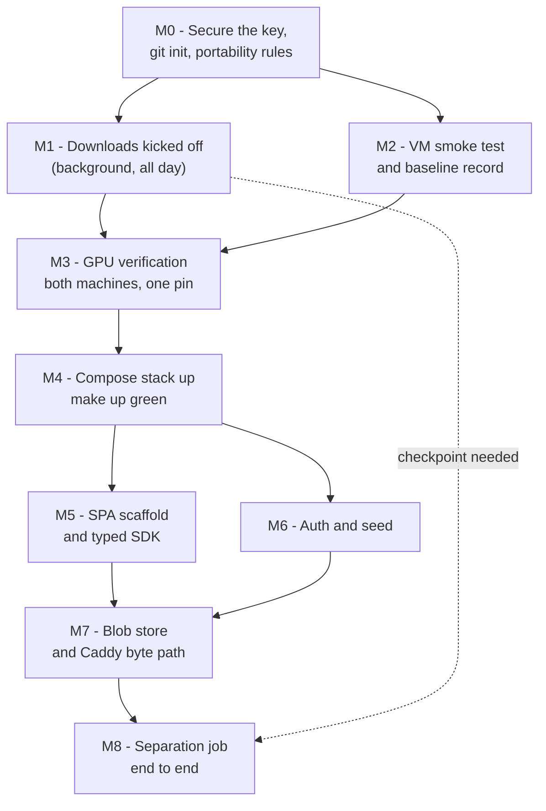

# Elums — Implementation Plan, Saturday Oct 3, 2026

**Day 1 of 10. Budget: 8 hours. Topology: local-first.**

Scope is fixed by the *Sat Oct 3 — Foundation* section of [ELUMS_BUILD_SCHEDULE.md](ELUMS_BUILD_SCHEDULE.md). Architecture is fixed by [ELUMS_TECHNICAL_APPROACH.md](ELUMS_TECHNICAL_APPROACH.md). Nothing below adds scope beyond that checklist.

Where the planning documents and the observed machines disagree, the disagreement is recorded in [§3](#3-contradictions-and-outdated-assumptions) rather than resolved silently. **§3.1 is the most important section in this document** — the Smule box is not the machine either planning document describes, and that has consequences on Oct 11 and Oct 12 that must be decided before then.

---

## 1. Objectives and acceptance criteria

The schedule's stated end state: *"`make up` is green, you can log in as a seeded user, and uploading an MP3 returns a vocal stem and an instrumental. The VM is verified and downloading in the background."*

Today's checklist, verbatim from the schedule, with its owning milestone:

- [ ] First 30 min: kick off the local inference-weight downloads → **M1**
- [ ] VM smoke test, 30 min → **M2**
- [ ] Start GTSinger + NanoPitch-PreExtract on the VM inside `tmux`, then detach → **M1**
- [ ] Confirm Cursor Remote-SSH connects to the VM → **M2**
- [ ] Work the portability disciplines checklist → **M0, M4** (distributed; see [§6.0](#m0--secure-the-key-initialize-the-repository-set-the-portability-rules))
- [ ] Local GPU verification: CUDA ≥12.8 wheel, arch in `get_arch_list()`, force a real kernel launch → **M3**
- [ ] Scaffold: compose with `api`/`worker`/`gpu-worker`/Postgres 18/Valkey/Caddy; Vite 8 + React 19; FastAPI + SQLAlchemy 2 async + Alembic; Procrastinate; `@hey-api/openapi-ts` in the Vite build; `make up` → **M4, M5**
- [ ] Auth + seed: opaque session tokens, Argon2id, 10 demo users with a pre-populated social graph → **M6**
- [ ] Blob store: content-addressed filesystem, `BlobStore` Protocol, Caddy `forward_auth` + `file_server` → **M7**
- [ ] Separation job end-to-end on one song via `python-audio-separator` → **M8**

### Acceptance criteria

Each is a command with an expected result. All twelve must pass to call the day done.

| # | Criterion | Verified by |
| --- | --- | --- |
| A1 | No secret is in git history | `git log -p` contains no private key; `id_ed25519_drexel` is outside the work tree and `.gitignore` covers `*.pem`, `id_*`, `.env` |
| A2 | Local GPU works from the actual GPU image | `sm_86` in `torch.cuda.get_arch_list()` **and** a forced kernel launch returns, inside `elums:gpu` |
| A3 | VM GPU works from the same torch pin | `sm_120` in `get_arch_list()` **and** a forced kernel launch returns, in a venv on the VM |
| A4 | Six compose services reach healthy | `docker compose ps` shows `healthy` for `db`, `valkey`, `caddy`, `api`, `worker`, `gpu-worker` |
| A5 | `make up` is green and idempotent | run twice from a clean tree; the second run is a no-op, not an error |
| A6 | App loads at `http://localhost:8080` | SPA renders; `crossOriginIsolated === true` in the console |
| A7 | Seeded login works end to end | `POST /api/auth/login` with a demo credential, then `GET /api/me` returns that user |
| A8 | Session cookie is correctly scoped and hashed at rest | `Set-Cookie` carries `HttpOnly` and `SameSite=Lax`; `sessions.token_hash` holds a hash and the plaintext appears nowhere |
| A9 | Social graph is present | `GET /api/users/{id}/following` is non-empty for at least 6 of 10 demo users |
| A10 | Upload an MP3 and get two stems | `POST /api/songs` → job succeeds → two `stems` rows (`vocals`, `instrumental`) with distinct blob hashes |
| A11 | Blobs are served by Caddy, not Python, with Range and authz | `curl -r 0-1023` returns `206` with a correct `Content-Range`; an unauthenticated request to a private blob returns `403`; API logs show the authz hit but no byte transfer |
| A12 | Downloads progressing and ML timings logged | VM `tmux` sessions alive and `du -sh` growing; structlog JSON line for the separation job carries `model`, `duration_ms`, `vram_peak_mb` |

---

## 2. Assessment of the current implementation

**There is no application code.** The working tree holds five files and is **not a git repository** (`git rev-parse` → fatal, exit 128). No `AGENTS.md`, no `.cursor/rules`, no `README`, no `Makefile`, no package manifests.

Two things in the tree matter today:

- **`id_ed25519_drexel` and `id_ed25519_drexel.pub` are sitting in the repository root.** Despite the name, this is the Smule VM key — confirmed working against `108.39.26.2:48585`. A naive `git init && git add .` commits a live private key. **M0 handles this before anything else touches git.**
- **`IMPLEMENTATION_PLAN_2026-10-03.md` already existed**, produced by a prior session, and this document replaces it. Its central premise — *"19.7 GB free locally, therefore the VM is the runtime for everything"* — is false: `C:` has **148.4 GB free**. With the disk constraint gone, the build schedule's local-first posture is viable and governs. That reversal also means the VM's limitations (§3.1) do not block today, where under the old plan they would have ended it.

Everything else follows: there are no patterns to reuse, so every convention established today — config loading, logging, error envelope, naming, job shape — is what days 2–10 inherit. The conventions in M4 are chosen for that reason and are deliberately boring.

### Observed hardware

| | Local (`C:\Users\dillo\Documents\GitHub\Elums`) | Smule box (`108.39.26.2:48585`) |
| --- | --- | --- |
| Kind | Windows 11, native | **vast.ai unprivileged Docker container** (not a VM) |
| GPU | RTX 3070, 8192 MiB, `sm_86` | RTX 5060 Ti, **16311 MiB**, cc `12.0` = `sm_120` |
| Driver / max CUDA | 595.95 / 13.2 | 595.58.03 / 13.2 |
| CPU / RAM | 16 logical cores / 32 GB | **128 vCPU / 251 GB** |
| Disk free | 148.4 GB on `C:` | 1.5 TB on `/` (overlay) |
| Container runtime | Docker Desktop installed, WSL2 distro **stopped** | **none — no Docker, no Docker-in-Docker** |
| Python | 3.13.14 | 3.12.3 system, `/venv/main` |
| Present | Node 22.15.0, OpenSSH 9.5p2, `tar.exe`, Compose v5.3.1 | `uv`, `ffmpeg`, `tmux` 3.4, `git` 2.43.0, `supervisor`, `caddy`, partial CUDA 13.2 toolkit (incl. cuBLAS + cuDNN) |
| Absent | `rsync`, `make`, `gh` | `docker`, `postgres`, `valkey`, `node` on non-login `PATH` |

---

## 3. Contradictions and outdated assumptions

Found by inspecting both machines and querying PyPI, npm, Docker Hub, the PyTorch wheel index, the HuggingFace API, and the GitHub API on Oct 3, 2026. Everything labelled *verified* was checked today; everything else is explicitly an assumption.

### 3.1 The Smule box cannot run Docker — and this breaks Oct 11 and Oct 12

This is the finding that matters most, and neither planning document anticipates it.

The machine is a **vast.ai unprivileged container**, and it ships an agent guide at `/etc/vast-agents-guide.md` stating the constraint directly:

> This is an **unprivileged Docker container**, not a VM. You are `root` … but this is *not* full root: you **cannot** load kernel modules, **run another container engine (no Docker-in-Docker)**, use kernel profilers, mount block devices, or change sysctls/cgroups. … manage long-running services with **supervisor** instead of Docker.

Verified: `docker: command not found`. Four things in the planning documents depend on Docker being available there:

- **§13**: *"Deployment. Docker Compose + NVIDIA Container Toolkit (`capabilities: [gpu]` is mandatory), Caddy 2.11 as reverse proxy."*
- **Schedule, Sync and deploy**: `git remote add vm …` with a *"post-receive hook runs `docker compose up -d --build`."*
- **Schedule, Sun Oct 11**: *"Fresh clone on the VM, VM-specific `.env`, `docker compose up -d --build"* — described as *"the one mandatory VM task, and the only thing on this schedule that cannot be deferred."*
- **Schedule, Mon Oct 12**: *"a fresh clone plus a documented `.env` reaches a working app with one command."*
- **Schedule, Sat Oct 3**: `docker run --rm --gpus all nvidia/cuda:13.0-base nvidia-smi` — **this command will fail today.** M2 substitutes an equivalent check.

Three further consequences of the same environment, all verified from the capabilities manifest:

- **`workspace_is_volume: false` → nothing on that box survives a recycle or destroy.** Container storage only; there is no mounted host volume. The schedule already says the VM *"must not hold the only copy of nine days of work"*; the real rule is stronger — **the VM holds no durable copy of anything.** GTSinger and the SSL feature cache are acceptable losses because they are re-downloadable, but code, results, ablation tables, and trained checkpoints must be pushed off-box the moment they exist.
- **All five normal external ports are already in use** (22→48585, 1111→48511 Instance Portal, 6006→48228 Tensorboard, 8080→48162 Jupyter Terminal, 8384→48289 Syncthing), plus one self-mapped port 72299→48355. **No new external port can be allocated at runtime.** This does *not* break the access story: the guide recommends exactly what §13 already chose — `ssh -L 8080:127.0.0.1:<app_port>`, which lands on container-localhost, bypasses the portal's auth edge, needs no token, and exposes nothing publicly. §13's claim that *"the `ssh -L 8080` access pattern is an asset, not a problem"* survives intact.
- **A Caddy is already running** as the instance portal edge (`/opt/instance-tools/bin/caddy`, managed by supervisor, reading `/etc/portal.yaml`). The app's own Caddy must bind a distinct container-internal port and must not be confused with it. Do not stop `caddy`, `instance_portal`, or `tunnel_manager`.

**Does this block today? No.** The user has chosen local-first, Docker Desktop is installed locally, and the Saturday checklist's only VM items are a smoke test and background downloads. **It blocks Sunday Oct 11.** Three resolutions exist, and the choice is the user's, not the implementing agent's — see **MA-3** in §4. Today's job is only to avoid foreclosing any of them, which the portability disciplines already accomplish: `pathlib` everywhere, every root from an env var, `uv`-managed dependencies that install identically inside or outside a container, and no logic that lives only in a `Dockerfile`.

### 3.2 The torch wheel index is `cu130`, and one pin must satisfy two architectures

The schedule says *"install torch with a CUDA ≥12.8 wheel (cu130 covers your card and the VM's)."* Verified directly against `download.pytorch.org` (cp313 builds):

- `whl/cu128/torch/` — stops at **2.11.0**, confirming §11.6's claim that cu128 wheels were dropped at 2.12.
- `whl/cu130/torch/` — carries **2.12.0 through 2.14.1**.
- `whl/cu126/torch/` — also carries 2.14.1, but §11.6 states it has no Blackwell kernels.

The VM's own manifest independently confirms the requirement: `compute_capability: "12.0"`, `min_cuda_for_wheels: "12.8"`, `driver_max_cuda: "13.2"`. A CUDA 13.x build runs natively on a 13.2 driver, so no forward-compat shim is involved (`forward_compat.enabled: false`, which the guide says is the correct state here).

**Decision: pin `torch==2.14.1` from `https://download.pytorch.org/whl/cu130`, one pin for both machines.** This is the schedule's *"one CUDA wheel for both machines"* discipline, and it is only satisfied if **the same wheel yields `sm_86` locally and `sm_120` on the VM** — which is why A2 and A3 are separate criteria rather than one. Assume, do not assert, that the cu130 build includes `sm_86`; **M3 is the check, and it is cheap.**

**Documented fork:** if the cu130 arch list omits `sm_86`, the two machines need different pins. Prefer keeping cu130 for the GPU image (Blackwell is the deployment target) and let the local box run that same image — the 3070 would then need `whl/cu126` or `whl/cu128` locally, which costs the one-wheel property and must be recorded as a deviation.

### 3.3 The PyPI package is `audio-separator`, not `python-audio-separator`

§5 and today's checklist both name `python-audio-separator`. That is the **GitHub repository** (`nomadkaraoke/python-audio-separator`; verified MIT, 1,399 stars, via the GitHub API). The installable distribution is **`audio-separator`, version 0.47.0** — verified on PyPI. Extras: `cpu`, `dml`, `gpu`.

Two install notes:

- Install torch from the cu130 index **first**, so `audio-separator`'s `torch>=2.3,<3` requirement is already satisfied and pip does not substitute a default-index build.
- Prefer **`audio-separator[cpu]` plus the explicit cu130 torch** over `[gpu]`. Mel-Band RoFormer is a torch model; the `[gpu]` extra pulls `onnxruntime-gpu`, which drags a second CUDA runtime into the process for no benefit. Only add `[gpu]` if a checkpoint we actually need demands ONNX.

### 3.4 Separation on an 8 GB card is the day's real technical risk

§5 measures full Mel-Band RoFormer at 27–41 s per song on an RTX 4000 Ada **16 GB**. The schedule flags the fit: *"Separation at ~7 GB is the one tight fit on 8–12 GB. If it will not hold, turn `--mdxc_segment_size` down — slower, but it fits. Find this out today, not Sunday."*

The local card is 8192 MiB and is simultaneously driving the Windows desktop compositor, so usable VRAM is meaningfully below 8 GB. **Plan for this rather than discovering it:** start at a reduced segment size, measure `torch.cuda.max_memory_allocated()`, and only raise it if there is headroom. M8's failure table makes OOM a first-class, handled outcome. The documented escape hatch is running separation on the VM's 16 GB card, which costs the local-first property for one stage and is strictly better than losing the day.

### 3.5 The planning documents disagree about when the Smule emails go out

§14 of the approach document puts *"Email `damp-edu@smule.com`; request a written NanoPitch license grant"* on **Day 0**. The build schedule moves both to **Mon Oct 5, first 30 minutes**, drafted Sunday evening.

**The build schedule governs** — it is the operative daily plan and it says *"Do not plan around the reply."* No email work is scheduled today. Flagged only because reply latency is pure wall-clock; see the optional **MA-4**.

### 3.6 Python version drift between the two machines

Local is 3.13.14; the VM's system Python is 3.12.3. Neither planning document pins a version. The dependency intersection that decides it: `whisperx` requires `<3.14`, `librosa` 1.0 requires `>=3.12`, `audio-separator` 0.47.0 excludes 3.14.1.

**Pin Python 3.13 everywhere**, in `pyproject.toml` (`requires-python = ">=3.13,<3.14"`) and in the image (`python:3.13-slim`, verified published). On the VM, `uv` is already installed and will fetch a 3.13 interpreter for a project venv rather than using the 3.12 system Python — so the drift costs nothing provided no script ever calls bare `python3` there.

### 3.7 Non-interactive SSH on the VM has a different environment

The agent guide is explicit: Node lands on `PATH` only via nvm in an *interactive login shell*, and `$WORKSPACE` / `HF_HOME` are likewise shell-sourced. Verified — `ssh elums-vm 'echo $WORKSPACE'` returns empty.

**Rule for every VM command in this plan and after it:** use `ssh elums-vm 'bash -lc "…"'`, or set the variables explicitly in the command. A script that works when pasted into an interactive session and fails when invoked over `ssh` is a confusing hour, and it will happen on Tuesday night if it is not written down now.

### 3.8 Version drift in the approach document (none blocking today)

Verified latest versus what §4/§13 assert. Recorded so later days do not inherit a stale pin:

- **`wavesurfer.js` 8.x** — §13 pins 7.12.7. The *"pass `peaks` + `duration` with no `url`"* claim is a v7 observation. Re-verify on v8 or pin `^7.12.7`. Needed Tue Oct 6.
- **`librosa` 1.0.0** — a major bump from 0.10.x. §7.4's `librosa.pyin` reference is a 0.10 API. Re-verify before Sat Oct 10.
- **`pgvector` on PyPI is the Python client**, a different artifact from the Postgres *extension* version §8.3 cites. Do not conflate them when pinning.
- **TypeScript is at 7.0.2.** `@hey-api/openapi-ts@0.99.0` declares a peer range satisfied by 7.x, but its generated output has not been checked against the TS 7 compiler. If it fails to typecheck, pin TS 6.x and record the downgrade (M5).
- Verified as stated: `procrastinate` 3.10.0, `sqlalchemy` 2.1.3, `alembic` 1.20.0, `argon2-cffi` 25.1.0, `pydantic-settings` 2.15.0, `structlog` 26.1.0, `psycopg` 3.3.6, `soundfile` 0.14.0, `fastapi` 0.142.2, `uvicorn` 0.54.0, `vite` 8.3.2, `react` 19.3.0. Images `pgvector/pgvector:pg18`, `valkey/valkey:9.1-alpine`, `caddy:2.11`, `python:3.13-slim` all published.
- **HuggingFace access is not a risk**: `GTSinger/GTSinger`, `smulelabs/NanoPitch-PreExtract`, and `laion/larger_clap_music_and_speech` all return `gated: false, private: false`. No token, no access request. Given how much of §11.1 is about datasets disappearing, this is worth having confirmed.
- **Licensing spot-check**, supporting risk 12: `nomadkaraoke/python-audio-separator` = MIT; `smulelabs/smule-renaissance` = MIT; `smulelabs/NanoPitch` = `NOASSERTION` (6 stars); `openmirlab/all-in-one-infer` = `NOASSERTION` (27 stars). All four match §2 and risk 10 exactly as written.

---

## 4. Manual actions required from you

One is blocking today. One is a decision needed before Oct 11. The rest are optional.

### MA-1 — Start Docker Desktop (blocks M3 onward, i.e. most of the day)

Docker Desktop is installed at `C:\Program Files\Docker\Docker\Docker Desktop.exe`, but the `docker-desktop` WSL2 distro is **Stopped** and the daemon is unreachable. The agent can launch the executable, but Docker Desktop may require an interactive session for its first-run prompts, license acceptance, or an update.

1. Start Docker Desktop and wait for the whale icon to settle.
2. Confirm **Settings → Resources → WSL Integration** is enabled, and that **Settings → Resources** allots at least 16 GB memory and 8 CPUs (local has 32 GB / 16 cores). The default allocation is often too small for Postgres plus a torch image.
3. Tell the agent when it is up.

*Why this and not "run it on the VM":* the VM cannot run Docker at all (§3.1), and today's topology is local-first by your decision.

### MA-2 — Decide the source of the test MP3 (blocks A10 only)

Separation needs real content with a sung lead. Either point the agent at a local file, or approve it downloading one Creative Commons track with vocals from the Free Music Archive or ccMixter into `data/samples/`.

**Default assumption if you say nothing: the agent downloads a CC-licensed track** and records the title, source URL, and license in `data/samples/README.md`. That is preferable anyway — it keeps Oct 12's clean-checkout demo reproducible without a licensing question.

### MA-3 — Decide how the Smule box gets deployed to (blocks Sun Oct 11, not today)

Because of §3.1 there is no `docker compose up` on that machine. Three options; the agent will not choose one:

- **(a) Native deployment under supervisor.** Install Postgres and Valkey from apt, run the API and workers from a `uv` venv, add supervisor service definitions, and reach it through `ssh -L`. Keeps Docker Compose as the *deliverable* contract — which is what §13 says Smule actually evaluates, *"source code Smule stands up internally"* — while the demo host runs natively. Costs roughly 2.5–3 h on Oct 11 against the 1.5 h budgeted.
- **(b) Ask Smule for a VM instance or a DinD-enabled template.** The vast.ai guide notes VM instances exist as *"the exception, not the default."* Clean, but it is a request with unknown latency, it re-opens the Oct 5 email plan, and everything downloaded to the current box would need re-downloading.
- **(c) Demo from the local Docker stack** and document the VM as dataset/training capacity only. Cheapest, but it abandons *"record a demo walkthrough video against the VM deployment, not local"* (Oct 12) and weakens the deployment story.

**Recommendation: (a), with (b) raised in Monday's product email as a question rather than a blocker.** Deciding by Sunday evening is sufficient; deciding today is better, because (b)'s latency only shrinks.

### MA-4 — Optional, ~5 minutes: send the NanoPitch license request today

Per §3.5 the schedule puts this on Monday and the agent will not act on it. Sending the Smule Labs license-grant request now buys two days of wall-clock for free. Blocks nothing — SwiftF0 (MIT) is wired in behind the same interface on Thu Oct 8 regardless (risk 13).

### Explicitly NOT needed from you today

- **An OpenRouter API key.** No LLM call sites exist until Fri Oct 9. The agent adds `OPENROUTER_API_KEY=` to `.env.example` as a placeholder.
- **A GitHub remote.** Today's repository is local history. Oct 12's clean-clone check needs a remote eventually; the agent records it as a loose end rather than asking for credentials now.
- **Anything to do with the SSH key.** Verified working. M0 relocates it safely.

---

## 5. Early checks that could invalidate the approach

Ordered by how much of the day each would cost. The first four resolve inside M2 and M3, which is why they are scheduled first.

| # | Check | Why it matters | If it fails |
| --- | --- | --- | --- |
| EC-1 | Docker daemon up, WSL2 GPU passthrough works: `docker run --rm --gpus all nvidia/cuda:13.0-base nvidia-smi` **locally** | Everything from M4 on runs in containers; WSL2 GPU passthrough is a separate mechanism from the Windows driver and can be broken independently | Fix WSL integration / `wsl --update`. If GPU passthrough is genuinely unavailable, run `gpu-worker` outside Docker via `uv run` locally and record the deviation; the other five services are unaffected |
| EC-2 | `sm_86` in `get_arch_list()` from `torch==2.14.1+cu130`, **plus a forced kernel launch**, inside `elums:gpu` | §11.6's named trap: `is_available()` returns `True` on a wheel with no matching kernels and dies at the first op. Also settles §3.2's one-wheel question | Split the pin per machine (§3.2 fork) and record the loss of the one-wheel discipline |
| EC-3 | `sm_120` in `get_arch_list()` from the same pin, in a venv on the VM | The deployment target's architecture; risk 2 | cu130 is already the newest index. Escalate — this would mean the VM is unusable for GPU work and the whole training plan moves |
| EC-4 | Separation completes on the 8 GB local card, and at what segment size and peak VRAM | §3.4. Calibrates Sun–Tue, which are budgeted against §5's ~110 s per 4-minute song | Reduce `--mdxc_segment_size` further; if it still will not fit, move the separation stage to the VM and record it |
| EC-5 | `audio-separator --list_models` actually offers a vocals Mel-Band RoFormer checkpoint, and its **exact filename** | §5 names *"Kimberley Jensen's `vocals_mel_band_roformer` checkpoint"* with no filename. **Unverified** — read it off the live model list, do not guess | Fall back to the next-best MB-R vocals entry and record the substitution. `smulelabs/windowed-roformer` is the documented alternative (§5) |
| EC-6 | COOP/COEP headers in Caddy do not break the SPA build or the generated SDK | §10.5: multi-threaded WASM silently collapses to one thread without cross-origin isolation, and a CDN asset lacking CORP is the most common way adoption fails | Back the headers out to Wed Oct 7 where they are actually required, and record it. One line of Caddyfile either way |
| EC-7 | Long VM downloads survive SSH disconnection | Losing a 54 GB download at hour 6 costs Friday's training, not today | Never run a download in a foreground `ssh`. `tmux` from the first command in M1 |
| EC-8 | `make` is available, or a shim is | Both planning documents and every acceptance criterion say `make up`; `make` is **not installed** locally | `winget install ezwinports.make`. Fallback: a ~20-line `make.ps1` forwarding to the same `docker compose` commands, with the `Makefile` remaining the single source of truth for the deliverable |

---

## 6. Milestones

Dependency order. M1 starts early and runs in the background all day. M5 and M6 are independent of each other and can be swapped if one fights.



Rough clock, for pacing rather than prescription: M0 0:00–0:20 · M1 0:10–0:40 (then background) · M2 0:40–1:10 · M3 1:10–1:55 · M4 1:55–3:25 · M5 3:25–4:25 · M6 4:25–5:40 · M7 5:40–6:25 · M8 6:25–8:00.

---

### M0 — Secure the key, initialize the repository, set the portability rules

**Outcome:** a git repository that cannot leak the VM key, with the schedule's portability disciplines encoded as files rather than intentions.
**Prerequisites:** none. **This runs first, before any `git add`.**

**Key quarantine, in this order:**

1. Create `C:\Users\dillo\.ssh` (it does not exist — verified).
2. **Move** (not copy) `id_ed25519_drexel` and `id_ed25519_drexel.pub` there as `smule_vm` / `smule_vm.pub`.
3. Restrict the ACL, or OpenSSH will eventually refuse it with `UNPROTECTED PRIVATE KEY FILE`:
   `icacls C:\Users\dillo\.ssh\smule_vm /inheritance:r /grant:r "$($env:USERNAME):(R)"`
4. Write `~/.ssh/config` with **two** hosts (below), then re-verify access before deleting anything.

```sshconfig
Host elums-vm
    HostName 108.39.26.2
    Port 48585
    User root
    IdentityFile C:/Users/dillo/.ssh/smule_vm
    ServerAliveInterval 30
    ServerAliveCountMax 6

Host elums-tunnel
    HostName 108.39.26.2
    Port 48585
    User root
    IdentityFile C:/Users/dillo/.ssh/smule_vm
    LocalForward 8080 127.0.0.1:8080
    ServerAliveInterval 30
```

Two hosts, not one, because a single entry carrying `LocalForward` makes every scripted `ssh` try to bind 8080 and fail once a tunnel is already open. `elums-vm` runs commands; `elums-tunnel` is the long-lived browser tunnel (`ssh -N elums-tunnel`). Note the command in Smule's email includes `-N`, which means *do not execute a remote command* — dropping it is what yields an interactive shell.

**Then `git init`**, with `.gitignore` written *before* the first `git add`, covering at minimum: `.env`, `data/`, `models/`, `node_modules/`, `__pycache__/`, `.venv/`, `frontend/dist/`, `*.pem`, `id_*`, `*.key`. First commit is the three planning documents only; verify with `git status` that nothing else is staged.

**Portability disciplines, encoded as files** (schedule, *Portability disciplines*):

- **`.gitattributes` with `* text=auto eol=lf`** — without it, CRLF turns shell scripts into `bad interpreter` errors the first time they run on Linux. This must land in the first commit, because fixing line endings retroactively rewrites every file.
- **No absolute Windows paths, ever.** `pathlib` throughout; every root (`BLOB_ROOT`, `MODEL_ROOT`, `DATA_ROOT`, `HF_HOME`) comes from `Settings`, never a literal.
- **Case-sensitivity discipline.** Windows is case-insensitive, Linux is not. All modules lowercase `snake_case`; no module differing from another only by case.
- **Everything machine-specific in `.env`**, with `.env.example` committed and annotated.

**Validation:** `git log -p` shows no key material; `ssh elums-vm 'echo ok'` still returns `ok` from the relocated key; `git check-ignore -v .env data models` resolves.
**Completion:** A1 passes; commit `M0: repository init + portability disciplines`.

---

### M1 — Download kickoff

**Outcome:** every weight and dataset the next nine days need is downloading, ordered so nothing today waits on anything large.
**Prerequisites:** M0 (for the SSH config). Start inside the first 30 minutes — this is wall-clock, not working hours.

Two rules: **order by when it is needed, not by size**, and **never run a VM download in a foreground `ssh`** (EC-7).

**Local — inference weights (~20 GB total), per the schedule's background-jobs calendar.** These live under `./models` with `HF_HOME` pointed into it, so the GPU container sees them via one bind mount and a rebuild never re-downloads.

| Order | Artifact | Approx | First needed |
| --- | --- | --- | --- |
| 1 | Mel-Band RoFormer vocals checkpoint | ~1 GB | **today (M8)** |
| 2 | `all-in-one-infer` checkpoints | ~1 GB | Sun Oct 4 |
| 3 | Whisper `large-v3-turbo` + WhisperX align model | ~2 GB | Mon Oct 5 |
| 4 | RMVPE | <1 GB | Tue Oct 6 |
| 5 | LAION-CLAP `larger_clap_music_and_speech` | ~2 GB | Tue Oct 6 |

Item 1 is the only one M8 depends on, so it runs first and synchronously; resolve **EC-5** here by reading the filename off `audio-separator --list_models --list_filter=roformer` rather than guessing, and record it in config. While there, re-check §5's claim that the checkpoint was *"relicensed from GPL-3.0 to MIT in April 2026"* against the model's own source, and note the result in the licensing audit — risk 12 is specifically about NC and GPL weights reaching the product.

**VM — training datasets, in `tmux`.** This is also the schedule's designated tmux practice run.

| Artifact | Approx | First needed |
| --- | --- | --- |
| `smulelabs/NanoPitch-PreExtract` | 3.64 GB | Thu Oct 8 |
| `GTSinger/GTSinger` | 54 GB | Fri Oct 9 |

Both verified **ungated and public**, so no token and no access request. Invoke as `ssh elums-vm 'bash -lc "tmux new -d -s dl-gtsinger …"'` per §3.7, with `HF_HOME` set explicitly in the command rather than inherited. `hf download` resumes, so wrap each step so a rerun after a dropped connection skips what is complete rather than re-pulling 54 GB.

**Record the ephemerality.** Per §3.1 the VM has no volume. Note in `docs/vm-baseline.md` that both datasets are re-downloadable and therefore an acceptable loss on recycle — and that nothing non-reproducible may be left there.

Both halves go in `scripts/download_weights.sh` (local) and `scripts/download_datasets.sh` (VM), both idempotent and resumable.

**Validation:** `ssh elums-vm 'tmux ls'` shows live sessions; `du -sh` on the HF cache grows between two checks ten minutes apart; local `./models` contains the separation checkpoint and it loads.
**Completion:** local item 1 verified loadable; everything else in flight behind a resumable script. Contributes to A12.

---

### M2 — VM smoke test and baseline record

**Outcome:** a written record of what the Smule box actually is, and confirmation that the two things Tuesday night depends on — tmux and Remote-SSH — work.
**Prerequisites:** M0.

The schedule's framing is exactly right: *"Defer the work, not the verification — the worst outcome is discovering Tuesday night that the driver is broken."* Most of this is already done; the milestone is to re-run it reproducibly and write it down.

**The schedule's command list, corrected for §3.1.** `docker run --rm --gpus all nvidia/cuda:13.0-base nvidia-smi` **will fail — there is no Docker.** Substitute the equivalent evidence:

- `nvidia-smi` — GPU present, driver version. *Expected: RTX 5060 Ti, 16311 MiB, 595.58.03.*
- `vast-capabilities | jq '.hardware.gpu.cuda'` — the authoritative CUDA inventory. *Expected: `compute_capability: "12.0"`, `min_cuda_for_wheels: "12.8"`, `driver_max_cuda: "13.2"`, `cudnn: true`, `cublas: true`.*
- `vast-capabilities | jq '.instance.workspace_is_volume'` — *expected `false`; this is the ephemerality finding and must be recorded, not just observed.*
- `vast-capabilities | jq '.instance.open_ports'` — the port inventory, so Oct 11 does not rediscover that none are free.
- `df -h`, `nproc`, `free -g`, `git --version`, `tmux -V`, `ffmpeg -version`, `uv --version`.
- GPU verification proper is **M3**, not here.

**Two live checks the schedule names and recon has not covered:**

- **Cursor Remote-SSH connects.** *"If it is going to be a problem, find out today."* Requires the `elums-vm` host entry from M0.
- **tmux detach/attach round-trip.** `tmux new -s probe` → start something → `Ctrl-B D` → `tmux attach -t probe`. M1's downloads are the real exercise; this is the deliberate ten minutes of practice the schedule asks for.

**Validation:** `docs/vm-baseline.md` exists and contains each command's actual output, not a summary. Remote-SSH opens a file tree. `tmux ls` survives a disconnect.
**Completion:** EC-3's prerequisites are in place, EC-7 is proven, and §3.1's three constraints (no Docker, no volume, no free ports) are recorded in the repository rather than in this plan only. Commit `M2: VM baseline`.

---

### M3 — GPU verification on both machines, from one torch pin

**Outcome:** proof that the pinned wheel produces working kernels on `sm_86` locally and `sm_120` on the VM. This is the day's highest-value 45 minutes.
**Prerequisites:** M1 (torch installed), MA-1 (local Docker up), EC-1.

§11.6's trap is specific and expensive: `torch.cuda.is_available()` returns `True` on a wheel with no matching kernels and dies the instant a kernel runs. The assertion therefore has two halves and both must run **at container start**, not in a notebook:

```python
# scripts/verify_gpu.py — also imported by the gpu-worker entrypoint
expected = os.environ["EXPECTED_SM_ARCH"]          # sm_86 locally, sm_120 on the VM
assert expected in torch.cuda.get_arch_list(), torch.cuda.get_arch_list()
torch.zeros(8, device="cuda").add_(1).cpu()         # force a real kernel launch
```

Taking the expected arch from the environment rather than hardcoding `sm_120` is what makes one script serve both machines — and it is the difference between the one-wheel discipline being verified and being assumed.

**Image decisions, with reasons:**

- **Base `python:3.13-slim`, not `nvidia/cuda`.** The cu130 wheels bundle their own CUDA runtime and cuDNN as pip dependencies, so the multi-gigabyte devel image buys nothing and costs build time on every iteration. (`nvidia/cuda:13.x-*-ubuntu24.04` is the fallback only if a wheel turns out to need system CUDA.)
- **Install torch explicitly from the cu130 index before anything else** (§3.2, §3.3), so no later resolution silently swaps it.
- **Skip `flash-attn` and `xformers` entirely**, per §11.6 — sequences are short and `scaled_dot_product_attention` suffices. Avoiding them also avoids a long `nvcc` step in the Dockerfile.
- **`PYTORCH_CUDA_ALLOC_CONF=expandable_segments:True`** in the image, per §11.6.
- **Multi-stage `Dockerfile`, two targets:** `app` (no torch — keeps `api` and the CPU worker small and fast to rebuild) and `gpu` (torch + audio stack), sharing one `pyproject.toml` with dependency groups. `uv` for resolution and install, since it is already on the VM and makes the native-deployment option in MA-3 cheap.

**Validation:**
- Local: `docker compose run --rm -e EXPECTED_SM_ARCH=sm_86 gpu-worker python scripts/verify_gpu.py` → exit 0, prints the arch list and `torch.version.cuda` (expected `13.0`). **(A2)**
- VM: `ssh elums-vm 'bash -lc "cd /srv/elums && uv run --python 3.13 python scripts/verify_gpu.py"'` with `EXPECTED_SM_ARCH=sm_120` → exit 0. **(A3)**

A failure on either side is EC-2 / EC-3 and takes priority over every remaining milestone.
**Completion:** both arch lists recorded in `docs/vm-baseline.md`; commit `M3: GPU verified on both architectures`.

---

### M4 — Compose stack up, `make up` green

**Outcome:** six services healthy, schema migrated, a health endpoint that genuinely checks its dependencies, and the conventions days 2–10 inherit.
**Prerequisites:** M3.

**Services and pinned images** (all tags verified published):

| Service | Image | Role |
| --- | --- | --- |
| `caddy` | `caddy:2.11` | The only published port (8080). Serves the SPA, proxies `/api`, owns the blob byte path |
| `db` | `pgvector/pgvector:pg18` | Postgres 18 + pgvector in one image, so §8.3 needs no later base-image migration |
| `valkey` | `valkey/valkey:9.1-alpine` | Sessions, leaderboards, pub/sub (§4). BSD-3, not Redis's AGPL/SSPL |
| `api` | `elums:app` | FastAPI + uvicorn. Publishes no host port |
| `worker` | `elums:app` | Procrastinate, `--queues=cpu` |
| `gpu-worker` | `elums:gpu` | Procrastinate, `--queues=gpu --concurrency=1`, `capabilities: [gpu]` |

`gpu-worker` is pinned to one replica and holds the only CUDA context (§3). Its `concurrency=1` and Procrastinate's named lock are two independent guards on the same invariant; §11.6 asks for both, so keep both.

**Conventions established here.** Each becomes a pattern, so each is deliberately minimal:

- **Config** — `elums/config.py`, one pydantic-settings `Settings` class read from the environment. `.env.example` committed, `.env` gitignored. §6's *"config-as-data for every threshold"* carries over from SecondPass, so thresholds get a separate YAML file later; today only infrastructure settings exist.
- **Logging** — structlog JSON from line one, per the schedule's *"log token counts and GPU timings from day one."* Every line carries `request_id`; job lines add `job_id`; ML lines add `model`, `duration_ms`, `vram_peak_mb` (§13). This is what makes Oct 11's cost ledger a query rather than archaeology, and it is an hour of work with the highest signal on the list.
- **IDs** — `uuidv7()` as a server-side column default, native in PG18. Time-ordered without random-UUID write amplification (§4).
- **DB access** — SQLAlchemy 2.1 async with `psycopg` 3.3, declarative models, Alembic migrations.
- **Error shape** — one JSON envelope, `{"error": {"code", "message", "detail"}}`, from a single exception handler, so the generated TypeScript SDK gets one error type instead of ten.

**Job infrastructure.** Procrastinate 3.10.0. Its schema is applied by `procrastinate schema --apply` and is **not** Alembic-managed, so `make migrate` must run both in order: Alembic first, then Procrastinate. Establish the `lock="gpu:separation"` convention now (§4) — it is the durable GPU semaphore and the reason Procrastinate was chosen over Celery.

**Design `ingest_jobs` today even though only one stage exists.** It is the coordination point with Sunday's *"Procrastinate job chain with the step-indexed progress the UI will poll."*

| Column | Notes |
| --- | --- |
| `id` | `uuidv7()` |
| `song_id` | FK |
| `stage` | enum: `separate`, `structure`, `lyrics`, `align`, `f0`, `notes`, `embed`. **All seven values exist today; only `separate` is implemented** |
| `status` | enum: `pending`, `running`, `succeeded`, `failed` |
| `step_index` / `step_total` | the progress the UI polls |
| `message` | short human-readable current action |
| `error` | null unless `failed` |
| `started_at` / `finished_at` | timings |

Declaring all seven stages now means Sunday adds rows, not a migration plus a UI change.

**`make up` must be idempotent**, since A5 runs it twice: `docker compose up -d --build`, wait for health, `make migrate`, `make seed`. Alembic is idempotent by nature; M6's seed uses fixed UUIDs and upserts. Resolve **EC-8** here.

**Validation:** `docker compose ps` → six `healthy`. `curl -s localhost:8080/api/healthz` → `{"status":"ok","db":"ok","valkey":"ok"}`, where the endpoint actually round-trips a `SELECT 1` and a Valkey `PING` rather than returning a constant. `make up` twice is clean. `docker compose logs api | head` shows JSON lines, not plaintext.
**Completion:** A4 and A5 pass; commit `M4: compose stack green`.

---

### M5 — SPA scaffold and the typed SDK

**Outcome:** a Vite 8 + React 19 SPA served by Caddy at `:8080`, a TypeScript client generated from the API's own OpenAPI document, and cross-origin isolation already proven.
**Prerequisites:** M4.

**Stack:** `vite@8.3.2`, `react@19.3.0`, `@hey-api/openapi-ts@0.99.0`, TypeScript 7.0.2 (see §3.8 — downgrade and record if generated output fails to typecheck). Set `build.target: 'esnext'` and **do not** add `vite-plugin-top-level-await`: per §13, Vite 8.1+ has native `.wasm` ESM imports and that plugin is broken under Rolldown.

**The codegen decision worth making explicitly.** `@hey-api/openapi-ts` wants an OpenAPI document at build time, which naively means a running API — a circular dependency that would break Oct 12's *"clone to a fresh directory and verify `make up` from zero."* Resolution: **`make openapi` dumps `openapi.json` by calling `app.openapi()` in-process, with no server running, and the file is committed.** Codegen reads the file. The API stays the single source of truth (§3), the frontend builds from a cold checkout, and a stale SDK is caught by a regenerate-and-diff check rather than a runtime surprise.

**COOP/COEP goes in today**, even though `SharedArrayBuffer` is not needed until Wed Oct 7. §10.5 names this the most common adoption failure and the failure mode is silent: *"multi-threaded WASM silently collapses to one thread without cross-origin isolation."* Add `Cross-Origin-Opener-Policy: same-origin` and `Cross-Origin-Embedder-Policy: require-corp` in the Caddyfile and **self-host every asset** — no CDN fonts, no external scripts; a CDN asset without CORP is precisely the trap. Surface `crossOriginIsolated` on a `/diagnostics` route, which grows into Thursday's full diagnostics screen and today shows four booleans. This is **EC-6**: if it breaks the build, back the headers out to Wednesday and record it, since the cost is one line either way.

**Scope discipline:** a login form, a song-upload form with a job-progress poll, and `/diagnostics`. No design system, no router beyond three routes, no state library. Today's UI exists to prove A6, A7, and A10.

**Validation:** `make build-frontend` produces `frontend/dist`; Caddy serves it at `http://localhost:8080`; the console reports `crossOriginIsolated === true`; the generated client compiles and a generated call to `/api/healthz` returns the typed object.
**Completion:** A6 passes; `openapi.json` committed; commit `M5: SPA + typed SDK`.

---

### M6 — Auth and seed data

**Outcome:** you can log in as a demo user and see a populated social graph. §9 budgets this at *"half a day, ~250 lines, zero new services"* — hold it to that.
**Prerequisites:** M4. Independent of M5, so the two can be reordered if the frontend fights.

**Session design, per §9** — opaque tokens, not JWTs:

- Token: `secrets.token_urlsafe(32)`. Store **only** `sha256(token)` hex in `sessions.token_hash`; the plaintext exists in the cookie and nowhere else. Revocation is a `DELETE`.
- Passwords: Argon2id via `argon2-cffi` 25.1.0 at library defaults. Never log or return a hash.
- Routes: `POST /api/auth/login`, `POST /api/auth/logout`, `GET /api/me`, and `GET /api/users/{id}/following` for A9.

**One cookie detail that will silently break a later demo.** §9 specifies `HttpOnly; Secure; SameSite=Lax`. But the eventual deployment is **plain HTTP over an SSH tunnel** (§13). Chrome permits `Secure` cookies on `http://localhost` specifically, which is fine today, but the named Cloudflare Tunnel on Thu Oct 8 changes the origin. Make it a config flag rather than a constant:

```
SESSION_COOKIE_SECURE=false   # true behind the Cloudflare Tunnel (Thu Oct 8), false for ssh -L
```

`HttpOnly` and `SameSite=Lax` are unconditional. Writing this down now avoids a confusing twenty minutes on Thursday.

**Seed**, per §9's *"the difference between 'auth works' and 'I can log in as @dana and see her feed' is most of the perceived quality of a take-home."* `elums/seed.py`, run by `make seed`, **idempotent via fixed UUIDs and upserts** so A5's double `make up` does not duplicate rows. Ten users with handles and avatars, one shared documented demo password, an asymmetric and realistic follow graph (a few hubs, a few one-way follows, nobody isolated), and two or three groups.

**Deferred and stated:** §9 also asks for *"three pre-analyzed performances."* Impossible today — there is no chart until Tue Oct 6 and no analysis until Wed Oct 7. The seed script gets a stage-two function stub and a `TODO` naming the day it unblocks.

**Focused tests** (`tests/test_auth.py`) — meaningful behaviour and failure cases, not coverage theatre:

- correct credential sets a cookie and creates exactly one session row
- wrong password returns 401 and creates no row
- `GET /api/me` returns 401 with no cookie, and 401 with a revoked cookie
- the plaintext token appears nowhere in `sessions`
- logout deletes the row and the same cookie then fails

**Validation:** A7, A8, A9 via `curl -c/-b` against `localhost:8080`, and through the M5 login form.
**Completion:** tests green; commit `M6: auth + seed`.

---

### M7 — Blob store and the Caddy byte path

**Outcome:** content-addressed storage behind a Protocol, with bytes served by Caddy and authorization answered by FastAPI. Per §4: *"keep Python out of the byte path entirely."*
**Prerequisites:** M4 and M6 (authz needs sessions).

**The Protocol** (`elums/blobs/store.py`) — the seam that makes §4's documented ~40-line `S3BlobStore` a later addition rather than a refactor:

```python
class BlobStore(Protocol):
    def put(self, data: BinaryIO, *, content_type: str) -> BlobRef: ...
    def open(self, sha256: str) -> BinaryIO: ...
    def exists(self, sha256: str) -> bool: ...
    def url(self, sha256: str) -> str: ...
    def local_path(self, sha256: str) -> Path | None: ...   # None for non-local backends
```

`local_path` returning `None` is what lets the Caddy fast path degrade to a streaming response on a hypothetical remote backend, instead of the Protocol pretending every store is a filesystem.

**Layout and semantics.** `${BLOB_ROOT}/<ab>/<cd>/<sha256>` — two levels of two-hex-char fanout, so no directory exceeds a few thousand entries. `BLOB_ROOT` comes from `Settings`, never a literal (M0's portability rule). Writes go to a temp file in the same directory and then `os.replace`, which is atomic on one filesystem; a crash mid-write leaves a temp file, never a corrupt blob at a valid hash. Hash while streaming so a large upload is never fully buffered.

Blobs are **immutable and deduplicated by construction**: `put` of identical bytes yields the same `sha256`, and the `blobs` table (`sha256` PK, `size_bytes`, `content_type`, `created_at`) takes the insert as a no-op on conflict. That is §4's free deduplication, and it is why `Cache-Control: immutable` is correct rather than merely convenient.

**The byte path.** Caddy answers `GET /blobs/{ab}/{cd}/{sha}` by asking FastAPI for permission, then serving the file itself:

```caddyfile
handle /blobs/* {
    forward_auth api:8000 {
        uri /internal/blob-authz
    }
    header Cache-Control "public, max-age=31536000, immutable"
    root * /data/blobs
    file_server
}
```

`/internal/blob-authz` receives the original URI and cookie, returns **204** to allow and **403** to deny, and never touches the file. Today's policy is deliberately small: allow if the blob is reachable from a song or take the session may read; allow anonymously if that song is public; else deny. Caddy then handles HTTP Range itself, which is the entire point — §4 wants *"correct HTTP Range handling for audio seeking"* without Python in the loop, and Wednesday's playback and Thursday's phone testing both depend on real Range support. `/internal/*` must be unreachable from outside; Caddy does not proxy it and `api` publishes no host port.

**Upload validation and failure handling.** `POST /api/songs` accepts a multipart audio file and must fail fast and legibly:

- sniff with `ffprobe` rather than trusting the extension or the client's content type; **415** on no decodable audio stream
- cap size and duration from config (30 MB / 10 minutes today); **413** past the limit
- stream to the blob store while hashing; never buffer the whole file in memory
- a duplicate upload of identical bytes returns the existing song rather than erroring — which falls out of content addressing for free

**Focused tests** (`tests/test_blobstore.py`): put/open round-trip; identical bytes produce one hash and one row; `open` on an unknown hash raises a typed error rather than leaking `FileNotFoundError` from the filesystem; a simulated crash between temp write and `os.replace` leaves no blob at the target path.

**Validation:** A11 — `curl -r 0-1023` on a blob returns `206` with a correct `Content-Range`; an unauthenticated request to a private blob returns `403`; `docker compose logs api` shows the authz hit but no byte transfer.
**Completion:** A11 passes; commit `M7: blob store + Caddy byte path`.

---

### M8 — Separation job end to end

**Outcome:** the day's headline — upload an MP3, get a vocal stem and an instrumental, with the GPU semaphore and progress reporting Sunday will extend.
**Prerequisites:** M7, and M1 item 1 complete. MA-2 supplies the audio.

**Resolve EC-5 before writing the call** (see M1), and prefer `audio-separator[cpu]` plus the explicit cu130 torch over `[gpu]`, per §3.3.

**The job, and how it differs from a script.** A bare separation script would satisfy A10 and strand Sunday. Implement the one real stage inside the shape the chain needs:

```python
@app.task(queue="gpu", lock="gpu:separation", retry=2)
async def separate(song_id: UUID) -> None: ...
```

- **`lock="gpu:separation"`** is §4's durable GPU semaphore — Procrastinate serializes every job sharing the lock string, so exactly one separation runs at a time even across worker restarts.
- **Transactional enqueue** is why Procrastinate is here: the `songs` row, the `ingest_jobs` row, and the job itself commit in one transaction, so an orphaned job is impossible.
- **Progress** writes `step_index` / `step_total` / `message` to `ingest_jobs` so M5's poll shows movement. Today `step_total` is 1.
- **Instrumentation** logs `model`, `duration_ms`, and `vram_peak_mb` from `torch.cuda.max_memory_allocated()`, satisfying A12 and feeding Oct 11's ledger.

**VRAM policy, because of §3.4.** Start at a reduced `--mdxc_segment_size` rather than the default, log the measured peak, and only raise it if there is headroom. This is **EC-4**, and the number it produces calibrates Sunday through Tuesday.

**Output contract.** Write both stems as **FLAC**, not WAV — lossless for analysis, roughly half the bytes, and both `soundfile` and ffmpeg read it natively. One `stems` row per output: `song_id`, `kind` (`vocals` | `instrumental`), `blob_sha256`, `sample_rate`, `duration_s`, `created_at`. Keeping stems as first-class rows pointing at immutable blobs is what lets Sunday's `all-in-one-infer` run with `--stems-from-dir` instead of separating again.

**Failure handling** — each case gets a distinct, legible outcome rather than a generic 500:

| Failure | Handling |
| --- | --- |
| Checkpoint not yet downloaded (M1 still running) | **Retry with backoff, do not fail.** Expected to actually happen today, since downloads run concurrently |
| `torch.cuda.OutOfMemoryError` | `empty_cache()`, requeue once at a smaller segment size, then fail with the measured peak in the message. **Likely on the 8 GB card** — this is EC-4's failure path, not an edge case |
| Undecodable or corrupt audio | Fail immediately, **no retry** — a retry cannot help. `status='failed'` with a user-facing reason |
| Job killed mid-run (OOM-killer, restart) | Procrastinate's `SKIP LOCKED` requeues it; because blobs are content-addressed and immutable, a rerun is idempotent and overwrites nothing |

**Integration test** (`tests/test_separation.py`, marked `gpu`): enqueue separation on a **20-second clip**, run the worker in-process, assert two `stems` rows with distinct hashes, two blobs present, `status='succeeded'`, and a non-null `vram_peak_mb`. A short clip keeps this a seconds-long test that can run on every later change; the full-song run is a manual validation, not a test.

**Validation:** A10 and A12. Upload the MA-2 track through the SPA; watch progress; play both stems from `/blobs/...`; listen — the vocal stem should be recognizably isolated. Record wall-clock against §5's **27–41 s per song on an RTX 4000 Ada 16 GB**, noting that the local 3070 is half the VRAM and should be expected to be slower.
**Completion:** all twelve acceptance criteria pass; commit `M8: separation end-to-end — Day 1 foundation complete`.

---

## 7. If the day runs short

The schedule's invariant is *"end every day at a demonstrable state, even if the day's scope shrank."* Today's floor is **M0–M4 plus a working separation path**, because Sunday cannot start without stems and a job runner. Shed in this order, and record each cut:

1. **Caddy `forward_auth` for blobs** → serve blobs from a FastAPI `StreamingResponse` with manual Range support. Costs the "Python out of the byte path" property; recoverable in under an hour on Sunday. Cheapest cut because nothing downstream depends on *who* serves the bytes.
2. **Generated TypeScript SDK** → one hand-written `fetch` wrapper. Costs end-to-end types; `openapi.json` is still committed, so codegen is a later addition rather than rework.
3. **Social graph and groups in the seed** → ten users with no follows. Costs demo texture (A9), not function.
4. **The SPA upload form** → drive M8 with `curl`. The job, the stems, and the blobs all still exist, which is all Sunday needs; only the demo surface is lost.

**Do not cut** M3 (it is the day's whole risk-reduction purpose), M1 (wall-clock only compounds, and Friday's training depends on GTSinger landing), M0's `.gitattributes` and key quarantine (both are far more expensive to fix retroactively), or the `ingest_jobs` stage enum (a Sunday-morning migration costs more than defining it today).

**Escalate rather than improvise** if either of these happens:

- **M3 fails outright** — no working arch on any wheel. Risk 2's fallback is CPU ingest at 3–5× slowdown plus a pre-ingested demo catalog, and that reshapes Sunday through Tuesday. That decision is the user's.
- **EC-4 finds separation cannot fit the 8 GB card at any segment size.** The fix — moving one stage to the VM — partially reverses today's local-first decision and should be confirmed, not assumed.

---

## 8. End-to-end validation checklist

Run top to bottom. This is the demonstration of today's required end state.

**Repository hygiene**

- [ ] `git log -p | Select-String "BEGIN OPENSSH PRIVATE KEY"` → no match **(A1)**
- [ ] `id_ed25519_drexel` no longer in the work tree; `~/.ssh/smule_vm` works via `ssh elums-vm 'echo ok'`
- [ ] `.env`, `data/`, `models/` gitignored; `.env.example`, `openapi.json`, `.gitattributes` committed
- [ ] `git log --oneline` → one commit per completed milestone, each naming it

**Environment**

- [ ] `docker run --rm --gpus all nvidia/cuda:13.0-base nvidia-smi` **locally** → RTX 3070 visible **(EC-1)**
- [ ] `docker compose run --rm -e EXPECTED_SM_ARCH=sm_86 gpu-worker python scripts/verify_gpu.py` → exit 0 **(A2)**
- [ ] `ssh elums-vm 'bash -lc "cd /srv/elums && uv run python scripts/verify_gpu.py"'` with `EXPECTED_SM_ARCH=sm_120` → exit 0 **(A3)**
- [ ] `ssh elums-vm 'tmux ls'` → download sessions alive; HF cache `du -sh` growing **(A12, part)**
- [ ] `docs/vm-baseline.md` records GPU, driver, `workspace_is_volume: false`, port inventory, both arch lists

**Stack**

- [ ] `make up` → six services `healthy` **(A4)**
- [ ] `make up` again → no-op, no errors **(A5)**
- [ ] `curl -s localhost:8080/api/healthz` → `{"status":"ok","db":"ok","valkey":"ok"}`
- [ ] `docker compose logs api | head -5` → structlog JSON carrying `request_id`
- [ ] `docker compose exec db psql -c "select uuidv7()"` → a v7 UUID

**Frontend**

- [ ] `http://localhost:8080` → SPA renders
- [ ] console: `crossOriginIsolated` → `true` **(A6)**
- [ ] `/diagnostics` shows `crossOriginIsolated`, `sampleRate`, `baseLatency`, `outputLatency`

**Auth**

- [ ] login as a demo user → 200, `Set-Cookie` with `HttpOnly` and `SameSite=Lax` **(A7, A8)**
- [ ] `GET /api/me` with that cookie → the user; without it → 401
- [ ] `GET /api/users/{id}/following` → non-empty for ≥6 of 10 users **(A9)**
- [ ] `select token_hash from sessions limit 1` → a hash; the plaintext token appears nowhere

**Ingest**

- [ ] upload the MA-2 MP3 → `ingest_jobs` row at `stage=separate`, progress advances, `status=succeeded`
- [ ] two `stems` rows, `vocals` and `instrumental`, distinct `blob_sha256` **(A10)**
- [ ] both stems play in the browser; the vocal stem is audibly isolated
- [ ] `curl -r 0-1023` on a stem blob → `206` with a correct `Content-Range` **(A11)**
- [ ] unauthenticated request to a private blob → `403`
- [ ] the separation log line carries `model`, `duration_ms`, `vram_peak_mb` **(A12)**
- [ ] `pytest` → green; GPU-marked tests ran rather than skipped

---

## 9. Handoff

Record the day's work in **`PROGRESS.md`** at the repository root, created today and appended to on each subsequent day. Keep it terse and factual; it becomes the raw material for Oct 11's README, limitations list, and AI usage ledger.

For today, record:

1. **Milestone status** — M0 through M8, each `done` / `partial` / `cut`, with one line on why for anything not `done`.
2. **Acceptance criteria** — A1 through A12, pass or fail, pasting actual command output for **A2, A3, A10, and A12** specifically. Those four are the ones later days are most likely to need to re-read.
3. **Hardware and version truth** in `docs/vm-baseline.md` — both GPUs, both arch lists, driver and CUDA versions, the resolved torch wheel index, the VM's port inventory and `workspace_is_volume: false`, and the **exact separation checkpoint filename** chosen in EC-5 together with its verified license.
4. **Measured timings** — separation wall-clock, the segment size used, and `vram_peak_mb`, set against §5's 27–41 s estimate on a 16 GB card. Sunday through Tuesday's 4-hour blocks are budgeted against this number, so if the gap is large, say so plainly.
5. **Deviations from this plan**, each with its reason and its consequence for a later day. Routine details adjusted after seeing the code need no entry. Anything that changes an architectural decision or today's scope does — and should be raised, not merely logged.
6. **Blockers**, each with what is needed, from whom, and which later milestone it blocks.
7. **Loose ends carried forward.** At minimum, expect these:
   - **MA-3's deployment decision for the Smule box** — the largest open item on the project, blocking Sun Oct 11's only mandatory VM task
   - the three pre-analyzed seed performances deferred from §9 (M6)
   - the `wavesurfer.js` 7→8 API recheck before Tue Oct 6 (§3.8)
   - the `librosa` 1.0 API recheck before Sat Oct 10 (§3.8)
   - the absent git remote needed for Mon Oct 12's clean-clone verification
   - `SESSION_COOKIE_SECURE=true` when the Cloudflare Tunnel comes up Thu Oct 8 (M6)

**Flag immediately rather than working around:** any contradiction with [ELUMS_TECHNICAL_APPROACH.md](ELUMS_TECHNICAL_APPROACH.md) that would require changing an architectural decision; any finding that moves a milestone off a later day; and any failure of EC-1 through EC-4.
