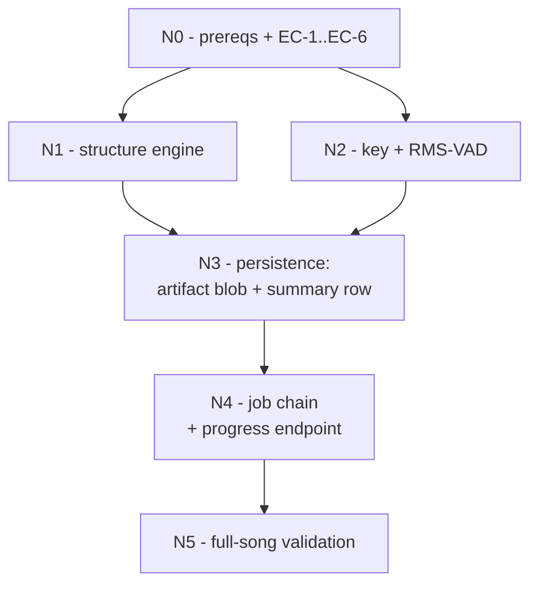

# Elums — Implementation Plan, Sunday Oct 4, 2026

**Day 2 of 10. 4 hours. Ingest A: structure, beats, key, vocal-activity segments.**
Scope from [ELUMS_BUILD_SCHEDULE.md](ELUMS_BUILD_SCHEDULE.md) "Sun Oct 4". Architecture is settled in [ELUMS_TECHNICAL_APPROACH.md](ELUMS_TECHNICAL_APPROACH.md) §4 (data tiers), §5 (ingest pipeline) and SecondPass's §2/§11.2 producer-consumer split — this plan does not relitigate any of it. Day 1 state and loose ends are in [PROGRESS.md](PROGRESS.md).

**End state:** a song row carrying sections, beats, downbeats, tempo, key, and vocal-activity segments for a real full-length track, with per-stage progress visible through an HTTP poll.

---

## 1. Manual prerequisites (you, before the agent can finish)

| # | Action | Blocks |
| --- | --- | --- |
| MA-1 | **Start Docker Desktop.** `docker info` answers (29.6.2), but `docker compose ps` is empty — the stack is down. | Everything |
| MA-2 | **Open a fresh terminal** (or reboot) so `make` resolves — PROGRESS §7's open PATH issue. If it still fails, agent runs `docker compose` directly and records it again. | `make up` only |
| MA-3 | **Decide the Smule-box deployment target** — still open, still the largest item on the project (PROGRESS §6; options in [IMPLEMENTATION_PLAN_2026-10-03.md](IMPLEMENTATION_PLAN_2026-10-03.md) §4 MA-3; recommendation was (a) native under supervisor). Oct 3's plan said "deciding by Sunday evening is sufficient" — **that is tonight.** | Sun Oct 11 |
| MA-4 | **Draft the two Smule emails tonight** so Monday is a send, not a writing session (schedule, Mon Oct 5). Not agent work. | Mon Oct 5 |

**Approved today:** the agent downloads 2–3 CC-licensed tracks with a sung lead into `data/samples/`, recording title/source/license in `data/samples/README.md`. No full-length song has ever run through this pipeline — Day 1 validated on 3 s and 20 s synthetic tones only, and PROGRESS §4's 55–70 s/song figure is an extrapolation that this plan's first real run either confirms or corrects.

---

## 2. Early checks — run these first, in this order

These expose integration failure before any code is written. Budget 30 minutes total.

- **EC-1 — torchaudio ABI (the day's real risk).** `all-in-one-infer==3.1.0` → `demucs-infer==4.2.2` → `torchaudio>=2.0.0`, but the `cu130` index tops out at **torchaudio 2.11.0** while we are pinned to `torch==2.14.1` (PROGRESS §3's one-wheel discipline). Verify in the `gpu` image: `uv add --group gpu "all-in-one-infer==3.1.0" torchaudio==2.11.0`, then `python -c "import torch, torchaudio, allin1_infer; print(torch.__version__, torchaudio.__version__)"`. *Expected:* clean import. *If it segfaults or raises an undefined-symbol error:* do **not** downgrade torch — that breaks `sm_120` on the VM. Fall back to a separate `allin1` compose service and Dockerfile target with its own torch 2.11/torchaudio 2.11 pin, consuming the same `gpu` queue and `gpu:separation` lock. Cost ~45 min; the task boundary is already a subprocess-free seam, so nothing else changes.
- **EC-2 — Python 3.13 resolution.** `madmom-infer==0.2.0` (BSD-2, pure-python wheel) and `demucs-infer==4.2.2` (MIT) both publish `py3-none-any` wheels, so the Blackwell/NATTEN trap §5 warns about is genuinely gone. Confirm `uv lock` resolves without pulling `natten` (it is an extra; do not enable it).
- **EC-3 — checkpoint identity.** Default model is `harmonix-all`, an **8-fold ensemble** — `huggingface.co/taejunkim/allinone` holds `harmonix-fold0-0vra4ys2.pth` … `fold7`, ungated. Resolve the exact files the package fetches by running it once, then record them in [config/models.yaml](config/models.yaml) and add the fetch to [scripts/download_weights.ps1](scripts/download_weights.ps1)'s deferred Item 2. *Expected:* 8 files, not 1 — the Oct 3 script comment anticipated this question but not the answer.
- **EC-4 — librosa 1.0 API.** `librosa==1.0.0` is already in the `gpu` lock transitively. Confirm `librosa.feature.chroma_cqt`, `librosa.feature.rms`, and `librosa.load` behave as 0.10 did before building key/VAD on them. This retires one of PROGRESS §7's carried loose ends.
- **EC-5 — decode path.** Feed all-in-one **WAV or FLAC only**. Its 3.1.0 release notes: WAV/FLAC decode via `soundfile`, MP3 goes through `torchaudio` and needs `torchcodec` on `torchaudio>=2.11`. Our stems are already FLAC; the source MP3 must not be handed to it directly.
- **EC-6 — GTSinger.** `ssh elums-vm 'bash -lc "du -sh /workspace/.hf_home/hub/datasets--GTSinger--GTSinger"'`. *Expected:* ~54 GB. Two minutes; it is Tuesday night's dependency, not today's.

---

## 3. Settled decision carried into today

**all-in-one-infer runs its own HTDemucs on the original mix, with `-k` to keep the four byproduct stems.** The schedule's `--stems-from-dir` line assumed Saturday's two Mel-Band RoFormer stems would feed it; they will not — the model consumes four demucs stems and its embeddings are shaped `[stems=4, time, 24]`. Substituting `other=instrumental`, `bass=drums=silence` is off the training distribution for exactly the beat/downbeat/section outputs we need. Cost is ~20–40 s extra GPU per song, serialized by the existing `gpu:separation` lock. Record the deviation in PROGRESS §5. The MBR vocal stem remains the reference vocal for everything downstream (VAD, lyrics, F0) — that does not change.

---

## 4. Milestones, in dependency order



Rough clock: N0 0:00–0:30 · N1 0:30–1:30 · N2 1:30–2:05 · N3 2:05–2:45 · N4 2:45–3:25 · N5 3:25–4:00.

### N1 — Structure engine

**Outcome:** a DB-free blocking function returning tempo, beats, downbeats, and labelled sections for one song.

New `elums/ingest/structure.py`, mirroring [elums/separation/engine.py](elums/separation/engine.py) exactly: no DB or Procrastinate import, called via `asyncio.to_thread`, raising `CheckpointNotReadyError` when weights are absent so Procrastinate's existing backoff applies.

```
run_structure(source_path, work_dir, model_root, device) -> StructureOutput
  # bpm, beats[], downbeats[], segments[{start,end,label}],
  # stems_dir, duration_ms, vram_peak_mb
```

Use the Python API (`allin1_infer.analyze`), not the CLI. Set `HF_HOME`/model cache from `settings.model_root` — never a literal path. Measure `vram_peak_mb` with the same `torch.cuda.reset_peak_memory_stats()` pattern `engine.py` already uses.

*Validation:* run on one CC track, print bpm and section labels. Expected: plausible bpm, downbeats at ~4-beat spacing, 6–12 segments with verse/chorus labels. §5 budgets ~110 s per 4-minute song warm; on the 8 GB 3070 expect more — record the real number.

### N2 — Key and vocal-activity segments

**Outcome:** key estimate from the instrumental, VAD segments from the vocal stem. Both librosa-only, so both are independent of EC-1's risk — build these first if EC-1 forces the fallback image.

- `elums/ingest/key.py` — `estimate_key(instrumental_path) -> KeyEstimate(tonic, mode, confidence)`. Krumhansl-Schmuckler profile correlation over `librosa.feature.chroma_cqt` (§5). `confidence` = gap between best and second-best correlation; §5 cross-checks this against the note histogram on Tuesday, so persist the full 24-correlation vector, not just the winner.
- `elums/ingest/vad.py` — `segment_vocal_activity(vocals_path, threshold=0.1, min_silence_s=1.0, max_segment_s=30.0) -> list[VocalSegment]`. Thresholds from §5 verbatim; put them in module constants, not call sites, because Monday's Whisper batching consumes the same boundaries and §5's whole point is that **segment boundaries are where the WER gain comes from**.

*Validation:* key on a song you know by ear; VAD segment count and total voiced duration within sight of the song's actual vocal content. Expected: no segment exceeds 30 s, no gap shorter than 1.0 s splits a segment.

### N3 — Persistence

**Outcome:** results stored per §4's tiering, not dumped into a JSONB column.

Per §4: the full analysis artifact (beats, downbeats, every segment, the correlation vector, VAD spans) is **one content-addressed blob** via the existing `LocalBlobStore`; Postgres holds a queryable summary. New `elums/models/song_analysis.py` — one row per song: `song_id`, `bpm`, `key_tonic`, `key_mode`, `key_confidence`, `beat_count`, `downbeat_count`, `section_count`, `voiced_duration_s`, `analysis_blob_sha256`, `model_versions` (JSONB). Alembic migration under `migrations/versions/`.

Also write per-stage provenance into `IngestJob.stage_results` under `structure_beats` / `rms_vad` keys, matching the `separation` entry's shape (`model`, `duration_ms`, `vram_peak_mb`) — Oct 11's AI/cost ledger is a query over this, per the schedule's daily-discipline rule.

*Open:* whether key lives on `song_analysis` or moves to `songs` once Tuesday's note-histogram cross-check exists. Keep it on `song_analysis` today; it is derived, versioned data.

### N4 — Job chain and visible progress

**Outcome:** upload → separation → structure → key/VAD runs unattended, and the SPA can watch it.

- New `elums/ingest/tasks.py`, registered through [elums/jobs/gpu_app.py](elums/jobs/gpu_app.py) (never `elums.jobs.app` — the api/worker images are deliberately torch-free, §11.6). Chain by deferring the next task at the end of the previous one, the pattern [elums/separation/task.py](elums/separation/task.py) already uses for its OOM requeue. GPU stages keep `lock="gpu:separation"`; CPU-only key/VAD run on the `gpu` queue without the lock.
- Each task sets `current_stage`, its own `*_status` column, and `step_index`/`step_total` — the columns [elums/models/ingest_job.py](elums/models/ingest_job.py) already defines for exactly this.
- **New `GET /api/songs/{song_id}/ingest`** in [elums/api/routers/songs.py](elums/api/routers/songs.py), returning the 7 stage statuses, `current_stage`, `step_index/step_total`, `message`, and `error_message`. This closes PROGRESS §7's "no HTTP endpoint exists for polling an ingest job" gap — `tests/test_separation.py` currently reaches into the DB as a stand-in. Owner-or-public authorization, same rule as `/internal/blob-authz`.
- Minimal poll in [frontend/src/pages/HomePage.tsx](frontend/src/pages/HomePage.tsx) after upload: 7 stage labels with status, refreshed every 2 s, via the generated client (`npm run codegen` after the route lands). Text and a spinner — not a designed UI.

*Validation:* upload through the browser, watch all four implemented stages move `pending → running → succeeded` without a refresh; `curl` the endpoint anonymously against a private song → `403`.

### N5 — Full-song validation

Run the whole chain on 2–3 real tracks. Confirm separation's real per-song `duration_ms` and `vram_peak_mb` at `segment_size=128`, and **correct PROGRESS §4's extrapolation in writing** if it is off — Tue's 4-hour block is budgeted against it. Listen to the vocal stem, retiring the Day 1 loose end that it was only ever checked structurally.

---

## 5. Acceptance — end-to-end

1. `make up` (or the documented `docker compose` fallback) brings all 7 services up; second invocation shows zero `Recreate`.
2. Log in as a seeded user, upload a **real 3–4 minute CC track** through the SPA.
3. The progress poll shows separation → structure_beats → rms_vad advancing to `succeeded`; `GET /api/songs/{id}/ingest` agrees with the DB.
4. `song_analysis` has one row with a plausible bpm, a key with a confidence, `section_count` between 4 and 15, and a non-null `analysis_blob_sha256`.
5. That blob fetches through Caddy (`206` on a Range request) and parses as JSON containing beats, downbeats, labelled segments, the key correlation vector, and VAD spans.
6. `ingest_jobs.stage_results` carries `model`/`duration_ms`/`vram_peak_mb` for all three completed stages.
7. `pytest` green, including a new `tests/test_structure.py` covering the VAD segmenter and the KS key estimator on synthetic input (deterministic layers only — SecondPass §9's "tests on the logic, not the models").
8. Commit per milestone with the milestone name; **push to GitHub** — there is still no remote (PROGRESS §7), which is now two days of work on one machine.
9. Append a Day 2 section to PROGRESS.md in the Day 1 format: milestone table, deviations with consequences, measured timings, blockers, loose ends.

---

## 6. Scope flags

- **The schedule's `--stems-from-dir` objective is intentionally not met as written** (§3 above). The outcome it was protecting — no wasted separation time — is partly given up by design; the stems all-in-one produces are kept rather than discarded.
- **"Visible per-stage progress" ships as a polling endpoint plus a text list**, not a designed progress UI. Sufficient for the day's end state and for Tuesday's karaoke page to build on.
- **If EC-1 fails**, the separate-image fallback consumes ~45 min and N5 shrinks to one song instead of three. Nothing is dropped.
- **If the real per-song separation time lands near 70 s**, say so plainly in PROGRESS before Tuesday's block is planned against it.
- Day 1's stranded-`pending`-job sweep, the missing compose healthchecks, and the orphaned `.staging` temp files in `data/blobs/.staging` (seven 30 MB files from rejected oversize uploads — `LocalBlobStore.put` leaves them by design, nothing reaps them) all remain open. **None are today's work**; they belong on a day with headroom.
