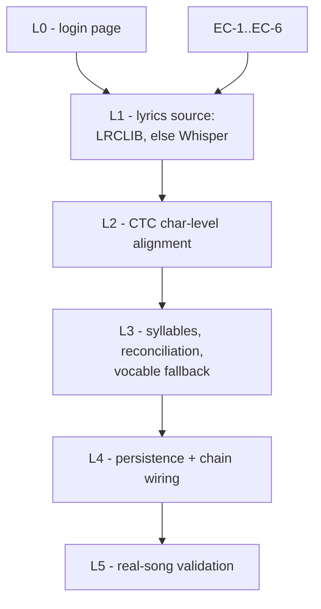

# Elums — Implementation Plan, Monday Oct 5, 2026

**Day 3 of 10. 4 hours (0:30 yours for emails, 3:30 agent). Emails, then Ingest B: lyrics + alignment.**
Scope from [ELUMS_BUILD_SCHEDULE.md](ELUMS_BUILD_SCHEDULE.md) "Mon Oct 5". Architecture is settled in [ELUMS_TECHNICAL_APPROACH.md](ELUMS_TECHNICAL_APPROACH.md) §5 and SecondPass §3.3(b) / §4 / §11.2 — this plan does not relitigate any of it. Day 1–2 state, deviations, and loose ends are in [PROGRESS.md](PROGRESS.md).

**End state:** word- and syllable-level timings over a real full-length song, persisted in the song's analysis artifact, verified by eye and ear against the audio.

---

## 1. Manual prerequisites (you)

| # | Action | Blocks |
| --- | --- | --- |
| MA-1 | **Send both Smule emails — first 30 min, not agent work.** Research: DAMP access, stronger NanoPitch checkpoint. Product: the assumptions list. **Put MA-3 in the product email** — the deployment target for the Smule box has been open two days ([PROGRESS.md](PROGRESS.md) §6) and is the largest item on the project. Do not plan around the reply. | Sun Oct 11 |
| MA-2 | **Start Docker Desktop**; confirm `docker compose ps` shows 7 services. | Everything |
| MA-3 | **Fresh terminal** so `make` resolves (PROGRESS Day 1 §7). Agent falls back to raw `docker compose` and records it again if not. | `make up` only |
| MA-4 | **Add the GitHub remote and push.** `git remote -v` is still empty after three days and nine commits on one machine. Two minutes. | Oct 12 clean-clone check |
| MA-5 | Confirm outbound HTTPS from containers to `lrclib.net` is acceptable (first external network call the pipeline makes). | EC-4 |

---

## 2. Early checks — run first, in this order (~35 min)

- **EC-1 — the day's real risk: does `whisperx` install at all?** It is **not** in `pyproject.toml`'s `gpu` group and not in `uv.lock` (verified). It pulls `ctranslate2` + `faster-whisper` + `pyannote.audio` against `torch==2.14.1+cu130` / Python 3.13, and the Whisper weights already on disk at `models/whisper-large-v3-turbo/` are **HF-transformers format, not CTranslate2** — so even a clean install needs a model conversion. **Timebox 20 minutes.** *If it resolves and co-imports with torch/torchaudio:* use it. *If it fights the one-wheel discipline (§3.2 of the Oct 3 plan) at all:* stop and take the fallback — `torchaudio.functional.forced_align` (torchaudio 2.11.0 is already pinned and co-import-verified, Day 2 EC-1) driving a wav2vec2 CTC model. **This is the same algorithm, not a redesign:** CTC Viterbi forced alignment against known text (SecondPass §3.3(b)), char-level spans first and word collapse second (§5's `char_segments_arr` property). Record the outcome in [config/models.yaml](config/models.yaml) and PROGRESS §5, and correct §5 of the approach doc if the `whisperx` name stops being accurate.
- **EC-2 — `transformers` is missing.** Not in the lock either; it is what runs the HF-format Whisper checkpoint. `uv add --group gpu transformers`, then confirm `uv lock` does **not** move `torch` or `torchaudio`. If it tries, pin it down rather than letting torch float.
- **EC-3 — the align weights were never downloaded.** [scripts/download_weights.ps1](scripts/download_weights.ps1) has Items 1–5; the schedule's "WhisperX align model" is not among them. Fetch the English wav2vec2 CTC model into `${MODEL_ROOT}` (torchaudio's `WAV2VEC2_ASR_BASE_960H` bundle, or `facebook/wav2vec2-base-960h` via `huggingface_hub`), add it as Item 6, and add a `lyrics_alignment:` entry to `config/models.yaml` with the license verified into [docs/licensing-audit.md](docs/licensing-audit.md) — same discipline EC-5 got on Day 1.
- **EC-4 — LRCLIB reachable from `gpu-worker`.** One `GET https://lrclib.net/api/get?artist_name=...&track_name=...&duration=...` from inside the container, with a descriptive `User-Agent` per their API etiquette. *If blocked:* Whisper-only path, no architecture change, note it.
- **EC-5 — hyphenation dictionary license.** `pyphen` is tri-licensed GPL-2.0 / LGPL-2.1 / **MPL-1.1**; ship under MPL-1.1 and record it in `docs/licensing-audit.md` before it lands in the lock. `cmudict` (BSD-2) is the cleaner alternative if the tri-license reads badly.
- **EC-6 — GTSinger on the VM** (carried unresolved from Day 2): `ssh elums-vm 'du -sh /workspace/.hf_home/hub/datasets--GTSinger--GTSinger'`. Expect ~54 GB. Two minutes; Tuesday night's dependency, not today's.

---

## 3. Settled decisions carried into today

- **The Mel-Band RoFormer vocal stem is the reference vocal** for transcription and alignment (Day 2 §3). all-in-one's HTDemucs byproducts are not used here.
- **Whisper runs batched over the VAD segments already persisted** in the analysis blob's `vad_segments`. Never re-run VAD. §5's finding is that the WER gain comes from segment boundaries, not cleaner audio — those boundaries already exist.
- **Whisper deletes >50% of non-lexical vocables** (§5, risk 5). The energy-gated fallback is in today's scope, not polish.
- **One analysis blob per song**, re-read → merged → re-hashed → summary row repointed: exactly the pattern `run_rms_vad` already uses in [elums/ingest/tasks.py](elums/ingest/tasks.py). Because the pointer stays on `SongAnalysis`, `/internal/blob-authz` needs no new join (Day 2 §5 item 2 added that one).
- **Registration through `elums/jobs/gpu_app.py` only.** The api/worker images stay torch-free (§11.6).

---

## 4. Milestones, in dependency order

Clock: EC 0:00–0:35 · L0 0:35–1:00 · L1 1:00–1:55 · L2 1:55–2:40 · L3 2:40–3:20 · L4 3:20–3:45 · L5 3:45–4:00.

### L0 — Login page

**Outcome:** you can test everything after this in a browser instead of `curl`. PROGRESS Day 2 §7 names this as today's action item; it gates your own validation of L5.

`frontend/src/pages/LoginPage.tsx` + a `/login` route in [frontend/src/App.tsx](frontend/src/App.tsx). Email/password form posting through the generated client to `/api/auth/login`, which already sets the cookie. Surface the demo credentials on the page itself (`dana@elums.demo` / `elums-demo-2026`, from [elums/seed.py](elums/seed.py)) — the tester should not have to know they exist. `HomePage.tsx` shows the current user from `/api/me` and links to `/login` on 401.

*Validation:* log in in a real browser, then upload from `HomePage` with no devtools and no `curl`.

### L1 — Lyrics source

**Outcome:** a line- or segment-level transcript in absolute song time, from LRCLIB where possible and Whisper otherwise.

New `elums/ingest/lyrics.py`, DB-free and blocking, mirroring [elums/ingest/structure.py](elums/ingest/structure.py).

- `fetch_lrclib(artist, title, duration_s) -> LrcLines | None`. **Metadata gap to close:** `songs` has `title` and no `artist` ([elums/models/song.py](elums/models/song.py)), but LRCLIB's `/api/get` needs `artist_name` + `track_name` + `duration` (±2 s). Extend `probe_audio` in [elums/ingest/probe.py](elums/ingest/probe.py) with `format_tags=title,artist`, add an `artist` column + Alembic migration, and fall back to splitting the filename on `" - "`. That is the smallest change that makes LRCLIB usable; an explicit artist field in the upload form is a later addition, not today's.
- `transcribe_segments(vocals_path, segments) -> list[SegmentText]`. `transformers` Whisper large-v3-turbo loaded from `settings.model_root / "whisper-large-v3-turbo"` (never a literal path), `language="en"`, batched over `vad_segments`, segment offsets added back so every timestamp is absolute song time. Turn off cross-segment conditioning — it is the documented hallucination-loop path, and batching over independent segments is the entire point.
- *Open decision, resolved for today:* run Whisper even when LRCLIB hits, but only if the LRCLIB result looks thin (fewer than 4 lines, or covering under 40% of `voiced_duration_s`). Otherwise skip it and save ~30 s of GPU.

*Validation:* `data/samples/is-this-all-liz-james.mp3` (221.3 s, Day 2's one clean full-chain run). Print the first 10 lines from whichever source won, plus which source it was.

### L2 — CTC alignment

**Outcome:** per-character and per-word start/end times on the vocal stem.

New `elums/ingest/align.py`: `align_chars(vocals_path, segment_texts) -> list[WordSpan]`.

- wav2vec2 CTC emissions over the vocal stem, `torchaudio.functional.forced_align` against the normalized transcript (uppercase, punctuation stripped, `|` word separator — the CTC vocabulary is letters only).
- **Align per VAD segment, not over the whole track.** Forced alignment is O(frames × tokens); a 4-minute single pass is both a memory risk and prone to mis-locking across long instrumental gaps.
- **Freeze this interface today — Tuesday's note grid consumes it:**
  `CharSpan(char, start_s, end_s, score)` → `WordSpan(text, start_s, end_s, char_spans, score)`. Keep the char spans; L3 cannot do its job without them.

*Validation:* pick one chorus, compare the first word's `start_s` against where you hear it. Expect agreement within ~100 ms.

### L3 — Syllables, reconciliation, vocable fallback

**Outcome:** syllable-level timings, reference text where it exists, and note-bearing events where Whisper went silent.

- **Syllable grouping:** split points from the hyphenation dictionary (EC-5), boundaries from the char spans. Never split a word evenly in time — that is the specific UltraSinger failure §5 calls out.
- **Anchor-sequence reconciliation** when LRCLIB text exists: longest common subsequence over normalized words, anchor on matched runs, interpolate inside unmatched gaps. Keep the **reference text** and the **ASR timings** where they disagree.
- **Energy-gated fallback** (§5, risk 5): any voiced span ≥300 ms in `vad_segments` with no overlapping `WordSpan` emits a wordless syllable event flagged `is_vocable`. Tuesday treats these as unconstrained syllable spans for note segmentation.

*Validation:* vocable count plausible (a handful, not hundreds); total syllable coverage sane against `voiced_duration_s`.

### L4 — Persistence and chain wiring

- Merge a `lyrics` object into the analysis blob using `run_rms_vad`'s existing re-hash-and-repoint pattern.
- `SongAnalysis` gains `lyrics_source` (`lrclib` / `whisper` / `reconciled`), `word_count`, `syllable_count`, `vocable_event_count`; one Alembic migration.
- In [elums/ingest/tasks.py](elums/ingest/tasks.py): add `run_lyrics` and `run_ctc_alignment`, both `queue="gpu"` with `lock="gpu:separation"` (both are CUDA). **`run_rms_vad` stops being terminal** — it defers `run_lyrics` and leaves `status=RUNNING`; `run_ctc_alignment` becomes the new terminal stage setting `SUCCEEDED` + `completed_at` until Tuesday. Drop its `step_index = step_total` blunt signal while you are in there (Day 2 §7).
- `stage_results` gets `lyrics` and `ctc_alignment` entries with `model` / `duration_ms` / `vram_peak_mb` — Oct 11's cost ledger is a query over this column.
- The SPA's progress poll needs no change; `GET /api/songs/{id}/ingest` already returns all 7 stages.

### L5 — Real-song validation

Run the full chain on both tracks in `data/samples/`, including **"Fill Me Up"**, whose Day 2 run was lost to the stale-image issue (Day 2 §7). Record real `duration_ms` / `vram_peak_mb` for the two new stages.

---

## 5. Acceptance — end-to-end

1. `make up` (or the documented `docker compose` fallback) green; second invocation shows zero `Recreate`.
2. Log in at `/login` as `dana@elums.demo` **in a browser** and upload `is-this-all-liz-james.mp3`.
3. The poll advances `separation → structure_beats → rms_vad → lyrics → ctc_alignment`, all `succeeded`, without a refresh.
4. The analysis blob fetches through Caddy (`206` on a Range request) and parses as JSON containing `lyrics.source`, `lyrics.words[]` with `start_s`/`end_s`/`syllables[]`, and the vocable events.
5. **Verified by ear on one chorus:** at least 8 of 10 word onsets within ~150 ms of what you hear.
6. Structural invariants hold: no syllable span falls outside its word span; no word span overlaps the next by more than 10 ms; every timestamp is inside the song's duration.
7. `song_analyses.lyrics_source` / `word_count` / `syllable_count` / `vocable_event_count` populated and plausible.
8. `ingest_jobs.stage_results` carries `model` / `duration_ms` / `vram_peak_mb` for `lyrics` and `ctc_alignment`.
9. `pytest` green, including a new `tests/test_lyrics.py` covering **deterministic layers only** — syllable grouping, LCS reconciliation, energy-gap detection — on synthetic input. No model in a unit test (SecondPass §9; Day 2 precedent).
10. Commit per milestone with the milestone name, and **push to GitHub** (MA-4).
11. Append a Day 3 section to `PROGRESS.md` in the Day 1/2 format: milestone table, EC outcomes, deviations with consequences, measured timings, blockers, loose ends.

---

## 6. Scope flags

- **The emails consume 30 of the 4 hours and are yours.** The agent's block is 3:30, and L0 was added to it. If something slips, L3's reconciliation degrades first (LRCLIB text with Whisper timings, no LCS anchoring) — the syllable grouping and vocable fallback do not, because Tuesday's note grid is constrained by syllable spans.
- **If EC-1 takes the fallback**, nothing architectural changes, but `whisperx` leaves the dependency list. Correct §5 of the approach doc rather than leaving a stale name in it.
- **Explicitly not today, and not silently dropped:** a lyric correction UI, and the manual lyric-paste path from risk 5. Neither is on today's schedule line; both are named here so they are not assumed to exist on Tuesday.
- **"Verified by eye against the audio"** is satisfied by acceptance check 5, a manual spot check — not by a built lyric-review tool.
- **Carried, not today's work:** the stranded-`pending`-job sweep, compose healthchecks for the 5 services without them, `.staging` orphans in `data/blobs/`, `step_index`/`step_total` repurposing, dev-DB test-user residue, and the MA-3 deployment decision.
