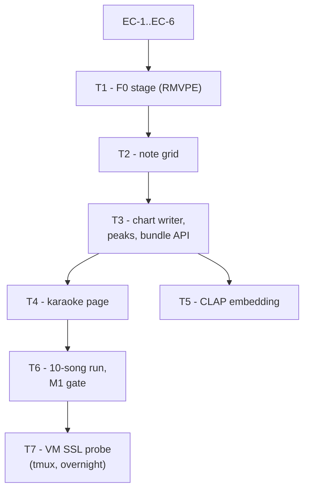

# Elums — Implementation Plan, Tuesday Oct 6, 2026

**Day 4 of 10. Ingest C: F0 → note grid → chart → M1, plus tonight's VM SSL layer probe.**
Scope from [ELUMS_BUILD_SCHEDULE.md](ELUMS_BUILD_SCHEDULE.md) "Tue Oct 6". Architecture is settled in [ELUMS_TECHNICAL_APPROACH.md](ELUMS_TECHNICAL_APPROACH.md) §4, §5, §8.3, §11.2 and SecondPass §11.2 Step 3 — this plan does not relitigate any of it. Day 1–3 state, deviations, and loose ends are in [PROGRESS.md](PROGRESS.md).

**End state (M1):** upload an arbitrary MP3 and get a playable karaoke chart in a browser. Tonight, the SSL layer probe runs unattended on the VM.

> **Deviation from the schedule, by explicit decision:** the 4-hour timebox does not apply. Today is a full working day, and the VM probe is a first-class milestone (T7), not background work. Both tracks ship; nothing here is contingent on time running out.

---

## 1. Manual prerequisites (you)

| # | Action | Blocks |
| --- | --- | --- |
| MA-1 | **Start Docker Desktop**; `docker compose ps` shows 7 services. Open a **fresh terminal** so `make` resolves (PROGRESS Day 1 §7). | Everything |
| MA-2 | **RESOLVED Oct 5 night — no action needed.** GTSinger is fully downloaded: `hf download` itself reported `✓ Downloaded` with exit code 0, 45.4 GiB, no retry needed — this is the authoritative completion signal, not an external `du` guess against the schedule's "~54 GB" figure (that number was approximate; `hf`'s own success marker is what matters). WavLM-large is also done and load-verified (§2 EC-0). | — |
| MA-3 | **RESOLVED Oct 5 night.** `elums` is now a real GitHub repo — `origin` = `https://github.com/dillonmchenry/Elums.git`, `master` pushed, 15 commits (M8 → Day 3), no secrets in history. On the VM, `/srv/elums` was swapped from the Oct 3 hand-copied subset to a genuine `git clone` of that same repo (old copy preserved at `/srv/elums-oldcopy`, 268 KB, harmless). The `.venv` survived the swap and is verified working: `torch==2.14.1+cu130`, `cuda.is_available() == True`, `transformers==5.9.0`. **No `vm` remote / push-to-deploy hook was set up** — its post-receive step would be `docker compose up -d --build`, which cannot run on this box (`docker: command not found`, confirmed directly), so wiring that up now would just be a different shape of MA-5's open blocker. Code reaches the VM today via `git pull` on `/srv/elums` (now a real clone) instead. | T7, Oct 12 |
| MA-4 | **Headphones and audio playback available** for the M1 honesty pass (T6) and the still-open Day 3 "verified by ear" check. Three days of validation have been by-eye only. | T6 |
| MA-5 | **Smule-box deployment decision (carried, Day 1 §6).** The VM has no Docker Engine; §13's `docker compose up -d --build` story cannot run there. Open four days. | Sun Oct 11 |

---

## 2. Early checks — run first, in this order (~45 min)

These are ordered to surface integration failures before any pipeline code is written.

- **EC-0 — VM access from an agent session: RESOLVED Oct 5, no action needed.** `ssh elums-vm` works directly from a chat session (Days 2 and 3 recorded "no VM access," but the cause was not the connection). Verified live: `hostname` → `c7247e62ff01`, RTX 5060 Ti present, `HF_HOME=/workspace/.hf_home`, `hf` 1.30.0 at `/venv/main/bin/hf`, 1.5 TB free. **WavLM-large is downloaded, byte-verified, and load-verified against `transformers==5.9.0`** on the VM's actual `/srv/elums` env — 488/488 weights loaded, zero missing/unexpected/mismatched keys, 315.5M params, a real CUDA forward returning 25 hidden states of `(1, 49, 1024)`. No `.bin`→safetensors conversion needed.
  - **A `tmux` session can die mid-run with zero error output, even once already producing real progress** (observed directly: a detached GTSinger download reached 51% of a 149K-file reconciliation pass, actively advancing, then the session was simply gone — no crash message, no OOM evidence in the accessible cgroup/journal). Root cause not established (this is an unprivileged container with a shared, read-only kernel — see `docs/vm-baseline.md` — so kernel-level kill evidence isn't visible). **Mitigation that worked:** don't rely on tmux's own session surviving. Write the command to a real script file on disk first (never an inline multi-line string through nested shell quoting — see next bullet), `bash -n` it to confirm it parsed intact, then launch with `setsid <script> < /dev/null > logfile 2>&1 & disown` so the process is reparented away from both the SSH session and the tmux pane. Poll the log file, not `tmux capture-pane`, since the pane can disappear with the process underneath it. Apply this to T7's probe launch directly, not just to large dataset pulls.
  - **PowerShell's `@'...'@` here-string mangles both quoting and trailing newlines when piped through `ssh`.** Two concrete failures hit tonight: (a) inner double-quotes inside a single-quoted `ssh host '...'` command get silently stripped, so e.g. `grep -E "hf download|run_x"` arrives unquoted and shell-splits on the `|`; (b) a here-string with no explicit blank line before the closing `'@` drops a stray `\r` onto the *last* line only, which turned a clean 15-line bash script into `...done\r` — invisible until `bash -n` or `cat -A` is run, and the failure mode is "unexpected end of file" pointing at the wrong line. **Always:** end multi-line here-strings with a blank line before `'@`, and verify any remotely-written script with `cat -A` or `bash -n` before trusting it to run unattended.
- **EC-1 — how RMVPE actually runs. The day's real risk.** `models/rmvpe.pt` is on disk (Item 4, Day 1) but **there is no PyTorch RMVPE package on PyPI** — only the model weights. Two paths: (a) **vendor** RVC-Project's `infer/lib/rmvpe.py` (MIT, © 2023 liujing04 / 源文雨 / Ftps) into `elums/vendor/rmvpe/`, which loads the exact checkpoint already downloaded and runs on CUDA; (b) `rmvpe-onnx` (MIT, PyPI), which pulls a *different* ONNX checkpoint and CPU onnxruntime. **Take (a)** — it preserves the one-wheel discipline, uses the weights already audited, and keeps F0 on the GPU. Record provenance in [config/models.yaml](config/models.yaml) and the MIT attribution in [docs/licensing-audit.md](docs/licensing-audit.md). **Timebox 25 min**; fall back to (b) and note it if the vendored module fights torch 2.14.
- **EC-2 — wavesurfer.js 7→8 API recheck** (PROGRESS Day 1 loose end, explicitly due today). Not in [frontend/package.json](frontend/package.json). Confirm the v8 `WaveSurfer.create({ peaks, duration, media })` signature before writing T4 against a v7 tutorial.
- **EC-3 — `audiowaveform` is not apt-installable on Debian.** The base is `python:3.13-slim`; BBC ships a per-Debian-version `.deb` from GitHub Releases, not a repo package. **Decision: compute peaks in Python** (soundfile + numpy min/max per bucket, 8-bit, ~2000 buckets) and pass them to wavesurfer's `peaks` option. Zero new system dependencies, identical client behaviour, works unchanged on the VM. This satisfies the schedule's intent (precomputed peaks, no client-side decode) without its literal tool.
- **EC-4 — CLAP loads from the local checkpoint.** `models/clap-music-speech/` exists. Confirm `transformers==5.9.0` exposes `ClapModel`/`ClapProcessor`, that it loads from `settings.model_root` (never a literal path), the required input sample rate (48 kHz), and the output dimension (expect 512 — the migration depends on it).
- **EC-5 — pgvector.** The image is `pgvector/pgvector:pg18`, but the extension has never been created. Add the `pgvector` Python package to the **core** group (SQLAlchemy `Vector` type), `CREATE EXTENSION IF NOT EXISTS vector` in the migration, and verify `uv lock` does not move torch/torchaudio.
- **EC-6 — WavLM hidden states.** On the VM: `WavLMModel.from_pretrained(..., output_hidden_states=True)` returns 25 tensors (embedding + 24 layers). Add `scikit-learn` to the `gpu` group for the linear probe; re-verify the lock.

---

## 3. Settled decisions carried into today

- **The Mel-Band RoFormer vocal stem is the reference vocal** for F0, exactly as it was for lyrics (Day 3 §3). Not all-in-one's HTDemucs byproduct.
- **Per-frame F0 is a binary `float16` blob, not JSON** (§4: "a 3-minute take is 18,000 frames… as arrays it is ~70 KB per channel"). The JSON analysis blob keeps only derived structures. This is the tiering rule, not an optimization.
- **Note grid is constrained, not learned** (§5): derivative-peak + inverse-confidence segmentation over RMVPE, constrained to syllable spans, snapped to the beat grid, quantized to key. ROSVOT is the documented fallback, not today's work.
- **One analysis blob per song**, re-read → merged → re-hashed → repointed — the pattern every stage in [elums/ingest/tasks.py](elums/ingest/tasks.py) already uses. The chart is a **second, separate blob** (it is the client-facing bundle; the analysis blob is internal).
- **Registration through `elums/jobs/gpu_app.py` only**; api/worker images stay torch-free (§11.6).
- **Every new blob kind needs a `/internal/blob-authz` join.** This has bitten twice (Day 1 §5.3 stems, Day 2 §5.2 analysis). Today adds **three**: f0, peaks, chart.

---

## 4. Milestones, in dependency order

### T1 — F0 stage

**Outcome:** a per-frame F0 + confidence track over the vocal stem, stored as binary float16.

New `elums/ingest/f0.py`, DB-free and blocking, mirroring [elums/ingest/structure.py](elums/ingest/structure.py): `extract_f0(vocals_path, model_root) -> F0Track`. RMVPE is 16 kHz, hop 160 → **100 Hz frame rate, 0 Hz for unvoiced**. Resample inside the module; never force the caller to.

`run_f0` in [elums/ingest/tasks.py](elums/ingest/tasks.py), `queue="gpu"`, `lock="gpu:separation"`. `run_ctc_alignment` stops being terminal and defers it. Write two `float16` arrays (`f0_hz`, `confidence`) as one `.npz`-style blob; put `f0_blob_sha256`, `frame_rate_hz`, `voiced_frame_ratio` on `SongAnalysis`.

**Freeze this interface — Wednesday's scoring consumes it:** `F0Track(frame_rate_hz: float, f0_hz: NDArray[float16], confidence: NDArray[float16])`, frame *i* at `i / frame_rate_hz` seconds.

*Validation:* `tests/fixtures/twenty-second-tone.mp3` is a synthetic tone — F0 should be near-constant and match the generated frequency within a few cents. A real song's `voiced_frame_ratio` should land near `voiced_duration_s / duration_s` from the VAD stage (within ~15%); a large gap means the resample or hop is wrong.

### T2 — Note grid

**Outcome:** per-note MIDI events attached to syllables.

New `elums/ingest/notes.py`. Convert F0 to cents; find segment boundaries at derivative peaks **and** confidence troughs; **clip every segment to its syllable span** from `artifact["lyrics"]["words"][].syllables` (a note never crosses a syllable boundary; every syllable yields ≥1 note); drop segments under ~80 ms; set pitch from the voiced-frame median; snap onsets to the nearest beat in `artifact["beats"]` only when within half a beat; quantize pitch class to the detected key, **recording the pre-quantization MIDI** so the decision stays auditable. `vocable_events` become unconstrained spans with the same treatment (§5's Whisper-deletion mitigation — they are note-bearing).

**Cross-check the key** against the note histogram and write both into the artifact — Day 2 shipped `key_confidence=0.074` on a near-tie, and §5 named this cross-check as the fix. Do not overwrite `key_tonic`; add `key_tonic_from_notes` and let T6 judge.

**Freeze:** `Note(start_s, end_s, midi, midi_raw, confidence, syllable_index, word_index, is_vocable)`.

*Validation:* note count is in the low hundreds (not thousands) for a 3–4 minute track; every note lies inside its syllable; median note duration is plausible (roughly 0.15–0.6 s).

### T3 — Chart writer, peaks, bundle API

**Outcome:** one fetchable artifact the client can render, plus the endpoint that points at it.

- `elums/ingest/chart.py`: assemble `{version, duration_s, bpm, key, sections[], beats[], downbeats[], words[] (with syllables), notes[], vocable_events[], stems{vocals_sha256, instrumental_sha256}, peaks_sha256}` → its own blob. Version it from the first write.
- Peaks per EC-3, over the **instrumental** (that is what the page renders), as a separate small blob.
- `run_note_grid` becomes the terminal stage: writes chart + peaks, sets `chart_blob_sha256` / `peaks_blob_sha256` / `note_count` on `SongAnalysis`, sets `status=SUCCEEDED` and `completed_at`.
- `GET /api/songs/{song_id}` (new, in [elums/api/routers/songs.py](elums/api/routers/songs.py)): song metadata plus the chart, peaks, and stem blob hashes. **Reuse the owner-or-public rule and 404-not-403 convention** `get_ingest_status` already established (Day 2 §5.3) — do not reinvent it.
- **Extend `/internal/blob-authz`** ([elums/api/routers/internal.py](elums/api/routers/internal.py)) for the three new blob kinds. The existing query joins `Song.source_blob_sha256`, `Stem.blob_sha256`, `SongAnalysis.analysis_blob_sha256`; add f0, peaks, chart or every fetch 403s for its own owner.

*Validation:* `curl -r 0-1023` on the chart blob → `206` with `Server: Caddy`; anonymous fetch of a private chart → `403`.

### T4 — Karaoke playback page

**Outcome:** press play, hear the instrumental, watch lyrics scroll in time.

`frontend/src/pages/SongPage.tsx` at `/songs/:id`, routed in [frontend/src/App.tsx](frontend/src/App.tsx); link it from the upload progress UI in [HomePage.tsx](frontend/src/pages/HomePage.tsx) when the job succeeds. Fetch the bundle via the generated client (regenerate with `make openapi` — **PowerShell 5.1 needs the UTF-8-no-BOM write**, Day 2 §5.4). wavesurfer v8 over `/blobs/<instrumental_sha256>` with precomputed `peaks`; highlight the active syllable from the media element's `currentTime` in a `requestAnimationFrame` loop. Also render the note grid as a **static** lane (plain DOM or SVG, laid out once from the chart) — it is what makes a bad grid visible at a glance during T6, and it is the fastest honest read on M1 quality. **The 60fps Canvas pitch lane with a live performance overlay is Wednesday's (§13), not today's** — this lane is scaffolding for judging the chart, and Wednesday replaces it rather than extending it.

*Validation:* play the song in a browser; the highlighted syllable matches what you hear through a chorus, and the drawn notes visibly track the melody you are hearing. This is the "playable chart" half of M1.

### T5 — CLAP embedding (fire-and-forget)

**Outcome:** a 512-d vector per song, so Sunday's recommender has a populated index.

`elums/ingest/clap.py` + `run_clap_embedding`, `queue="gpu"`, `lock="gpu:separation"`, deferred by `run_note_grid` **after** it sets `SUCCEEDED`. A CLAP failure must never fail an ingest job — log and move on. New `song_embeddings` table (`song_id`, `Vector(512)`, `model_version`), one Alembic migration also creating the extension. **No HNSW index today**; Sunday builds it after bulk load, with `hnsw.iterative_scan = relaxed_order` and `ANALYZE` (§8.1 — filtered recall collapses without them).

*Validation:* two musically similar sample tracks are closer in cosine distance than either is to a synthetic tone fixture.

### T6 — Ten songs, and the M1 gate

Run the full seven-stage chain on both `data/samples/` tracks plus ~8 more diverse ones you source. Record `duration_ms` / `vram_peak_mb` per stage (Oct 11's ledger is a query over `stage_results`). **Then listen.** For 3 songs, play the instrumental against the chart and judge honestly: do onsets land, is the melody recognizable, how often is the octave wrong?

> **M1 gate.** Write the numbers down — per-song note count, subjective onset accuracy, octave errors — and present them. **Do not pick the fallback (correction UI vs. curated seed catalog, risk 4) yourself; surface the evidence and let the owner decide.** Record the decision point in PROGRESS Day 4 §6 whether or not it is resolved tonight.

### T7 — VM SSL layer probe (first-class today)

**Outcome:** a layer-selection table and 2–3 cached WavLM layers on the VM's SSD, so Friday's technique head trains in minutes (§11.2).

Runs on the VM via `uv run` — **there is no Docker there** (docs/vm-baseline.md). Depends on MA-2 and MA-3.

- **Inspect GTSinger's actual layout and label schema first** — read one annotation file and print its keys. Do not guess the format; the per-technique folder structure and JSON fields are the one thing this milestone cannot proceed without.
- `scripts/ssl_layer_probe.py`: stratified ~2-hour English subset (singer × technique), WavLM-large hidden states for candidate layers **{1, 4, 7, 12, 18, 24}**, mean-pool per labeled span,
  - Resolve the model as `microsoft/wavlm-large` by repo id — it is already in `HF_HOME` (EC-0), so no path handling. `num_hidden_layers: 24`, so `output_hidden_states=True` returns **25** tensors and index 0 is the CNN feature encoder; the candidate set above maps straight onto `hidden_states[i]`.
  - Its `preprocessor_config.json` sets **`do_normalize: true`** at 16 kHz, unlike the base checkpoints. Load it with `AutoFeatureExtractor.from_pretrained` rather than hand-rolling the preprocessing — a silently wrong normalization degrades every probe score without erroring, the same failure class as SecondPass's unnormalized-mel bug (§3.1).
  - Only `pytorch_model.bin` exists; there is no safetensors file. **Verified Oct 5 on the VM that `transformers==5.9.0` loads it cleanly** — 488/488 weights, all four of `missing_keys` / `unexpected_keys` / `mismatched_keys` / `error_msgs` empty, 315.5M params, and a CUDA forward on the 5060 Ti returning 25 hidden states of `(1, 49, 1024)` for one second of audio. No conversion needed. (In transformers 5.x those loading-info values are **sets**, not lists — do not index them.) one logistic-regression probe per layer over the **six** labels — mixed, falsetto, breathy, pharyngeal, vibrato, glissando (§11.2: drop bubble/strong/weak). Emit a macro-F1-per-layer table to `results/ssl_layer_probe.json`, committed and pushed off-box.
- `scripts/cache_ssl_features.py`: cache the top 2–3 layers in fp16 to the SSD (~30 GB per layer; §11.2 and the schedule's "never cache SSL features locally").
- **Launch:** per EC-0's finding, don't trust a bare `tmux` session alone — write the probe-then-cache chain to a script file, `bash -n` it, then `setsid <script> < /dev/null > /tmp/probe.log 2>&1 & disown`. Poll `/tmp/probe.log`, not a tmux pane. Check it tomorrow morning, not tonight.

*Expected result:* macro-F1 varies **substantially** across layers, with early layers competitive — §11.2 cites WavLM peaking at layer 1 (72.5%) and collapsing by layer 12. A flat table across all six layers means the probe is broken (label leakage or pooling bug), not that layer choice does not matter.

---

## 5. Acceptance — end-to-end

1. `make up` green; second invocation shows zero `Recreate`.
2. Log in at `/login` as `dana@elums.demo` in a browser, upload `data/samples/fill-me-up-ellody.mp3`.
3. The poll advances all seven stages — `separation → structure_beats → rms_vad → lyrics → ctc_alignment → f0 → note_grid` — to `succeeded` without a refresh.
4. The progress UI links to `/songs/:id`; that page plays the instrumental with scrolling, correctly timed lyrics and a visible note lane. **This is M1.**
5. Chart, peaks, and f0 blobs each fetch through Caddy (`206` on a Range request) for the owner and `403` anonymously.
6. Structural invariants: every note lies inside its syllable span; every timestamp is inside `[0, duration_s]`; `note_count > 0` and the F0 frame count equals `round(duration_s * 100)` ± 1.
7. `song_analyses` carries `f0_blob_sha256`, `chart_blob_sha256`, `peaks_blob_sha256`, `note_count`, `key_tonic_from_notes`; `stage_results` carries `model` / `duration_ms` / `vram_peak_mb` for `f0` and `note_grid`.
8. `song_embeddings` has one 512-d row per ingested song.
9. `pytest` green, including a new `tests/test_notes.py` covering **deterministic layers only** — segmentation, syllable clipping, beat snapping, key quantization — on synthetic F0. No model in a unit test (Day 2/3 precedent).
10. Ten songs ingested; the M1 quality table exists and has been read aloud honestly.
11. The VM probe is running detached in `tmux` and `tmux attach -t probe` shows forward progress before you sleep.
12. Commit per milestone with the milestone name; **push to GitHub** (MA-3); append a Day 4 section to [PROGRESS.md](PROGRESS.md) in the Day 1–3 format.

---

## 6. Scope flags

- **Sequencing, since both tracks ship.** T7's only hard constraint is that it be **launched** tonight so it runs while you sleep; it does not compete with M1 for attention once detached. The efficient order is EC-1..EC-6 → T1..T3 → **start T7's GTSinger schema inspection and subset selection while the T6 ingests run on the local GPU** → T4 → T6 → launch T7 → bed. The two machines are independent, but hold the schedule's "never debug two machines at once" rule: if T7 misbehaves, finish M1 first, then come back to it.
- **`audiowaveform` is replaced by Python-computed peaks** (EC-3), deliberately, not dropped.
- **Not today, and not silently dropped:** the chart-correction UI (gated on T6), ROSVOT, the Canvas pitch lane (Wednesday, §13), and the HNSW index (Sunday, §8.1).
- **Carried, not today's work:** the stranded-`pending`-job sweep, compose healthchecks for the five services without them, `step_index`/`step_total` repurposing, dev-DB test-user residue, the untested `lrclib`/`reconciled` lyric paths, the Day 3 "verified by ear" check, and MA-5's deployment decision.
