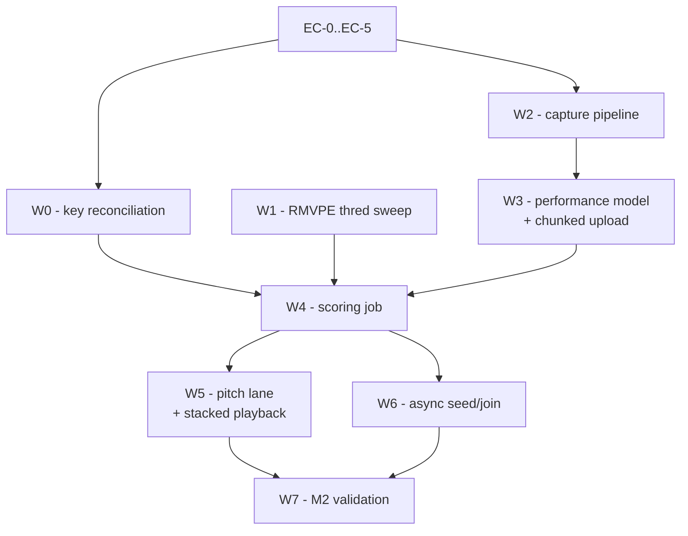

# Elums — Implementation Plan, Wednesday Oct 7, 2026

**Day 5 of 10. Capture, scoring, async seed/join → M2.**
Scope from [ELUMS_BUILD_SCHEDULE.md](ELUMS_BUILD_SCHEDULE.md) "Wed Oct 7". Architecture is settled in [ELUMS_TECHNICAL_APPROACH.md](ELUMS_TECHNICAL_APPROACH.md) §6.2, §6.3, §7.2–7.4, §10.1–10.2, §13 and SecondPass §3.4, §4, §5.5 — read the alignment and measurement math there; this plan does not restate or relitigate it. Day 1–4 state and loose ends are in [PROGRESS.md](PROGRESS.md).

**End state (M2):** record a take against a chart in a browser, get per-note pitch scoring and an overall score, publish a take as a joinable seed, and join someone else's.

---

## 1. Manual prerequisites (you)

| # | Action | Blocks |
| --- | --- | --- |
| MA-1 | **20-minute listening spot-check closing the M1 gate** (PROGRESS Day 4 §5/§8). Play 2–3 charts at `/songs/:id`; judge onsets, melody, octave errors. **Decision taken: M1 is provisionally met and today builds against the chart as-is** — this records honest numbers, it does not re-open the gate. | W4 confidence |
| MA-2 | **Docker Desktop up** (7 services), fresh terminal so `make` resolves. **Restart `api`/`worker`/`gpu-worker` after every `.py` edit** — Day 4 §7.1's staleness gotcha otherwise reads as a scoring bug. | Everything |
| MA-3 | **Headphones for every take today**, plus a real microphone and Chrome. AEC is Thursday (§10.3); on speakers the backing track bleeds into the mic and corrupts alignment and loudness. | W2, W7 |
| MA-4 | **RESOLVED Oct 6 evening — closed, not carried.** There is no deployment decision to make: the brief says *"you will deliver the source code to us, and we will deploy the application internally."* We host nothing, the VM is training capacity only, and Oct 11's "mandatory VM task" no longer exists. The risk moved to clean-clone reproducibility — see [PROGRESS.md](PROGRESS.md) Day 4 §11 for the six concrete gaps and the revised Oct 11 block in [ELUMS_BUILD_SCHEDULE.md](ELUMS_BUILD_SCHEDULE.md). | — |
| MA-5 | **Smule emails not sent Oct 6** — held to Oct 7. The deployment question is now dropped from them (MA-4); two licensing questions replace it, both of which became blocking under the new delivery mode: whether the GTSinger-derived technique-head checkpoint can ship in the repo, and what demo audio can. Do not plan around the reply. | Oct 11 |

---

## 2. Early checks — run first, in this order (~50 min)

Ordered to surface integration and compatibility failures before any capture code is written.

- **EC-0 — AudioWorklet through Vite 8 + Caddy. The day's real risk.** §13 requires `?worker&url` plus `worker.format: 'es'`; nothing in [frontend/](frontend/) has ever loaded a worklet. `addModule()` a no-op processor and confirm it loads **through Caddy at `:8080`**, not just Vite's port — COEP `require-corp` plus the HMR websocket is where this breaks. **Then confirm the same module survives `npm run build` + `vite preview`**, because the built frontend is what Smule stands up, and "works in dev, fails in production" is the precise failure §13 rejected Next.js over. Timebox 30 min.
- **EC-1 — `getUserMedia` constraints actually honored.** Request `echoCancellation / noiseSuppression / autoGainControl: false`, read `track.getSettings()` back (§10.2: chrome-wide AEC3 is default-on; `{exact: false}` throws `OverconstrainedError` on some builds). Build the banner now.
- **EC-2 — `SharedArrayBuffer`.** Assert `crossOriginIsolated === true` and that one constructs in page, worklet, and worker. Add `ringbuf.js` to [frontend/package.json](frontend/package.json); confirm ESM import under Vite 8.
- **EC-3 — chunked upload.** Confirm Caddy's `reverse_proxy` streams a `PUT` body without buffering or a size cap; a 3-minute 48 kHz take is ~35 MB.
- **EC-4 — `extract_f0` on a user take.** [elums/ingest/f0.py](elums/ingest/f0.py)'s frozen `F0Track` is the scoring input; confirm it accepts a 48 kHz WAV (it resamples internally) and that a new task module registered through [elums/jobs/gpu_app.py](elums/jobs/gpu_app.py) keeps `api`/`worker` torch-free (§11.6).
- **EC-5 — blob authz for new kinds.** Three land today (take audio, take f0, analysis). [elums/api/routers/internal.py](elums/api/routers/internal.py) needs a join for each or every fetch 403s for its own owner. **This has bitten three times.** Write the joins with the model, not after.

---

## 3. Settled decisions carried into today

- **What ships is the clean clone, so today's code has to survive one.** Smule deploys the repo on their own Linux host (MA-4/MA-5). Three concrete constraints on everything written today, none of them new rules — just newly load-bearing: every filesystem root comes from `Settings`/`.env` and `pathlib`, never a literal path; new module and asset filenames are case-correct, since Windows will not catch a mismatch and their host will; and `config/coaching.yaml` is committed (`config/` is tracked, `data/` and `models/` are not). The six clean-clone gaps found Oct 6 are Oct 11's work, not today's — **do not add a seventh.**
- **Score against the chart, not the reference vocal.** Today's vector is user-side plus median-anchored loudness; SecondPass §4.5's `ref_*` mirror fields and technique comparison arrive Friday. Leave them absent, not zeroed.
- **Overall score uses SecondPass §5.5's own fallback rule.** No technique head exists yet, so that weight redistributes into pitch: `0.95 × pct_in_tune + 0.05 × arrival_consistency`, components persisted separately. Do not invent a new blend.
- **§6.2 thresholds as config-as-data** in `config/coaching.yaml` from the first write (±25/50 cents, ±50 ms with late weighted harder, vibrato 4.5–6.5 Hz) — Friday's detectors read the same file.
- **Async seed/join is the solo path plus a parent pointer** (§7.3). The joiner tracks the backing track, which aligns them to the seed for free (§7.2).
- **One versioned analysis blob per performance**, binary f0 as its own blob — the tiering split [elums/models/song_analysis.py](elums/models/song_analysis.py) already draws (§4).
- **Live pitch is Thursday.** The lane renders chart notes plus a playhead live and overlays the **server-computed** f0 on playback. Write no throwaway detector today.

---

## 4. Milestones, in dependency order

### W0 — Key-estimate reconciliation (carried from Day 4)

**Outcome:** one resolved key per song, with its uncertainty visible.

[elums/ingest/key.py](elums/ingest/key.py)'s `confidence` is `best_corr - second_corr` (a margin, not a correlation); `_note_histogram_key_cross_check` in [elums/ingest/notes.py](elums/ingest/notes.py) computes the same margin from the note histogram. They disagree on 5/8 real songs. Add `key_confidence_low` to `SongAnalysis` (threshold 0.05–0.08 on either margin) and let the higher-margin side win the resolved `key_tonic`/`key_mode` that `_quantize_to_key` consumes, **keeping both raw values and margins** for audit. **Do not attempt the blended-correlation approach** (PROGRESS Day 4 §10 backlog — unvalidated research question).

*Validation:* re-run `scripts/validate_sample_songs.py` — `hot-n-cold` (0.023 vs 0.022) flags low-confidence; the 2 relative-major/minor cases resolve to one answer.

### W1 — `voiced_frame_ratio` threshold sweep (carried from Day 4)

**Outcome:** the systematic −0.11 RMVPE-vs-VAD gap is either fixed or documented as real.

Sweep `thred` (0.01 / 0.03 / 0.05 — already a parameter on `infer_from_audio` in [elums/vendor/rmvpe/model.py](elums/vendor/rmvpe/model.py)) over 2–3 real songs offline, no pipeline change. *Expected:* if the gap narrows materially at 0.01 the default is miscalibrated — change it. If it barely moves, **stop** and document the definitional difference (pitch-confidence gate vs RMS energy gate). Nothing consumes this number today; do not tune further.

### W2 — Capture pipeline

**Outcome:** press record, sing, and a full-quality WAV exists client-side with no dropouts.

Per §10.1: `getUserMedia` → `AudioWorkletNode` → `SharedArrayBuffer` ring (`ringbuf.js`) → Web Worker WAV encode. New `frontend/src/audio/capture-worklet.ts`, `frontend/src/audio/encodeWorker.ts`, `frontend/src/pages/SingPage.tsx` at `/songs/:id/sing`. The worklet allocates nothing per `process()`. Backing track is the instrumental blob; record `AudioContext.currentTime` at record start so W4 has a nominal offset. Banner on `crossOriginIsolated === false` or any constraint returning `true`; surface the same values on [DiagnosticsPage.tsx](frontend/src/pages/DiagnosticsPage.tsx).

*Validation:* a 60 s take's WAV duration is within 50 ms of wall clock and the ring reports zero overruns.

### W3 — Performance model and chunked upload

**Outcome:** audio lands server-side during the take, so post-song wait is seconds.

New `elums/models/performance.py`: `song_id`, `user_id`, `kind` (`SOLO`/`SEED`/`JOIN`), `parent_performance_id`, the three blob hashes, `score_overall`, `pct_in_tune`, `median_cents`, `arrival_offset_ms_median`, `octave_shift_semitones`, `alignment_warning`, `offset_s`, `latency_offset_ms`, `device_label`, `status`. New `elums/api/routers/performances.py`: create, `PUT /api/performances/{id}/chunks/{n}` (ordered append to a staging file, under a root taken from `Settings` beside `BLOB_ROOT` — never a literal path, per §3), `complete` (ffprobe via [elums/ingest/probe.py](elums/ingest/probe.py), `store.put`, defer analysis), and `GET`. Reuse `get_ingest_status`'s **owner-or-public, 404-not-403** rule verbatim (Day 2 §5.3). Extend `/internal/blob-authz` per EC-5.

*Validation:* a 60 s take completes within ~2 s of its final chunk; an out-of-order index is rejected 409; re-`PUT`ing an index is idempotent.

### W4 — Scoring job

**Outcome:** a per-note measurement vector and an overall score per take.

New `elums/scoring/` — `align.py`, `measure.py`, `loudness.py`, `tasks.py` (registered through `gpu_app`, `queue="gpu"`, `lock="gpu:separation"`). Implement SecondPass §4's **karaoke path only**: voicing-mask grid search over ±1.5 s in 20 ms steps against the chart's expected-voiced mask, requiring ≥1.0 s voiced overlap (§4.1a); global octave shift as the rounded median of per-note residuals plus per-frame ±600-cent folding, with `note_octave_offset` surfaced not swallowed (§4.2); arrival detection in onset vs continuation mode with **edge-margin rejection at 20 ms** (§4.3 — without it every timing statistic is poisoned); core windows trimmed 50 ms each side and **shifted by detected arrival** (§4.4). Loudness per §3.4: per-frame RMS dBFS at 10 ms, `median_db` anchored above a −60 dB floor. Then `alignment_sanity_check` (§4.1c): sang-but-nothing-in-tune sets `alignment_warning` and the UI banners rather than pretending.

**Freeze — Friday's detectors consume this:** `NoteMeasurement(note_index, median_cents, pct_in_tune, drift_cents_per_s, voiced_coverage, mean_voicing_confidence, note_octave_offset, arrival_offset_ms, core_start_s, core_end_s, user_rms_db, user_rms_relative_db, vibrato_rate_hz, vibrato_extent_cents, scoop_cents, envelope_shape)`.

**Write `measure.py` side-agnostic, because Friday's reference side reuses it.** SecondPass's `ref_*` mirror fields (§4.5), precomputed once per song (§9), were what made comparative coaching moments possible. Elums already stores the reference's continuous pitch losslessly (the per-song f0 blob, 100 Hz), but the chart's `Note` carries only static pitch (`midi`, `midi_raw`, `confidence`). So the per-note functions (drift, scoop, vibrato, envelope) take any `F0Track` (plus an optional RMS track) and a list of note windows, never a performance object. Friday then runs the same code once at ingest over the song's own f0 blob, so reference and user are measured identically and `ref_*` becomes wiring, not new measurement code. Reference fields stay absent today (§3). **One real data gap:** there is no reference loudness track, so envelope-shape and dynamics `ref_*` have no source. If time allows, add a per-frame RMS dBFS track (10 ms, same function as the user side) over the vocal stem at ingest, stored as its own binary blob with an authz join (EC-5). Otherwise it is Friday's first task.

*Validation:* a take recorded ~300 ms late recovers `offset_s` within 40 ms; an octave-down take reports `-12` and still scores in tune; silence yields `alignment_warning` rather than a confident bad score.

### W5 — Pitch lane and stacked playback

**Outcome:** a 60fps lane during the take, and take-vs-take comparison after.

New `frontend/src/components/PitchLane.tsx`: Canvas 2D, position from `AudioContext.currentTime`, typed arrays pre-allocated, **zero allocation in the frame loop**, `devicePixelRatio` capped at 2 (§13). Recording draws chart notes plus playhead; `/performances/:id` overlays the server f0 and colors notes by `pct_in_tune` against §6.2's bands. Stack takes of the same song. [SongPage.tsx](frontend/src/pages/SongPage.tsx)'s static SVG lane is **replaced**, not extended.

*Validation:* a DevTools profile over 30 s of recording shows steady 60fps with no GC sawtooth.

### W6 — Async seed/join

**Outcome:** publish a take as a seed; a joiner sings against seed + backing.

`POST /api/performances/{id}/publish-seed` flips `kind` to `SEED`; `GET /api/songs/{id}/seeds` lists them. Joining is `SingPage` with the seed's vocal blob mixed into the monitor path and `parent_performance_id` set — **no new alignment code**, since the joiner tracks the backing track (§7.2/§7.3). Seed and joins score independently; no mixing today.

*Validation:* `dana@elums.demo` publishes a seed, `milo@elums.demo` joins it, both score independently with their own per-note vectors.

> This is also the machinery behind §9's three pre-analyzed seed performances, still an open Day 1 loose end and now Oct 11's "decide what ships as seed content" (PROGRESS Day 4 §11, gap 5). Since `data/` is gitignored and their first run starts empty, those seeds have to be **reproducible from a script**, not committed blobs. Don't build that today — just don't make it impossible.

### W7 — M2 validation

Full loop on 2 real songs, 3 takes each (one late, one an octave down, one honest). Record `duration_ms` / `vram_peak_mb` per scoring stage — Oct 11's ledger is a query over it.

> **M2 gate.** Sing against a chart, get per-note pitch scoring, and join someone else's seed. "Singing together" is satisfied in its async form, five days early.

---

## 5. Acceptance — end-to-end

1. `make up` green; second invocation shows zero `Recreate`.
2. As `dana@elums.demo` at `localhost:8080`, open an ingested song, record a verse on headphones, stop. `getSettings()` shows all three constraints `false`, or a banner says they did not take.
3. Chunks upload during the take; the performance reaches `succeeded` within seconds of stopping.
4. `/performances/:id` shows an overall score, per-note coloring against §6.2's bands, and a playhead-synced lane; take and instrumental play back in time.
5. The three W4 cases behave as specified (late offset, octave-down, silence).
6. Take audio, take f0, and analysis blobs each fetch through Caddy (`206` on Range) for the owner and `403` anonymously.
7. `performances` carries `score_overall`, `pct_in_tune`, `arrival_offset_ms_median`, `octave_shift_semitones`, `offset_s`, plus `duration_ms` / `vram_peak_mb`.
8. Seed published by dana, joined by milo, both scored independently.
9. `pytest` green, including new tests on **deterministic layers only** — offset search, octave folding, arrival edge-margin rejection, core-window shifting, median-anchored loudness, score blending — over synthetic f0. No model in a unit test (Day 2/3/4 precedent).
10. `key_confidence_low` correct across the 8-song table; the `thred` sweep's conclusion written down either way.
11. Commit per milestone with its name, **push to GitHub**, append a Day 5 section to [PROGRESS.md](PROGRESS.md) in the Day 1–4 format.

---

## 6. Scope flags

- **If the day slips, cut in this order:** the reference RMS track at ingest (W4's optional item, falls to Friday), then W6's join flow (a published seed still demos), then W5's stacked comparison, then W1. **W0, W2, W3, W4 are the floor** — without them there is no M2 and Thursday has nothing to put on a phone.
- **EC-0 is the designated day-reshaper.** If the worklet will not load through Caddy inside the timebox, fall back to `MediaRecorder` today, ship W3–W6 against it, and move the worklet to Thursday alongside NanoPitch. That costs the zero-allocation guarantee and the live lane, not M2 — say so explicitly rather than sliding.
- **Not today, not dropped:** WASM AEC, the iOS session dance, NanoPitch WASM, latency calibration (Thursday, §10.3/§10.4); reference-side measurements, the detector bank, vibrato gating by the technique sigmoid (Friday, §6.4); GCC-PHAT, drift correction, LUFS mixing (Saturday, §7.4); pitch correction (§7.4, default off).
- **Carried:** the stranded-`pending`-job sweep, the five missing compose healthchecks, `step_index`/`step_total` repurposing, dev-DB test-user residue, the untested `lrclib`/`reconciled` lyric paths, and the blended-correlation key approach. **MA-4 is closed, not carried** (see §1); the deliverable-hardening work it has been displacing is now scheduled for Oct 11.
