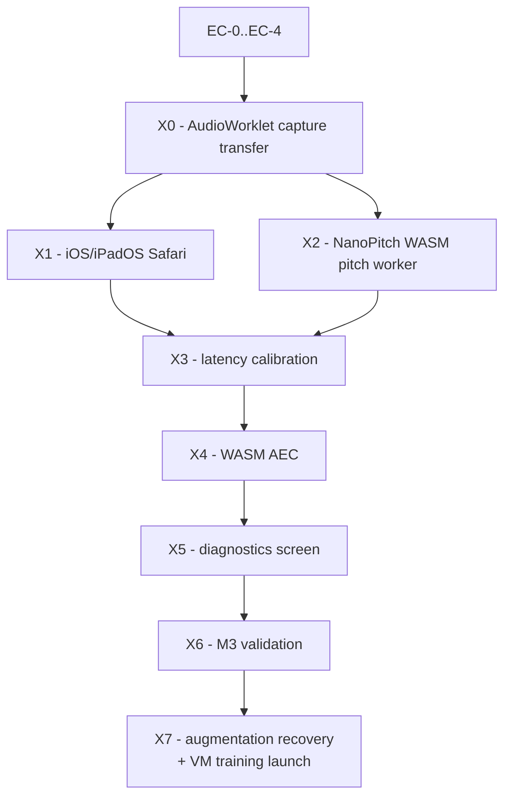

# Elums — Implementation Plan, Thursday Oct 8, 2026

**Day 6 of 10. Mobile + real-time audio → M3.**
Scope from [ELUMS_BUILD_SCHEDULE.md](ELUMS_BUILD_SCHEDULE.md) "Thu Oct 8", items 0–5. Architecture is settled in [ELUMS_TECHNICAL_APPROACH.md](ELUMS_TECHNICAL_APPROACH.md) §2.2, §10.1–10.5, §13 and SecondPass §3.1, §8.1, §11.4 — read the DSP and platform detail there, it is not restated. Day 5 §2/§9/§10 of [PROGRESS.md](PROGRESS.md) is the direct input to X0.

**All six scheduled items land today, plus the VM training launch — the day has more hours than the 8-hour block assumed.** The schedule's top-down ordering still governs **sequence**, not survival: X0→X7 are strictly ordered by dependency and **worked one at a time to completion**, not interleaved. The descope ladder in §6 is retained purely as a contingency if something upstream fails, not as a plan.

**End state (M3, extended):** record through a real AudioWorklet graph on a real iOS device, see a live NanoPitch-driven pitch lane, get the take scored, measure real ERLE from the WASM echo canceller, and have NanoPitch training running overnight on the VM.

---

## 1. Manual prerequisites (you) — before the agent starts

| # | Action | Blocks |
| --- | --- | --- |
| MA-1 | **Done — Docker Desktop is up.** Confirm 7 services and use a **fresh** terminal so `make` resolves (Day 1 §7's PATH issue). Restart `api`/`worker`/`gpu-worker` after any `.py` edit (Day 4 §7.1); the frontend polls and does not need one. | Everything |
| MA-2 | **Done — the NanoPitch files are already in `vendor/nanopitch/`**, mirroring upstream's own `wasm/` + `web/` + `training/` shape: `wasm/{nanopitch.c,nanopitch.h,build.sh}`, `export_weights.py`, `training/model.py`, `training/runs/best_150+late_clean_112gru_model/checkpoints/best.pth` (1.68 MB, 112-GRU), and the prebuilt `web/nanopitch.{js,wasm}` plus `web/index.html` as reference. **Two small gaps:** copy `../NanoPitch/LICENSE` to `vendor/nanopitch/LICENSE` (matching the `elums/vendor/rmvpe/LICENSE` precedent), and for X7 copy `training/train.py` **from the `init-run` branch** — `git -C ../NanoPitch show init-run:training/train.py` — not from the current `dillon-best` checkout, whose `augment_mel_batch` is still the unimplemented stub. | X2, X7 |
| MA-3 | **Headphones, a real mic, and Chrome desktop** for X0–X3: no echo canceller exists until X4, so speakers would bleed the backing track into every take and corrupt alignment and loudness. **Then speakers for X4 and X6** — the AEC cannot be validated on headphones, which bypass it by design, so an open-air playback path (laptop speakers are fine) is a real requirement once X4 starts. | X0, X4 |
| MA-4 | **iPad reachable at the stack.** `cloudflared` is installed; a quick tunnel (`cloudflared tunnel --url http://localhost:8080`) is adequate for one device — the named tunnel stays Oct 11. Two changes come with it: `SESSION_COOKIE_SECURE=true` in `.env` (Day 1 loose end), and **`vite.config.ts`'s `hmr.clientPort: 8080` breaks** behind a 443 tunnel — set `clientPort: 443`/`protocol: 'wss'` or disable HMR for that session. | X1 |
| MA-5 | NanoPitch licensing is **resolved — free to use for this project**; `docs/licensing-audit.md` says the opposite, so correct that entry. Smule email status still unconfirmed (Day 4 §11), not blocking. | — |

---

## 2. Early checks — first, in this order (~70 min)

Ordered so compatibility and integration failures surface before any capture or DSP code exists.

- **EC-0 — AudioWorklet through Vite 8 + Caddy. The day-reshaper, carried unrun from Wednesday (Day 5 §2).** `addModule()` a no-op processor; confirm it loads **through Caddy at `:8080`** (not Vite's 5173) with COEP `require-corp` and HMR both live; assert `crossOriginIsolated === true`; construct a `SharedArrayBuffer` in page, worklet, and worker. **Then confirm it survives `npm run build` + `vite preview`** — §13 rejected Next.js precisely over dev-works/prod-fails. Needs `?worker&url`, `worker.format: 'es'`, `build.target: 'esnext'`. **Timebox 30 min.** If it fails, X0 is impossible and with it X2–X6; the day becomes X1, X7, and an honest writeup — X7 is VM-side and independent of the browser, so it survives regardless. Say so, do not slide.
- **EC-1 — Emscripten.** `emcc` is not on PATH; `../emsdk` is cloned outside this tree. **Prefer the `emscripten/emsdk` Docker image** to a host install (Linux-reproducible, matches the portability disciplines); wire it as `make nanopitch-wasm` with the repo root mounted so it reads `vendor/` and writes into `frontend/`. The prebuilt `web/nanopitch.js` is built `ENVIRONMENT=web` with a hardcoded `ENVIRONMENT_IS_WORKER=false`, so it is untrustworthy inside a Worker — rebuild with `-s ENVIRONMENT=web,worker -s EXPORT_ES6=1`, keeping `build.sh`'s other flags. **Retarget `build.sh`'s `OUT_DIR`** (currently `$SCRIPT_DIR/../web`, i.e. `vendor/nanopitch/web/`) **to `frontend/public/nanopitch/`**: the `frontend` service builds from `context: ./frontend` and bind-mounts only `./frontend:/app`, so nothing under `vendor/` is visible to Vite, and Vite's dev server refuses to serve outside its own root regardless.
- **EC-2 — weight export and size agreement. Most likely silent failure.** `python vendor/nanopitch/export_weights.py vendor/nanopitch/training/runs/best_150+late_clean_112gru_model/checkpoints/best.pth -o frontend/public/nanopitch/weights.bin`. Two fixes first. **(a)** `export_weights.py:105` does `sys.path.insert(0, os.path.join(os.path.dirname(__file__), '..', 'training'))` — correct upstream, where the script sat in `deployment/` with `training/` as a root-level sibling; here `training/` is its **child**, so the path resolves to `vendor/training` and line 106's `from model import NanoPitch` raises `ImportError`. Drop the `'..'`. **(b)** The checkpoint is **112-GRU** while `nanopitch.h` defaults to `NC_GRU_SIZE 96` and `model.py`'s own default is 96: read `cond_size`/`gru_size` from the `.bin` header (bytes 8–15) and pass both to `nanopitch_load_weights` **and** `nanopitch_create_state`. A mismatch does not error, it produces garbage.
- **EC-3 — sample-rate and block-size bridge.** `nanopitch_process_frame` wants **exactly 160 floats at 16 kHz** per call (`NC_HOP_LENGTH`, 10 ms, 4-frame warm-up). AudioWorklet delivers 128-frame blocks at the device rate, and §10.4 forbids forcing `sampleRate`. Decide the resampler now: **anti-aliased polyphase FIR, not decimation** — aliasing lands in the mel bins. Reblock 128→160 through the ring with no per-call allocation.
- **EC-4 — numerical parity against the Python path.** SecondPass §3.1 names this hazard: mel filters must be **unnormalized** (peak 1.0, not librosa Slaney) or log-mel mean shifts ~4.5 nats and the VAD head silently decalibrates while pitch still tracks. Compare `nanopitch_compute_mel` against `vendor/nanopitch/training/model.py` on one `data/samples/` vocal stem and assert per-frame agreement. Use **`forward_single_frame`**, not the batched `forward` — it is the frame-by-frame streaming path that mirrors `nanopitch_process_frame`, and the batched version hides exactly the state-carry bugs worth catching. `vendor/nanopitch/training/` has no `__init__.py`, so a pytest-based check needs the same `sys.path` insert (or a `conftest.py` entry) rather than a package import, and in-container runs still need `PYTHONPATH=/app` (Day 5 §7.5). **Port by test, not by eye.**

---

## 3. Settled decisions carried into today

- **Item 0 is built before item 4, and both ship.** Per the schedule's Oct 7 clarification and Day 5 §10.0, these were never the same cut: the live lane and the `getSettings()` opt-out are brief-named capture requirements that need the worklet + SAB graph regardless of whether the FDAF filter lives inside it. Today the ordering is a dependency rather than a triage — X4's reference signal and delay node both hang off X0's graph and X3's measurement.
- **NanoPitch owns only the latency-critical path.** Server scoring stays on RMVPE (§2.2 — NanoPitch trains on RMVPE posteriorgrams and cannot beat its teacher). Do not route `elums/scoring/` through it.
- **Canvas 2D, position from `AudioContext.currentTime`, zero frame-loop allocation, DPR capped at 2** (§13). `PitchLane.tsx` honors this already and has an unfed `f0Overlay` prop (Day 5 §6) — X2 feeds it, does not rewrite it. Audio crosses threads through the SAB ring, never `postMessage`.
- **Latency: full measured round-trip, main `AudioContext`, no `outputLatency` subtraction** (§10.4 — that was a real formula bug). Calibrate *after* the mic opens.
- **Clean-clone discipline binds:** roots from `Settings`/`pathlib`, case-correct filenames, and **do not add a seventh clean-clone gap** (Day 4 §11). **This is now settled rather than open:** `.gitignore` anchors only `/models/` and `/data/*` at the repo root and has no `vendor/`, `*.pth`, or `*.wasm` pattern, so `vendor/nanopitch/` — checkpoint included — commits as ordinary tracked files and needs no fetch script. `.dockerignore` likewise has no `vendor/` entry and the `Dockerfile` does a plain `COPY . .`, so `model.py` and `best.pth` reach both the `app` and `gpu` images, which is what EC-4 needs. Keep the generated `weights.bin` in `frontend/public/nanopitch/` and commit it too (~1.6 MB).

---

## 4. Milestones, in dependency order

One at a time, left to right. X4 genuinely needs X3's measured delay, and X5 is only worth building once X2's RTF and X4's ERLE exist to display — so the ordering is a real dependency chain, not a priority list.

### X0 — Transfer capture off `MediaRecorder` onto an AudioWorklet graph

**Outcome:** the §10.1 graph exists and a take records through it with no dropouts.

Replace [SingPage.tsx](frontend/src/pages/SingPage.tsx)'s `MediaRecorder` path with `getUserMedia` → `AudioWorkletNode` → SAB ring (`ringbuf.js`, add to [package.json](frontend/package.json)) → two Worker consumers: `encodeWorker` (WAV encode + chunked upload) and `pitchWorker` (X2). New `frontend/src/audio/{capture-worklet.ts,encodeWorker.ts,pitchWorker.ts,ring.ts}`. Keep the existing constraint request and `getSettings()` banner verbatim — they are correct.

**Two gaps this closes.** `SingPage` **never plays the backing track**: it constructs an `AudioContext` and reads `currentTime`, but nothing decodes or plays the instrumental blob. Add `AudioBufferSourceNode` → `destination`; X4's AEC reference is that same node behind a `DelayNode`. And [performances.py](elums/api/routers/performances.py) stores assembled chunks as `content_type="audio/wav"` while `MediaRecorder` produced WebM — mislabeled today, fixed by a real WAV encoder.

**Unresolved interface decision:** chunk 0 cannot carry a correct WAV header, since take length is unknown at record start. Pick one and write it down — **(a)** headerless Int16 PCM chunks with `complete`'s assemble step prepending the header (recommended; `probe_audio` then sees a valid file), or **(b)** a placeholder header the server patches.

*Validation:* a 60 s take's stored-blob duration within 50 ms of wall clock; zero ring overruns; `ffprobe` shows the expected rate and duration; re-scoring yields an `offset_s` consistent with measured latency, not a random value.

### X1 — iOS/iPadOS Safari works at all

**Outcome:** the capture graph runs on the iPad, or its failure is understood and bounded.

Per §10.4: `navigator.audioSession.type = 'auto'` → `getUserMedia` → `'play-and-record'`; teardown `'playback'` then immediately `'auto'`, or output fidelity stays degraded. **Never force `sampleRate`.** Feature-detect `navigator.audioSession` first. The iPad has no physical silent switch, so that fix reduces to `'playback'` on the monitor path. Ship the **capture fallback ladder** — worklet → `MediaRecorder` → explicit banner — so a WebKit refusal degrades instead of blanking.

**No Mac for Web Inspector**, so debug on-device: an in-page log/error overlay plus a `POST` of client errors to the API, so failures land in `api` logs beside `request_id`. Build it *before* the first iPad load. **Timebox 90 minutes** per the daily discipline; anything past it goes in the limitations list.

### X2 — NanoPitch WASM in the pitch worker

**Outcome:** a live pitch meter from in-browser inference, numerically consistent with the Python path.

With EC-1–EC-4 green this is wiring: `pitchWorker` drains the ring, resamples to 16 kHz, and calls `nanopitch_process_frame` per 160 samples. Use the **realtime greedy/online Viterbi decoder** the C engine implements — the path SecondPass deliberately matched for browser parity (§3.1). Surface a **live RTF meter**. `process_frame` returns 0 through the 40 ms warm-up; the first 4 frames are legitimately empty, not a bug.

**Match the existing prop, which is narrower than the C output.** [PitchLane.tsx](frontend/src/components/PitchLane.tsx) declares `f0Overlay?: { t_s: number; midi: number }[]`, so the worker converts Hz→MIDI itself and **drops unvoiced frames** rather than emitting `f0_hz: 0` — there is no confidence field to gate on and 0 Hz has no MIDI value, so an unvoiced frame would draw a garbage point rather than a gap.

**One performance trap §13's guarantee does not cover.** `PitchLane`'s draw sits in a `useEffect` keyed on `currentTimeS` and `f0Overlay`, and `SingPage` drives it by calling `setCurrentTimeS` inside a `requestAnimationFrame` loop. Appending an f0 point to React state 100×/s means a re-render plus a fresh array every frame — allocation in the frame loop, one layer above the canvas where the zero-allocation rule was aimed. Hold the overlay in a **preallocated typed array behind a ref** that the draw reads, and keep React out of the per-frame path. Decide this before writing the worker, not after profiling it.

*Validation:* a sustained sung note tracks within a semitone in the live lane; EC-4's parity assertion passes; RTF well under 1.0 on desktop and iPad; a DevTools profile over 30 s of recording shows steady 60fps with no GC sawtooth.

### X3 — Latency calibration

**Outcome:** a measured per-device offset that scoring consumes, plus a manual escape hatch.

`@adasp/latency-test` (MIT), 3 runs, **gate on the 18 dB reliability ratio**, sharing the **main** `AudioContext`, full round-trip. Persist to `performances.latency_offset_ms` — the column exists from W3. Ship the manual nudge slider for repeated calibration failure (§10.4 also sanctions Chrome Android's `echoCancellation: true` as a legitimate fallback there).

*Validation:* three runs on one device agree within ~10 ms and clear 18 dB; a take with the offset applied scores a smaller `|offset_s|` than the same take without.

### X4 — WASM known-reference AEC — **in scope today**

**Outcome:** ~10–15 dB ERLE on speakers, measured not assumed, with headphones still bypassing it entirely.

Partitioned-block FDAF per §10.3: backing track into `inputs[1]` of the same worklet node so mic and reference arrive on the same audio-thread tick, bulk delay absorbed by a `DelayNode` set from X3's τ̂ (the dependency — do not start X4 before X3 reports a reliable number), **adapt during the count-in then freeze** for the take, strictly linear subtraction with no suppressor or spectral floor on the stored path, suppression confined to the monitor branch. Store **both** raw and cleaned signals plus the delay estimate so ERLE is computable server-side and the canceller is A/B-able.

**Hold the stated expectation at ~11 dB, not 30** (§10.3's cited speakerphone measurement), and report the measured number rather than the target. The cheap stretch, only if the linear filter converges cleanly first, is a memoryless `tanh` pre-distortion of the reference.

**The acceptance bar is downstream damage, not ERLE alone** (SecondPass §11.4b): re-score the same take with AEC on and off and compare `pct_in_tune` and the loudness slopes. A canceller that wins 12 dB of ERLE while flattening dynamics has failed, because dynamics are what the coach measures. Keep the **headphone bypass path** regardless — it stays the primary quality story, not a fallback.

### X5 — Diagnostics screen

[DiagnosticsPage.tsx](frontend/src/pages/DiagnosticsPage.tsx) stops being a stub: `sampleRate`, `baseLatency`, `outputLatency`, `crossOriginIsolated`, `getSettings()`, X3's RTT and reliability ratio, X2's RTF, and X4's measured ERLE. Cheap, and it is what makes every other item on this list demonstrable on the iPad instead of merely asserted.

### X6 — M3 validation

Full loop on one `data/samples/` song, on **desktop Chrome and the iPad**: record → chunked upload → score → live lane during the take → results page. Log `duration_ms`/`vram_peak_mb` per stage. Run it twice on speakers, AEC on and off, for X4's comparison.

> **M3 gate.** Record, score, and see a live pitch lane on a real iOS device.

### X7 — Augmentation recovery, then the VM training launch — **in scope today**

**Outcome:** NanoPitch training running overnight on the VM under the same augmented recipe that produced the checkpoint we ship, with the unaugmented baseline as the ablation's control.

**This is recovery, not implementation — verified, and it changes the cost.** The schedule calls for "the augmentation stub implemented," and §2.2 correctly describes upstream's `augment_mel_batch` as a deliberate stub returning clean audio. But it is **already fully written in your own history**: `git -C ../NanoPitch show init-run:training/train.py` has random per-row SNR mixing via `torch.logaddexp`, plus a `clean_prob` pass-through and a late-epoch schedule, exposed as `--snr-range` (default `-5 20`), `--aug-clean-prob` (`0.10`), `--aug-clean-prob-late` (`0.25`), and `--aug-clean-late-frac` (`0.20`). That matches `submissions/dillon-best/submission.yaml`'s *"augmentation + clean probability"* and the `best_150+late_clean_112gru_model` run name exactly. **Do not rewrite it from the docstring.**

Branch provenance matters here: the implementation is on **`init-run` (`a33ca94`)**, which is pushed to `origin`, and on `backup-before-clean` (`70c677c`), which is **local-only** — so a VM-side clone must take `init-run`. The current `dillon-best` checkout is *not* the one to copy from despite its `ceb38be "add augmentation"` commit message; its `augment_mel_batch` still returns `mel_clean` unchanged.

Steps: vendor `init-run`'s `train.py` beside `model.py` for provenance and the writeup; on the VM, clone or fetch NanoPitch at `init-run` and confirm `smulelabs/NanoPitch-PreExtract` (already cached per Day 1 §4) supplies the `clean.npz` / `noise.npz` / `test.npz` that `--data-dir` expects; smoke-test a handful of steps before committing to the full run; then launch detached with **`setsid ... < /dev/null > log 2>&1 & disown`**, not a bare `tmux` session — Day 4 §6's finding, after a download session died on its own mid-transfer (Day 1 §5.6).

*Validation:* the smoke run's loss decreases and the log shows a non-zero mixing gain (i.e. augmentation is actually on, which a stubbed `return mel_clean` would silently hide); the detached process survives closing the SSH session; copy the checkpoint off the box as soon as it exists, since the VM is an unprivileged container a recycle destroys.

---

## 5. Acceptance — end-to-end

1. `make up` green; second invocation shows zero `Recreate`.
2. A no-op worklet loads through Caddy `:8080` **and** through `vite build` + `vite preview`; `crossOriginIsolated === true`; SAB constructs in page, worklet, and worker.
3. As `dana@elums.demo` on desktop Chrome with headphones, record a verse through the worklet graph with the instrumental audibly playing: `getSettings()` shows all three constraints `false` or the banner fires; chunks upload during the take; the stored blob is a valid WAV within 50 ms of wall clock; zero ring overruns; the performance reaches `succeeded`.
4. EC-4's log-mel parity assertion passes and the live lane tracks a sustained note within a semitone.
5. Three latency runs agree within ~10 ms and clear 18 dB; `latency_offset_ms` is persisted on the take.
6. The same record-and-score loop completes **on the iPad** through the tunnel, with the audioSession sequence applied and no unhandled errors in the on-device overlay.
7. **On speakers**, a take recorded with the AEC active reports a measured ERLE (report the number, whatever it is), and re-scoring the same take with the canceller on versus off shows `pct_in_tune` and the loudness slopes substantially unchanged — the §11.4b bar. Headphones still bypass the filter entirely.
8. `/diagnostics` renders every X5 field with real values on both devices.
9. NanoPitch training is running detached on the VM under `init-run`'s augmented recipe, survives an SSH disconnect, and its log shows augmentation actually engaged rather than a stubbed pass-through.
10. `pytest` and `vitest` green, `tsc -b` clean. New tests cover **deterministic layers only** — resampler, 128→160 reblocker, ring wrap-around, WAV header assembly, latency-gate arithmetic, and the FDAF's frequency-domain block math on synthetic signals. No WASM module and no microphone in a unit test (Day 2–5 precedent).
11. Commit per milestone with its name, **push to GitHub**, append a Day 6 section to [PROGRESS.md](PROGRESS.md) in the Day 1–5 format — with the measured ERLE and the AEC on/off scoring comparison recorded as numbers, not impressions.

---

## 6. Scope flags

- **Everything in §4 lands today, sequentially.** X4 and X7 were the two items an 8-hour block could not hold; with more hours available they are in scope, and both became cheaper than estimated — X7 is a branch recovery rather than a from-scratch implementation (see X7), and X2's WASM work starts from an existing C engine and a prebuilt artifact rather than a port. **Finish each milestone before starting the next.** The temptation with extra hours is to run X4 alongside X2; don't — they share the same `AudioWorkletNode` and the same ring, and debugging an adaptive filter against an unvalidated capture graph is the cross-machine-debugging mistake in miniature (Day 1's "never debug two things at once").
- **Contingency only, if something upstream fails:** cut X7, then X4, then X3's nudge slider, then X2's RTF meter. **EC-0, X0, X1, X2 remain the floor** — without them there is no M3, and Friday's coaching work has no verified capture path underneath it. Cutting X4 is still brief-sanctioned ("in scope if needed") with headphones as a documented posture (§10.3), and X7 still blocks nothing per the background-jobs calendar. Neither is *planned* to be cut.
- **The one hard sequencing constraint:** X4 cannot start before X3 produces a reliable τ̂, because the `DelayNode` that absorbs bulk delay is set from it and §10.3 explicitly rejects covering that delay with filter taps.
- **Carried, untouched:** W5's take-vs-take stacking, the two-user JOIN flow's live verification, W4's three cases as real audio, the stranded-`pending`-job sweep, the five missing compose healthchecks, `step_index`/`step_total`, dev-DB test-user residue, the `lrclib`/`reconciled` lyric paths, the blended-correlation key approach, and all six clean-clone gaps (Oct 11).
